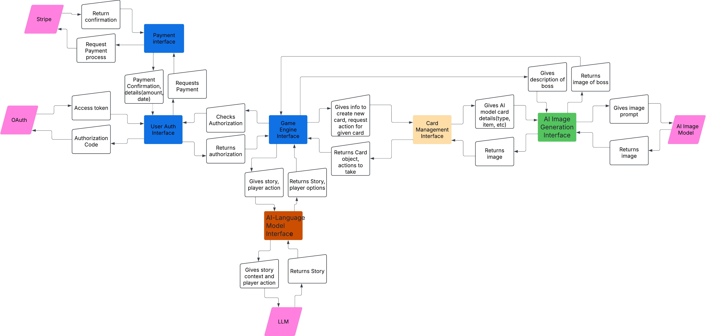

AI Note: This document was generated with the help of Chat GPT.

## Architecture
**System Overview:** The system follows a client-server architecture where the client is a web application that communicates with a backend server to handle game state, user accounts, card collections, payments, and story generation. The server-side logic will be responsible for processing game logic, generating dynamic stories using AI language models, and managing data persistence.

**Key Components:**

- **Client (Web Interface):**

   - **Frontend (UI):** Provides users with an interface for interacting with the game, such as creating accounts, initiating game sessions, viewing storylines, and interacting with the game world (e.g., collecting cards, battling bosses).
   - **Game State Management:** The client stores temporary game states and interactions while interacting with the server to update game progress.

- **Backend (Server):**

   - **API Layer:** The server exposes RESTful APIs to facilitate communication with the client. It will be responsible for handling requests like card collection updates, story generation, and game state management.
   - **Internal Backend interfaces:** The core of the backend, which handles the AI-generated story, card interactions and generation, and game logic (including user progress and boss battles).
   - **Database:** A relational database to persist game data, user accounts, card collections, game progress, and transaction history.
- **External Services:**

  - **Stripe:** For handling payments and purchasing the game.
  - **AI Language Model:** An AI-based model that generates stories for the game. This can be an API for a pre-trained model like GPT-4 or a custom language model.
  - **AI Image Generation:** An external service to generate card images based on AI models, providing users with unique visual content for the game.
  - **OAuth**: For handling authentication and to provide extra security for the user.

**Design Rationale:**
Client-Server separation ensures clear division of responsibilities, allowing the backend to manage game logic and storage, while the frontend focuses on delivering an interactive experience.
REST APIs provide a standard interface for communication, ensuring scalability and ease of integration with external services (like Stripe and the AI models).
AI-driven story generation and card image generation provide a unique and dynamic user experience.

# Backend Design for Text-Based Game

## Internal Interfaces

### NEW 1. User Authentication & Authorization Interface
- **Purpose:** Validates if the client has authorization using Supabase and OAuth.

- **Actions:**
   - **Authorization:** After successful authentication, retrieves an access token and refresh token to grant access to game data. Checks that Supabase has JWT for user, before allowing access to data.
   - **Session Management:** Manages user sessions, ensuring valid tokens are used and renews them when necessary.

- **Communication with Other Interfaces:**
   - **Internal:**
      - **Database**: Interacts with the user table for storing user credentials, securely hashing passwords (if email authentication is used.)
      - **Game State Engine:** Grants permission to the game engine to retrieve the user’s game state from the database.
      - **Payment Interface:** Confirms if the user has made a payment for the game (validating through the Stripe interface).
-**External:**
      - **OAuth Providers (Google/Facebook):** Handles the initial authentication and returns tokens to allow access.
      - **Supabase:** Verifies the access token and retrieves user data.
- **Rationale:**
The User Authentication & Authorization Interface manages secure user sign-ins through Supabase and OAuth. By integrating these authentication systems, we ensure the secure handling of user sessions, minimizing the need for managing user passwords directly. The use of Supabase and OAuth allows for more scalable and secure user management, keeping the authentication flow streamlined and secure. This interface does not directly handle the authentication since that will be handled by supabase, but is used to validate that supabase has given access token for user to access their data.

### 1. **User Authentication & Authorization Interface**
- **Purpose**:Validates using supabase whether client has authorization.
- **Actions**:
  - Uses supabase to validate user has permission to access game data then gives Game engine permission.
- **Communication with Other Interfaces**:
  - **Internal**:
    - **Database**: Interacts with the user table to store credentials and securely hash passwords (e.g., using bcrypt).
    - **Game State Engine**: Upon successful validation, gives game engine permission to retrieve the user’s game state from the database to resume gameplay.
    - **Payment**: Validates user has paid for game using payment interface.
  - **External**:
    - OAuth: If OAuth is used will exchange the authorization code for an access token and possibly a refresh token.
    - Supabase: Checks access token to allow backend to retrieve user data.
   
- **Rationale:** The User Authentication & Authorization Interface is essential for securing user accounts and ensuring that players can safely access their game data. It manages secure sign-ins, session handling via JWTs, and ensures that users only have access to their own information. By integrating with internal systems and supporting external OAuth, it provides both a seamless and secure authentication process, which is critical for maintaining player privacy, data integrity, and a personalized gaming experience. It allows the interface to be used by other interfaces in the future if needed. This interface will be fairly simple it will just make sure Supabase(using OAuth) has given user access, so the game can retrieve a users data.

---

### 2. **Game Engine (Story Generation & Game Logic) Interface**
- **Purpose**: Powers the dynamic AI-driven story generation, manages the game flow, handles player choices, and generates appropriate responses.
- **Actions**:
  - **Story Generation**: Requests internal AI Language model interface generate text-based story content based on the theme chosen by the player.
  - **Handle Player Actions**: Processes actions taken by the user (e.g., collecting items, battling bosses).
  - **Card and Buff Management**: Manages the card collection and ensures buffs and abilities apply correctly during combat or other in-game actions.
  - **Boss Battle Simulation**: Executes the logic for combat between players and bosses, updating health, energy, and game progress.
- **Communication with Other Interfaces**:
  - **Internal**:
    - **Card Management**: Asks Card Management to update, create, or apply cards in the player's inventory during the course of the game.
    - **Database**: Uses database to store the game state, player inventory, and progress, ensuring it’s updated after each action.
    -  **AI Image Interface**: Asks AI image interface for images related to the game such as an image of a boss to battle.
    -  **AI-Language Model Interface**: Interacts with the AI-Language Model Interface to generate the story dynamically based on the current game state and player input. The Game engine sends requests to the interface with the current game context and action needed, and the interface returns a new segment of the story and/or possible items the user can collect which will later be turned into cards.
  - **External**:
    - none
   
- **Rationale:** We want some central interface that controls the game and interacts with other interfaces to update the game. This will serve as a constant entry point between the client and the server and managing the game state.

---

### 3. **Card Management Interface**
- **Purpose**: Handles the collection, use, and upgrades of cards within the game. Each card has its attributes (e.g., attack, buff, cost, strength).
- **Actions**:
  - **Card Generation**: Creates cards when they are acquired by the player, using an AI image generation service for visual representation. When user gets an item after being prompted by ai language model, the item description will be passed on to Card Management to be turned into a card object. 
  - **Card Usage**: Allows players to use cards during combat or to buff themselves. Handles energy costs and buffs/debuffs applied.
  - **Card Collection**: Tracks which cards the user has and allows them to use them throughout the game.
  - **Card Upgrades**: Possible facilitates upgrading or enhancing cards.(This may not be in the final product for version 1.0)
- **Communication with Other Components**:
  - **Internal**:
    - **Game Engine**: Updates card usage during events like battles, triggering specific buffs or attack damage. When the user picks up an item Game engine will ask the Card engine to create a new card. The card engine is responsible for creating cards and their attributes and returns cards and their actions to the game engine for use.
    - **Database**: Saves card data in the user’s inventory and updates the database on each card use or collection.
    -  **AI Image Generation**: Requests images for newly generated cards. Sends card description to the interface which then returns an image which is stored in the database.
  - **External**:
    - none
   
- **Rationale:** Cards are going to be a big feature of the game so we want to separate the card implementation from other components like the game engine. This will allow us to add new card features in the future without having to change many details in other interfaces.

---

### 4. **Database Interface**
- **Purpose**: Manages all persistent data within the system. It stores information related to user accounts, game progress, cards, transactions, and more. See Data Base Design for more details about the Database.
- **Actions**:
  - **Store User Data**: Store user details such as usernames, passwords (hashed), email, etc.
  - **Store Game State**: Keeps track of player progress, inventory, story state, and choices.
  - **Transaction Logs**: Logs payment transactions and ensures users’ purchases are recorded.
  - **Game History**: Maintains historical data for user games, which can be useful for analytics or resuming games.
- **Communication with Other Components**:
  - **Internal**:
    - **User Authentication**: Reads and writes user details like credentials.
    - **Game Engine**: Retrieves and stores the user’s game state (e.g., current story progress, active cards).
    - **Card Management**: Stores and retrieves the player’s collection of cards and their associated attributes.
    - **Payment System**: Stores transaction history related to Stripe payments.
  - **External**:
    - None.
   
- **Rationale**: See Database design

---

### 5. **Payment Interface (Stripe Integration)**
- **Purpose**: Facilitates in-game purchases and the initial purchase of the game via Stripe. Ensures secure transactions and proper game access post-purchase.
- **Actions**:
  - **Purchase Game**: Handles the one-time purchase of the game using Stripe’s API.
  - **Transaction History**: Logs successful transactions and ensures users’ access is validated.
- **Communication with Other Components**:
  - **Internal**:
    - **Database**: Stores transaction records, which are essential for validating user purchases and maintaining access.
    - **User Authentication**: Once payment is successful, update the user’s account to grant game access.
  - **External**:
    - **Stripe API**: Makes requests to the Stripe API to process payments. It sends details like purchase amounts, user details, and transaction types (e.g., one-time, subscription), and Stripe returns the transaction status (e.g., success, failure). The backend updates the user’s game access based on Stripe’s response.
   
  - **Rationale**: We want an interface that is solely devoted to payments. We could have user auth handle payments, but in the future, if new paid game content is added, we want an interface that we can update and possibly have more payment options. Its implementation will not be prioritized during development since the focus will be on user experience.

    

---

### 6. **AI Image Generation Interface**
- **Purpose**: Generates custom images for cards that represent items, characters, or actions within the game.  Uses external AI image generation interface for actual image generation.
- **Actions**:
  - **Card Image Generation**: Receives requests from the Card Management component with card attributes and reaches out to AI generator to return a generated image.
  - **Image Storage**: Saves generated images to the Database.
  - **Boss image Generation:** Generates images of a boss/enemies based on llm output.
  - **Validation**: Ensures data sent back is valid format.
- **Communication with Other Components**:
  - **Internal**:
    - **Card Management**: Requests image generation for newly created cards or when upgrading cards. Passes the necessary card data (e.g., type, effects, item description) to the service.
    - **Game Engine**: Request a new image of a Boss/enemy based on LLM output. 
  - **External**:
    - **Image Generation API**: Interacts with an external image generation service (e.g., DALL·E, MidJourney, or a custom model) to create images. Sends requests with the image description and attributes, and the service returns an image to the interface.

- **Rationale:** Since we will be generating images throughout we want a component that is solely devoted to image generation, which will make it easier to upgrade or change in the future. It will also allow other interfaces added in the future a way to generate images. This will allow us to validate or make changes to prompts without affecting other interfaces too much.
---

### 7. **AI-Language Model Interface**
- **Purpose**: Generates the dynamic storylines based on user input and predefined game themes using an external LLM interface. Interface that reaches out to external AI interface to generate story.
- **Actions**:
  - **Story Generation**: Generates narrative elements in real-time based on user decisions, AI model inputs, and the theme of the game. Will prompt to sometimes include optional items that can be picked up by user and later turned into cards.
  - **Boss Battle Descriptions**: Provides descriptive content for boss battles, adding depth and excitement to the interactions.
  - **Quality Control/validation**: Makes sure what AI sends back is correct format/ data structure.
  - **Story Summary**: Summarizes important story beats during the user's journey. May be used for reducing storage requirements, and providing a way to inform a user of past events after returning to the game.
- **Communication with Other Components**:
  - **Internal**:
    - **Game Engine**: Receives prompts for story generation (e.g., user choices, current game state) from the game engine and sends a generated text for the user to interact with. The story’s progression is based on player decisions. 
    - **Database**: May store narrative branches and decisions for future gameplay sessions, ensuring continuity in the story.
  - **External**:
    - **AI-Language Model API**: Interacts with an external AI language model (e.g., OpenAI’s GPT-4 or a custom model). The backend sends requests containing the current game context, player actions, and predefined themes, and the model returns a story update that is displayed to the player.

- **Rationale:** Since LLM generation is so important to the game we want to separate the functionality from the rest of our interfaces. This will allow us to extend the interface to other interfaces in the future if needed. This interface will also importantly serve to make sure data sent back from AI is correct format so that it can be used to alter game state.
---

## External Interfaces:

### 1. **Stripe Integration**
- **Purpose**: Handles all financial transactions for the game, from the initial purchase to in-game purchases.
- **Communication**:
  - **Backend → Stripe**: API calls for initiating and processing payments for purchasing for the game.
  - **Stripe → Backend**: Stripe returns payment confirmation, success/failure responses, and transaction data.
 
- **Rationale**: Stripe won't be prioritized but if production is ahead of schedule, we will implement a way to pay for the game using Stripe, since some in our group are at least somewhat familiar with it.
  
  
### 2. **AI Language Model (LLM)**
- **Purpose**: Powers dynamic, AI-generated storytelling for the game.
- **Communication**:
  - **Internal AI-Language Model Interface → LLM API**: Sends context and player input to the LLM to receive a dynamically generated story or list of items a player can chose from that will turn into cards later.
  - **LLM → Backend**: Returns AI-generated story content to be presented to the player.

- **Rationale**:

### 3. **AI Image Generation Service**
- **Purpose**: Provides unique images for cards and other in-game visuals.
- **Communication**:
  - **Backend → Image Generation API**: Sends requests to generate images based on the attributes of newly created cards.
  - **Image Generation API → Backend**: Returns the generated image as a URL for storage.

- **Rationale**:

### 4. OAuth Authentication Service
 - **Purpose:** Authenticates users securely via OAuth and provides backend authorization to access user-specific game data and actions. It acts as a bridge between the backend system and external OAuth providers (e.g., Google, Facebook, etc.). This will not be a required way to sign in, but users will have the option besides giving an email and password.

- **Communication:**

  - **UserAuth interface → OAuth Provider (e.g., Google, Facebook):** Communicates with Oauth to set up user authorization.
 
  - **Supabase**: Supabase will use oauth to authenticate users.

- **Rationale:**
OAuth integration allows the backend to authenticate users without managing passwords directly, improving security and simplifying the login process. This ensures that only valid, authorized users can access protected resources and game data via the backend. Also provides a user a more convenient way to log in.

### 5. Supabase
- **Purpose:**
Supabase provides a complete backend solution that includes authentication, real-time data synchronization, and a relational database. This external service is used to manage user authentication (via OAuth or email), store game data, and manage user sessions.

- **Communication:**

   - **Backend → Supabase:** The backend communicates with Supabase to handle tasks like user sign-ups, sign-ins, storing game progress, managing transactions, and updating user inventories.
   **Supabase → Backend:** Supabase returns data such as the authentication token, user details, or game progress that the backend uses to authenticate and store the user’s state.
   **Rationale:**
   Supabase simplifies backend management by offering pre-built solutions for authentication, real-time data handling, and database management. It is a critical external service used by your backend to manage user data securely, store game progress, and manage multiplayer features.

Interface Rational: We divided our project into these interfaces to seperate the logic for different tasks. We believe this seperation will be useful for debuging and adding new features in the future. 

***Interface Interaction Overview***

 # Note: Need to figure out how we are getting images and llm details. URL is just a place holder. 

 ## another Draft for comparision:

 # System Overview

The system follows a client-server architecture where the client is a web application that communicates with a backend server to handle game state, user accounts, card collections, payments, and story generation. The server-side logic will be responsible for processing game logic, generating dynamic stories using AI language models, and managing data persistence.

---

## Key Components

### **Client (Web Interface)**

- **Frontend (UI)**: Provides users with an interface for interacting with the game, such as creating accounts, initiating game sessions, viewing storylines, and interacting with the game world (e.g., collecting cards, battling bosses).
  
- **Game State Management**: The client stores temporary game states and interactions while interacting with the server to update game progress.

---

### **Backend (Server)**

- **API Layer**: The server exposes RESTful APIs to facilitate communication with the client. It will be responsible for handling requests like card collection updates, story generation, and game state management. Handled with Game Engine Interface.
  
- **Internal Backend Interfaces**: The core of the backend, which handles the AI-generated story, card interactions and generation, and game logic (including user progress and boss battles).

- **Database**: A relational database to persist game data, user accounts, card collections, game progress, and transaction history.

---

### **External Services**

- **Stripe**: For handling payments and purchasing the game.

- **AI Language Model**: An AI-based model that generates stories for the game. This can be an API for a pre-trained model like GPT-4 or a custom language model.

- **AI Image Generation**: An external service to generate card images based on AI models, providing users with unique visual content for the game.

- **OAuth**: For handling authentication and providing extra security for the user. Supabase will be integrated to handle OAuth and authentication.(Handled by Supabase.
  
- **Supabase**: Database used for authentication, storing game state, images, and card data.

---

## Design Rationale

Client-Server separation ensures a clear division of responsibilities, allowing the backend to manage game logic and storage, while the frontend focuses on delivering an interactive experience. REST APIs provide a standard interface for communication, ensuring scalability and ease of integration with external services (like Stripe and the AI models). AI-driven story generation and card image generation provide a unique and dynamic user experience.

---

## Backend Design for Text-Based Game

---

### Internal Interfaces

#### 1. **User Authentication & Authorization Interface**

- **Purpose**: Validates user authorization using Supabase and OAuth for secure access.
  
- **Actions**:
  - Uses Supabase to validate user has permission to access game data, allowing the Game Engine to retrieve user information.
  
- **Communication with Other Interfaces**:
  - **Internal**:
    - **Database**: Interacts with the user table to store credentials and securely hash passwords (via Supabase).
    - **Game Engine**: Grants access to the user's game state data after successful validation.
    - **Payment**: Confirms user’s purchase status via the Payment Interface.
  - **External**:
    - **OAuth**: Supabase will uses OAuth to exchange the authorization code for an access token. Which will be used for validating whether user has access.
    - **Supabase**: Checks access tokens and allows the backend to retrieve user data.
  
- **Rationale**: The User Authentication & Authorization Interface ensures secure user access and handles user login via OAuth or email/password, depending on user choice. With Supabase managing both OAuth and database storage, there is no need for a separate internal user authentication system, simplifying both the user login and data retrieval process. This interface will be fairly simple and just check that supabase has authenticated a user before granting access to user data.

---

#### 2. **Game Engine (Story Generation & Game Logic) Interface**

- **Purpose**: Powers dynamic story generation, manages game flow, player choices, and game logic.
  
- **Actions**:
  - **Story Generation**: Requests internal AI Language Model to generate story content.
  - **Handle Player Actions**: Processes player choices (e.g., collecting items, battling bosses).
  - **Card & Buff Management**: Manages cards and buffs during in-game interactions.(card Management interface is responsible for updating,creating, and returning card actions. Game engine interface is responsible for applying the effects in game and to the client)
  - **Boss Battle Simulation**: Executes logic for combat and progression.
  
- **Communication with Other Interfaces**:
  - **Internal**:
    - **Card Management**: Gives card details to card management for creating new cards based on player actions. Card managment will send back card details and actions.
    - **Database**: Saves player’s progress and updates inventory during interactions.
    - **AI Image Interface**: Requests images for game content like boss fights.
    - **AI-Language Model Interface**: Generates story updates based on player input.
  
- **Rationale**: This interface serves as the central hub for game progression. It coordinates between multiple systems (card management, database, story generation) to deliver a consistent experience, keeping the flow of the game intact.

---

#### 3. **Card Management Interface**

- **Purpose**: Handles the collection, use, and upgrades of cards within the game.
  
- **Actions**:
  - **Card Generation**: Creates new cards based on in-game events and item descriptions.
  - **Card Usage**: Allows players to use cards for battles or buffs.
  - **Card Collection**: Tracks and updates the player's card inventory.
  - **Card Upgrades**: Manages potential future upgrades of cards.
  
- **Communication with Other Interfaces**:
  - **Internal**:
    - **Game Engine**: Updates card collection and usage during events.
    - **Database**: Stores card inventory and updates each card's use or collection.
    - **AI Image Generation**: Requests images for newly generated cards.
  
- **Rationale**: By separating card management, the game engine remains focused on game flow, while the Card Management Interface takes care of card creation and updates independently. This allows for easy future expansion of card-related features.

---

#### 4. **Database Interface (with Supabase Integration)**

- **Purpose**: Manages all persistent data, such as user accounts, game progress, cards, and transaction records using Supabase.

- **Actions**:
  - **Store User Data**: Saves user credentials (hashed passwords) and other relevant information.
  - **Store Game State**: Tracks player’s game progress, inventory, decisions, and stats.
  - **Transaction Logs**: stores all payment transactions and tracks in-game purchases(if implemented in the future).
  - **Game History**: Saves past game sessions to allow users to resume their gameplay.
  - **Card Collection Management**: Stores and updates the player’s card collection.

- **Communication with Other Interfaces**:
  - **Internal**:
    - **User Authentication Interface**: Stores and retrieves user credentials via Supabase authentication.
    - **Game Engine**: Retrieves and updates user game state and progress.
    - **Card Management**: Stores and updates player’s card inventory.
    - **Payment Interface**: Stores transactions for purchases and in-game items.
  - **External**:
    - **Supabase**: Handles authentication, queries, and storage of user and game-related data.

- **Rationale**: Supabase provides a powerful backend-as-a-service solution with built-in database management, authentication, and real-time capabilities. By using Supabase for data storage, we can focus on building out the game mechanics and user experience. The **Database Interface** will abstract the complexity of interacting with Supabase, allowing for seamless data management.

---

#### 5. **Payment Interface (Stripe Integration)**

- **Purpose**: Facilitates in-game purchases and the initial purchase of the game using Stripe.
  
- **Actions**:
  - **Purchase Game**: Handles payment processing through Stripe API.
  - **Transaction History**: Logs purchases to verify user’s game access.
  
- **Communication with Other Interfaces**:
  - **Internal**:
    - **Database**: Stores transaction records and verifies user access.
    - **User Authentication**: Updates user access after a successful payment.
  
- **External**:
  - **Stripe API**: Processes payments and returns transaction statuses.
  
- **Rationale**: A separate Payment Interface allows for clean management of financial transactions. It ensures the game can be easily updated in the future if more payment options are required. This is more of a could have for us, so it will not be highly prioritized during our implementation. 

---

#### 6. **AI Image Generation Interface**

- **Purpose**: Generates custom images for cards and other in-game visuals.
  
- **Actions**:
  - **Card Image Generation**: Requests images based on card attributes.
  - **Image Storage**: Stores generated images to the database.
  - **Boss Image Generation**: Generates visuals for bosses or enemies.
  - **Validation**: Ensures generated images are valid and usable.
  
- **Communication with Other Interfaces**:
  - **Internal**:
    - **Card Management**: Card managment requests images for newly generated cards and is sent back image or error.
    - **Game Engine**: Game engine requests images for boss encounters.
  - **External**:
    - **Image Generation API**: Generates images based on given descriptions.
  
- **Rationale**: This interface isolates image generation to a single component, allowing easy changes and enhancements in the future. It simplifies image management and keeps the logic for visual elements modular. Having logic for image generation seperate allows other components to use the interface without needing to know how it works.

---

#### 7. **AI-Language Model Interface**

- **Purpose**: Powers the AI-driven storylines for the game.
  
- **Actions**:
  - **Story Generation**: Generates narrative elements based on game state and user input.
  - **Boss Battle Descriptions**: Provides descriptions for bosses and encounters.
  - **Quality Control/Validation**: Ensures generated stories are in the correct format.
  - **Story Summary**: Provides summaries of major story beats.
  
- **Communication with Other Interfaces**:
  - **Internal**:
    - **Game Engine**: Requests story updates based on user choices.
    - **Database**: Stores story progress and player decisions.
  - **External**:
    - **AI-Language Model API**: Communicates with the LLM to generate dynamic narratives.
  
- **Rationale**: The AI-Language Model is key to the game’s dynamic narrative. Separating this functionality allows easy scalability and flexibility, ensuring stories are generated seamlessly.

---

### External Interfaces

---

#### 1. **Stripe Integration**

- **Purpose**: Handles all financial transactions for the game, from initial purchase to in-game purchases.
  
- **Communication**:
  - **Backend → Stripe**: Sends transaction details to Stripe.
  - **Stripe → Backend**: Returns transaction status (success/failure).

- **Rationale**: Payment is handled externally to reduce security concerns within the game’s backend. Stripe allows secure, easy payment processing.

---

#### 2. **AI Language Model (LLM)**

- **Purpose**: Generates dynamic, AI-powered storylines.

- **Communication**:
  - **Internal AI-Language Model Interface → LLM API**: Sends user input to LLM to generate stories.
  - **LLM → Internal AI-Language Model Interface**: Returns generated story content.

- **Rationale**: By using an external LLM, we can scale and improve the narrative quality without maintaining complex AI models in-house.

---

#### 3. **AI Image Generation Service**

- **Purpose**: Provides unique images for cards and in-game visuals like bosses.

- **Communication**:
  - **AI image generation internal interfac → Image Generation API**: Requests for image creation.
  - **Image Generation API → AI image generation internal interface**: Returns generated image data.

- **Rationale**: Isolating image generation to a single interface allows flexibility in switching image providers or refining visuals in the future. Using external service allows us to avoid needing powerful computers to run the models locally.

---

#### 4. **OAuth Authentication Service**

- **Purpose**: Manages user authentication via OAuth providers (e.g., Google, Facebook) for secure login.(note supabase will responsible for using OAuth)

- **Communication**:
  - **Supabase**: Verifies user and provides session tokens.
  
- **Rationale**: OAuth authentication reduces the overhead of managing user passwords. Supabase will simplify OAuth handling and session management.

---

#### 5. **Supabase**

- **Purpose**: Provides backend services for user management, including authentication (via OAuth or email) and game data storage.

- **Communication**:
  - **Backend → Supabase**: Communicates for tasks like sign-up, sign-in, game progress, and transactions.
  - **Supabase → Backend**: Returns user data, game state, and authentication details.

- **Rationale**: Supabase provides a comprehensive, out-of-the-box solution for user management, session handling, and database interactions, allowing us to focus on game development.

---

### Interface Rationale

We divided our project into these interfaces to separate logic and ensure flexibility. This modular approach will make debugging easier and provide a solid foundation for future feature additions. Each interface is designed to handle a specific concern, ensuring that the overall system remains organized and adaptable.

***Interface Interaction Overview***

