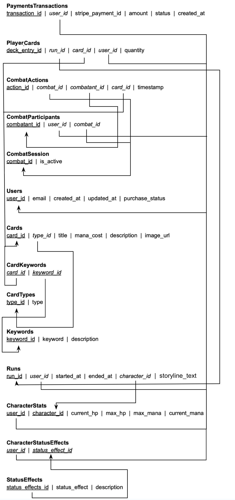

# Database Design

## 1. Purpose
The database for *The Last Game* serves as the backbone for storing and managing **user data, game progress, deck compositions, combat logs, and financial transactions**. It ensures **data integrity, persistence, and security**, facilitating smooth interactions between the client, game engine, and third-party services like **Stripe for payments and AI models for procedural content generation**.

The database is implemented using **Supabase**, providing built-in **authentication, storage, and real-time capabilities** to streamline development and scalability.

---

## 2. Database Schema and Entities

The database follows a **relational structure** and adheres to **third normal form (3NF)** to minimize redundancy and maintain data integrity. It consists of several core tables, each serving a specific function within the game.

The Database Schema is defined by this diagram. Note: Underline denotes primary keys and italics denotes foreign key (these are not mutually exclusive). Two primary keys indicate a composite primary key. 

### 2.1 Tables

- **Users** – Stores player accounts and authentication details, including purchase status and metadata required for game access.
- **Runs** – Represents individual roguelike playthroughs, tracking session progress and associated player data.
- **CharacterStats** – Maintains current health, mana, and other attributes of the player's in-game character during a run.
- **CharacterStatusEffects** – Tracks temporary buffs, debuffs, and other status effects applied to the player's character.
- **StatusEffects** – Defines all possible status effects in combat, including their mechanics and descriptions.
- **Cards** – Stores the generated cards, including their type, cost, and in-game effects.
- **PlayerCards** – Tracks the player's deck composition by linking individual cards to a specific run.
- **CardKeywords** – Establishes relationships between cards and gameplay keywords that define their effects.
- **Keywords** – Defines all possible card-related keywords and their descriptions.
- **CombatSession** – Represents active combat encounters, determining whether a battle is ongoing.
- **CombatParticipants** – Links players and enemies to a specific combat session, tracking their involvement making co-op possible.
- **CombatActions** – Logs each turn’s actions, including card plays and their resulting effects.
- **PaymentsTransactions** – Records financial transactions related to game purchases and any future in-game monetization.

This structured schema ensures efficient storage, retrieval, and management of game data while supporting **scalability, integrity, and performance optimization**.

---

## 3. Normalization & Data Integrity
The database is structured to maintain **3NF normalization**, ensuring:
- **Minimal redundancy** – No unnecessary duplicate data.
- **Efficient joins** – Indexed **foreign keys** optimize queries.
- **Atomic transactions** – **Run-based tables** ensure clear **session tracking**.

---

## 4. Indexing Strategies
To improve performance, the following indexes are implemented:

1. **Primary Indexes (Auto-Indexed)**  
   - `user_id`, `run_id`, `combat_id`, `card_id` (ensures fast lookups)
   
2. **Foreign Key Indexes** (to speed up joins)  
   - `player_cards(user_id)`, `combat_participants(combat_id)`, `payments_transactions(user_id)`
   
3. **Composite Indexes**  
   - **Card lookups:** `(card_id, type_id)` for filtering by **card type**.
   - **Combat logs:** `(combat_id, timestamp)` for retrieving **actions in order**.

---

## 5. Performance Considerations
### 5.1 Query Optimization
- **Lazy Loading for Combat Logs** – Only fetch the **last 10 turns** instead of all combat logs.
- **Partitioning Transactions** – **Payment logs older than 1 year** are archived to reduce load.
- **Asynchronous Writes for AI-Generated Data** – **AI-generated images/cards** are stored **after** gameplay, preventing UI delay.

---

## 6. Security Measures
### 6.1 User Data Protection
- **OAuth Authentication (via Supabase)** – Users authenticate securely via Google, Microsoft, etc.

### 6.2 Secure Transactions
- **Stripe Integration** – No credit card data is stored, only `stripe_payment_id` references.
- **Rate Limiting on Transactions** – Prevents **fraudulent purchases** via API abuse.

### 6.3 Preventing SQL Injection
- **Prepared Statements** – All queries use **parameterized SQL** to prevent injection attacks.
- **Role-Based Access Control (RBAC)** – Users can only **read/write their own game data** for the most part (They should be able to read the CharacterStats rows of anyone they are currently in an active comabt session with).

---

## 7. Integration with Other Components
The database interacts with **several core systems**:

| **Component**      | **Interaction** |
|--------------------|----------------|
| **Game Engine**   | Reads/writes **combat logs, player actions, and status effects** |
| **Card Management** | Stores **user decks, available cards, and AI-generated card metadata** |
| **AI Services**   | Stores **generated card descriptions, story logs, and procedural game elements** |
| **Payment Gateway** | Logs **successful/failed payments** |
| **Frontend UI**  | Fetches **game progress, deck contents, and transaction history** |

---

## 8. Justification & Rationale
The database was designed with **performance, security, and extensibility** in mind:

**Why Supabase?**  
- Provides **authentication, real-time queries, and cloud scalability** with minimal overhead.  
- **Alternative Considered:** PostgreSQL (Supabase is built on PostgreSQL but adds cloud-based auth & API).

**Why Relational (SQL) Instead of NoSQL?**  
- **Strong consistency** is required for combat interactions and purchases.  
- **Joins are frequent** (e.g., fetching a player’s deck & combat status).  
- **Previous Experience** with SQL.
- **Alternative Considered:** NoSQL (Firestore) – but complex relationships made SQL a better fit.

**Why store AI generated Content in the database?**  
- Generated cards and stories need to be **stored for later use and story summary**.  

---

