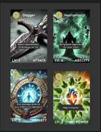

# Frontend Low Level Design

## Overview

The frontend application is built using React with TypeScript, following a component-based architecture. The application integrates with the backend services through RESTful APIs and manages game state using React Context and local state management.

## Type Definitions & Interfaces

### Core Types

#### Game Progress
- Game progress will contain the current story node, players inventory at the time, and the date the player last played the game. 

```typescript

type GameProgress = {
  currentStoryNode: string;
  inventory: Card[];
  lastPlayed: Date;
};
```
#### Card
- The card type will contain attributes and descriptions of the card. It will also have a link to the S3 bucket where we store the card image. Cards will have both attributes and effects, to provide a wide range of options for the player. 
```typescript

type Card = {
  id: string;
  name: string;
  description: string;
  imageUrl: string;
  type: CardType;
  attributes: CardAttributes;
  effects: CardEffect[];
};

type CardType = 'attack' | 'defense' | 'buff' | 'special';
type EffectType = 'damage' | 'heal' | 'buff' | 'debuff';
type CardAttributes = {
  cost: number;
  power: number;
  duration?: number;
};

type CardEffect = {
  type: EffectType;
  value: number;
  duration?: number;
};

```
#### Game State and Player Story Nodes
- We need a way to store story information, for when players leave and exit the game. We also 

```typescript
type GameState = {
  currentStory: StoryNode;
  playerState: PlayerState;
  bossState?: BossState;
  inventory: Card[];
};

type StoryNode = {
  id: string;
  content: string;
  choices: Choice[];
  items?: Item[];
};

type Choice = {
  id: string;
  text: string;
  nextNodeId: string;
  consequences?: GameStateChange[];
};
```


// Battle Types
type BossState = {
  id: string;
  name: string;
  health: number;
  maxHealth: number;
  imageUrl: string;
  abilities: BossAbility[];
};

type BossAbility = {
  name: string;
  damage: number;
  effects: CardEffect[];
};
```

### API Interfaces

```typescript
interface GameAPI {
  startGame(): Promise<GameState>;
  makeChoice(choiceId: string): Promise<GameState>;
  useCard(cardId: string, targetId?: string): Promise<GameState>;
  collectItem(itemId: string): Promise<Card>;
  saveProgress(gameState: GameState): Promise<void>;
}

interface AuthAPI {
  login(credentials: LoginCredentials): Promise<User>;
  logout(): Promise<void>;
  register(userData: RegistrationData): Promise<User>;
  resetPassword(email: string): Promise<void>;
}

interface CardAPI {
  getCards(): Promise<Card[]>;
  upgradeCard(cardId: string): Promise<Card>;
  getCardDetails(cardId: string): Promise<Card>;
}
```

## Component Architecture

### Core Components

#### CardComponent
```typescript
interface CardProps {
  card: Card;
  isPlayable: boolean;
  onUse?: (cardId: string) => void;
  className?: string;
}

const Card: React.FC<CardProps> = ({ card, isPlayable, onUse, className }) => {
  // Component implementation
};
```

#### StoryDisplay
```typescript
interface StoryDisplayProps {
  node: StoryNode;
  onChoiceSelected: (choiceId: string) => void;
}

const StoryDisplay: React.FC<StoryDisplayProps> = ({ node, onChoiceSelected }) => {
  // Component implementation
};
```

#### BattleInterface
```typescript
interface BattleInterfaceProps {
  playerState: PlayerState;
  bossState: BossState;
  availableCards: Card[];
  onCardPlayed: (cardId: string) => void;
}

const BattleInterface: React.FC<BattleInterfaceProps> = ({
  playerState,
  bossState,
  availableCards,
  onCardPlayed,
}) => {
  // Component implementation
};
```

#### Inventory
```typescript
interface InventoryProps {
  cards: Card[];
  onCardSelected: (card: Card) => void;
}

const Inventory: React.FC<InventoryProps> = ({ cards, onCardSelected }) => {
  // Component implementation
};
```

### Layout Components

#### GameLayout
```typescript
interface GameLayoutProps {
  children: React.ReactNode;
  showInventory?: boolean;
  showStats?: boolean;
}

const GameLayout: React.FC<GameLayoutProps> = ({
  children,
  showInventory,
  showStats,
}) => {
  // Component implementation
};
```

## Pages

### HomePage
```typescript
const HomePage: React.FC = () => {
  // Implementation for landing page
};
```

### GamePage
```typescript
const GamePage: React.FC = () => {
  // Main game implementation
};
```

### BattlePage
```typescript
const BattlePage: React.FC = () => {
  // Battle system implementation
};
```

### InventoryPage
```typescript
const InventoryPage: React.FC = () => {
  // Card collection and management implementation
};
```

### AuthPages
```typescript
const LoginPage: React.FC = () => {
  // Login implementation
};

const RegisterPage: React.FC = () => {
  // Registration implementation
};
```

## State Management

### Game Context
```typescript
interface GameContextType {
  gameState: GameState;
  dispatch: React.Dispatch<GameAction>;
}

type GameAction =
  | { type: 'UPDATE_STORY'; payload: StoryNode }
  | { type: 'USE_CARD'; payload: { cardId: string; targetId?: string } }
  | { type: 'COLLECT_ITEM'; payload: Item }
  | { type: 'UPDATE_PLAYER_STATE'; payload: Partial<PlayerState> };

const GameContext = React.createContext<GameContextType | undefined>(undefined);
```

### Auth Context
```typescript
interface AuthContextType {
  user: User | null;
  login: (credentials: LoginCredentials) => Promise<void>;
  logout: () => Promise<void>;
}

const AuthContext = React.createContext<AuthContextType | undefined>(undefined);
```

## API Integration

### API Client
```typescript
class APIClient {
  private baseUrl: string;
  private token: string | null;

  constructor(baseUrl: string) {
    this.baseUrl = baseUrl;
    this.token = null;
  }

  setToken(token: string) {
    this.token = token;
  }

  async get<T>(endpoint: string): Promise<T> {
    // Implementation
  }

  async post<T>(endpoint: string, data: any): Promise<T> {
    // Implementation
  }

  async put<T>(endpoint: string, data: any): Promise<T> {
    // Implementation
  }

  async delete(endpoint: string): Promise<void> {
    // Implementation
  }
}
```

### API Hooks
```typescript
function useGame() {
  const [gameState, setGameState] = useState<GameState | null>(null);

  // Implementation
}

function useCards() {
  const [cards, setCards] = useState<Card[]>([]);

  // Implementation
}

function useBattle() {
  const [battleState, setBattleState] = useState<BattleState | null>(null);

  // Implementation
}
```
# Additional UI Prototypes

Below are the newly added UI prototypes showcasing the main screens of the application. Each prototype is accompanied by a brief explanation of its purpose, key elements, and how it fits into the overall user flow.

---

## 1. Login Screen


**Purpose:**
- Provide users with a straightforward way to log in or register.
- Offer multiple sign-in options (e.g., Google, Microsoft) for convenience.

**Key Elements:**
- **Email & Password Fields:** Standard text inputs for credentials.
- **Social Login Buttons:** Quick authentication through external providers.
- **Submit Button:** Triggers login or registration flow.

**Flow Integration:**
1. **User enters credentials** (or chooses a social login).
2. **On success**, user is directed to the main game dashboard or character creation screen.

---

## 2. Character Creation


**Purpose:**
- Allow players to customize their game experience before starting.
- Select difficulty (“Hard” or “Merciful” modes), choose a game mode (single-player, multiplayer), and input character details.
- Optionally generate an AI-created avatar image based on the user’s description.

**Key Elements:**
- **Difficulty & Mode Selectors:** Radio buttons or dropdowns for selecting how challenging or story-driven the game will be.
- **Character Description Input:** Text field for the user to describe their character. This description is used to generate a personalized avatar image via AI.
- **Play Button:** Commits selections and initializes the game session.

**Flow Integration:**
1. **User selects difficulty level** (e.g., Hard or Merciful).
2. **User chooses game mode** (single-player, co-op, etc.).
3. **User enters a character description** and sees an AI-generated avatar.
4. **Clicking “Play”** starts the game and loads the initial story node.

---

## 3. Deck View



**Purpose:**
- Display the user’s current collection of cards.
- Provide detailed information on each card’s level, type (Attack, Ability, Power), and effects.

**Key Elements:**
- **Card Grid/List:** Each card is shown with its name, level, and an image.
- **Card Details:** Hovering or clicking on a card can reveal more in-depth stats or upgrade options.
- **Navigation Back to Game:** A clear way to return to the main story or battle interface.

**Flow Integration:**
1. **User opens the Deck screen** from a navigation menu or button.
2. **User reviews available cards**, possibly upgrades or discards them.
3. **Returning to the main game** continues story progression or battle interactions.

---

## 4. Chest Opening


**Purpose:**
- Present a reward or loot screen where the user can pick one new card to add to their deck.
- Occurs after certain story milestones, battles, or quest completions.

**Key Elements:**
- **Three Card Options:** Each with a unique effect, type, or rarity.
- **Selection Prompt:** “Pick a card and continue your journey.”
- **Add to Deck:** The chosen card is added to the user’s inventory for future battles.

**Flow Integration:**
1. **User completes an event** (defeats a boss, completes a quest, etc.).
2. **A chest screen appears** with three random card rewards.
3. **User selects one card** to keep, which is then stored in their deck/inventory.

---

## 5. Battle View


**Purpose:**
- Facilitate real-time or turn-based combat against bosses or other players (1v1 or multiplayer co-op).
- Display each participant’s health, chosen cards, and current status.

**Key Elements:**
- **Player & Enemy Portraits:** Show health bars, mana (if applicable), and character images.
- **Chosen Cards:** Each side reveals the card they’re playing this turn (attack, defense, ability, etc.).
- **View Deck Button:** Allows quick access to the player’s card collection to plan the next move.

**Flow Integration:**
1. **Battle starts** (boss encounter, PvP, or co-op).
2. **Players select cards** to play each round (using the “View Deck” button to choose).
3. **Round resolves**, showing damage dealt, healing, or buffs/debuffs applied.
4. **Repeat until** one side is victorious or the battle ends.

---

## How These Screens Fit Into the Overall Experience

1. **Login** → 2. **Character Creation** → 3. **Main Story/Battles**
   - Users begin at the login screen, authenticate, and create or load their character.
   - Once the character is set, they enter the main game flow, which can include battles, story progression, and deck management.

2. **Deck & Chest Interactions** are auxiliary:
   - Players access the **Deck View** at any time to strategize or upgrade.
   - **Chest Opening** occurs after significant milestones, rewarding players with new cards.

3. **Battle View** is central to combat encounters:
   - Displays real-time updates on health, mana, and card usage.
   - Integrates seamlessly with the deck system, allowing players to select the best cards for each encounter.

---

**Note:**  
All images shown are prototypes and subject to change based on ongoing user testing and feedback. Accessibility features such as proper color contrast, keyboard navigation, and ARIA labels are integrated to ensure inclusivity and a positive user experience.