# The Last Game Design Document

This design document is divided into 2 sections, a high-level design and a low-level design document. The low-level design takes place right after the High-level Ui design.


AI Note: This Design document was created with the assistance of ChatGpt.
# Group 5: High-Level Design Document: The Last Game

 ### **Design Summary:**

This design document outlines the architecture, security measures, and user interface for "The Last Game", a roguelike RPG card-based game where content is generated by AI to provide a unique user experience. Our design integrates multiple components for a seamless player experience. The database design ensures the persistence of user data, including game state, card collections, and transaction records, with robust relationships between entities like users, cards, and combat encounters. The game system includes interfaces for internal components, such as game logic, card management, and transaction tracking, and external systems like OAuth authentication, Stripe payment processing, and AI-driven content generation (for cards and story progression). These interfaces work in tandem to provide a smooth and responsive user experience.

Security is prioritized throughout the design with encryption, token-based authentication, and anti-cheat mechanisms to protect player data and game integrity. The possible multiplayer experience is safeguarded against exploits and DDoS attacks, and user privacy is ensured through anonymized data and secure communication protocols. The UI is designed with a modern aesthetic and responsive layout, leveraging a customizable theme system powered by AI. The game will run on web platforms with support for desktop and tablet browsers, offering an engaging and dynamic gameplay experience while ensuring reliable communication with both internal and external components for features like user management, transactions, and content generation. See table of contents to dive more into the details of our design.


## Table Of Contents
1. Stakeholder Expectations
   1. Game Players
   2. Game Developers/Operators
   3. Business Stakeholders

2. Game Design

3. System Overview

   
4. Backend Design

   
   4.1 Internal Interfaces
   
      1. User Authentication Interface
      2. Game Engine Interface
      3. Card Management Interface
      4. Payment Interface
      5. AI Image Generation Interface
      6. AI-Language Model Interface
         
   4.2 External Interfaces
   
      1. Stripe
      2. AI-Language Model
      3. AI Image Generator service
      4. Database with Supabase
      5. OAuth

5. Input/Output Processing for Backent

    1. Input Processing
    2. Output Processing
    3. Error Handling & Logging
         
6. Database Design

      1. Purpose
      2. Actions and Responsibilities
      3. Communication with other Components
      4. Tables and Entities
  
   
7. Risks and Security Design
    
    1. Authentication and Authorization
    2. Data Protection and Privacy
    3. Payment Security with Stripe
    4. Mitigating Common Attacks
    5. Secure Multiplayer and Fairplay
    6. Disaster Recover & Incident Response
    
   
8. UI Design
   
   1. Hardware Platform
   2. User Interface Design
   3. UI Flow
   4. Input/Output Processing
   5. Component Architecture
   6. Implementation Strategy
   

## **1. Stakeholder Expectations:**


### **i.** **Game Players:**

   - **Engagement & Enjoyment:** Players expect an immersive and evolving gaming experience powered by AI. The AI-generated stories should feel dynamic, with player choices significantly impacting the narrative, ensuring replayability.
     
   - **Customization & Progression:** The card collection system should feel unique for each player based on the story they are experiencing. Players want to see meaningful rewards tied to their in-game actions and feel a sense of accomplishment.
     
   - **Visual Appeal:** Players expect unique card visuals that are generated through AI, adding to the game's charm and personalization. UI should be easy to navigate and use.
     
   - **Security & Privacy:** Players are concerned about the security of their data, especially during payments and personal information storage. They expect a secure authentication process (OAuth) and protection of their game history and progress.
     
   - **Accessibility & Convenience:** Players expect easy access to the game through a web interface, intuitive game flow, and secure sign-ins without the need for managing multiple passwords.

### **ii.** **Game Developers/Operators:**

   - **Scalability & Flexibility:** The development team expects the system to be easily scalable and flexible for future feature expansion, such as adding more cards, boss battles, or in-game events.
     
   - **Maintainability:** Developers expect the system to be modular, with clear separation of concerns between the client-side and server-side components, facilitating maintenance and bug fixes.
     
   - **Security & Compliance:** The security design, including encryption, fraud protection, and adherence to privacy regulations, is crucial for the development team to ensure compliance and protect user data.
     
   - **External Service Integration:** Developers expect seamless integration with third-party services (Stripe, AI models, OAuth) for payment processing, authentication, and story generation.

### **iii.** **Business Stakeholders (Product Owners/Investors):**

   - **Monetization & Payment Handling:** Business stakeholders expect the integration with Stripe to support seamless in-game purchases, ensuring a reliable and secure transaction process for users, with potential for future monetization.
     
   - **User Acquisition & Retention:** Business stakeholders expect the game’s dynamic content and personalized experiences (via AI) to drive player engagement, retention, and growth. The game’s potential to scale should allow for new content and features that can attract and retain a large user base.
     
   - **Analytics & Data Management:** Stakeholders expect robust analytics on user behavior, progress, and in-game purchases, allowing for data-driven decision-making and targeted updates or new features.
     
   - **Security & Trust:** Business stakeholders are also invested in the system’s security and the reputation of the platform. Protecting user data and ensuring safe gameplay experiences is essential for maintaining user trust and preventing any negative public relations or financial impact from security breaches.


Overall, each stakeholder group expects a seamless, secure, and engaging experience, with a system designed for scalability and ease of expansion.


## 2. Game Design


### Glossary (**Bolded** words are defined here)

- *AI-driven* - All content will be generated by AI dynamically, based on the user's actions.<a name="AI-driven"></a>
- *Roguelike* - Death will be permanent, meaning the player will restart from scratch upon each death.
- *Deckbuilding* - Combat will be card-based, and the player will collect new cards, increasing the size of their deck as they play through scenarios.
- *Run* - A single playthrough of the game, from beginning to death.
- *Mana* - What the player uses to play cards. 
  - Each card has an associated mana cost.
- *Attack* - A type of card that deals damage and possibly applies status effects.
- *Ability* - A type of card that performs a one-time action.
- *Power* - A type of card that applies an effect that lasts for the rest of the combat.
- *Keyword* - See [Game Rules](#game-rules) for more info.

### Game Overview


**Last Game** will be an **AI-driven**, dynamic **roguelike** **deckbuilding** game.


- *Gameplay*  
  - The player will be faced with decisions and will be prompted by the AI to influence events and play through scenarios.
    - These scenarios will develop the story and also serve to increase the player's resources for combat.
  - The player will be placed in combat, and they will fight against enemies using the cards in their deck.
  - The player will be allowed to play for as long as they want to, without a specific end in mind.
    
- *Modes*
  - The main game mode will be a single-player campaign mode.
  - There will also be a multiplayer co-op mode that will allow two or more users to simultaneously play in the same game instance.


### Gameplay Mechanics


- *Text Interaction* 
  - The user will interact with the AI through a text entry box.
  - The AI will give the user a scenario and ask the user what their character will do.
    - This could consist of a binary choice or an open-ended prompt.
  - The AI will respond to the user's prompt and dynamically generate new content based on previous input.
  - The AI should be able to respond to any input the user gives, even if that input attempts to do something unrealistic.
    
- *Combat*
  - Combat will be turn-based
    - The player will always go first
      - With multiple players, the order is arbitrary, but enemies go last.
    - A turn will consist of the player playing various cards within the limits of their **mana**.
    - A player will select an "End Turn" button when they are ready to move on.
    - The player may play as many actions as they wish, as long as they don't exceed their **mana** reserve.     
  - Combat can end upon meeting one of two conditions:
    - The player's health reaches 0
    - All enemies' health is reduced to 0
  - The player should be able to see a card's description by clicking on it.
  - The player can play a card by dragging it upwards into the play area.
  - The player should be able to see their total and current **mana**.

  

Example of how UI and gameplay will look


- *Cards*
  - Cards will have several consistent features, and will always fit within certain rules:
    - Cards will have an associated **mana** cost.
    - Cards will have a title.
    - Cards will have a picture.
    - Cards will have one of the following attributes:
      - **Attack** 
      - **Ability** 
      - **Power** 
    - Cards will have a description.
      - This description will include any associated **keywords** in a distinct font.
      - The player should be able to hover over any **keywords** and a description of that **keyword** will be displayed.
    - Cards must consistently obey their own descriptions when played.

   
### Game Rules


- *Death*
  - When a player reaches 0hp, they die and must restart the game.
- *Gaining Cards*
  - The AI will generate three options for the player to choose from each time they complete combat.
  - The player will be able to gain cards when the AI allows them to during text prompt (non-combat) scenarios
    
- **Keywords**
  - Keywords are certain words that the AI understands have an exact, consistent meaning.
  - These keywords can range from 
  - Some keywords that we will implement are:
    - Base Effects
      - **Damage** - The attack will deal `n` damage to the target
      - **Defense** - The target will receive `n` block until their next turn
    - Status Effects
      - **Stunned** - The target will lose their next `n` turns
      - **Confused** - The target has a 50% chance to miss any attack for `n` turns
      - **Invincible** - The target is invulnerable to damage for `n` turns
      - **Exposed** - The target takes 25% more damage for `n` turns
      - **Weakened** - The target deals 25% less damage for `n` turns
      - **Slowed** - The target gains 25% less block for `n` turns
    - Buffs
      - **Strength** - The target deals `n` more damage until the end of combat
      - **Speed** - The target gains `n` more block until the end of combat
  - Keywords always produce an expected effect.


## 3. System Overview

The system follows a client-server architecture where the client is a web application that communicates with a backend server to handle game state, user accounts, card collections, payments, and story generation. The server-side logic will be responsible for processing game logic, generating dynamic stories using AI language models, and managing data persistence.


### Key Components

#### **Client (Web Interface)**

- **Frontend (UI)**: Provides users with an interface for interacting with the game, such as creating accounts, initiating game sessions, viewing storylines, and interacting with the game world (e.g., collecting cards, battling bosses).
  
- **Game State Management**: The client stores temporary game states and interactions while interacting with the server to update game progress.

---

#### **Backend (Server)**

- **API Layer**: The server exposes RESTful APIs to facilitate communication with the client. It will be responsible for handling requests like card collection updates, story generation, and game state management. Handled with Game Engine Interface.
  
- **Internal Backend Interfaces**: The core of the backend, which handles the AI-generated story, card interactions and generation, and game logic (including user progress and boss battles).

- **Database**: A relational database to persist game data, user accounts, card collections, game progress, and transaction history (uses Supabase as our database).

---

#### **External Services**

- **Stripe**: For handling payments and purchasing the game.

- **AI-Language Model**: An AI-based model that generates stories for the game. This can be an API for a pre-trained model like GPT-4 or a custom language model.

- **AI Image Generation**: An external service to generate card images based on AI models, providing users with unique visual content for the game.

- **OAuth**: For handling authentication and providing extra security for the user. Supabase will be integrated to handle OAuth and authentication.(Handled by Supabase.
  
- **Supabase**: Database used for authentication, storing game state, images, and card data.


### Design Rationale

Client-Server separation ensures a clear division of responsibilities, allowing the backend to manage game logic and storage, while the frontend focuses on delivering an interactive experience. REST APIs provide a standard interface for communication, ensuring scalability and ease of integration with external services (like Stripe and the AI models).


---


## 4. Backend Design


### 4.1 Internal Interfaces
**Change Note for low level:** During our low-level design we decided to deviate slightly specifically with regards to the Game engine. Instead of the game engine being focused on game logic like executing battles we have moved most of that logic to the front end and will use the backend for AI generation and communicating with the client to send and store data. The game engine will be an access point for the front end and will be responsible for sending and receiving data. We also break the Ai language model interface into sub-interfaces; one in charge of the story and another with creating attributes for bosses and characters.


#### i. **User Authentication & Authorization Interface**

- **Purpose**: Validates user authorization using Supabase and OAuth for secure access.
  
- **Actions**:
  
  - Uses Supabase to validate that the user has permission to access game data, allowing the Game Engine to retrieve user information.
  
- **Communication with Other Interfaces**:
  
  - **Internal**:
    
    - **Database**: Interacts with the user table to store credentials and securely hash passwords (via Supabase).
    - **Game Engine**: Grants access to the user's game state data after successful validation.
    - **Payment**: Confirms user’s purchase status via the Payment Interface.
      
  - **External**:
    
    - **Supabase**: Checks access tokens stored in the Supabase database and allows the backend to retrieve user data.
  
- **Rationale**: The User Authentication & Authorization Interface ensures secure user access by checking that a user has a valid access token before granting access to user data. With Supabase managing both OAuth and database storage, this interface will be fairly simple and just check that our Supabase database has authenticated a user before granting access to user data.

---

#### ii. **Game Engine (Story Generation & Game Logic) Interface**


- **Purpose**: Powers dynamic story generation, and manages game flow, player choices, and game logic. 

  
- **Actions**:
  
  - **Story Generation**: Requests internal AI-language model to generate story content.
  - **Handle Player Actions**: Processes player choices (e.g., collecting items, battling bosses).
  - **Card & Buff Management**: Manages cards and buffs during in-game interactions. (The card Management interface is responsible for updating, creating, and returning card actions. The game engine interface is responsible for applying the effects in-game and to the client)
  - **Boss Battle Simulation**: Executes logic for combat and progression.

  
- **Communication with Other Interfaces**:
  
  - **Internal**:
    
    - **Card Management**: Gives card details to card management for creating new cards based on player actions. Card management will send back card details and actions.
    - **AI Image Interface**: Requests images for game content like boss fights.
    - **AI-Language Model Interface**: Generates story updates based on player input.
      
  - **External:**
    
    - **Supabase Database**: Saves player’s progress, permanent game state, and updates inventory during interactions.

  
- **Rationale**: This interface serves as the central hub for game progression. It coordinates between multiple systems (card management, database, story generation) to deliver a consistent experience, keeping the flow of the game intact.

---

#### iii. **Card Management Interface**

- **Purpose**: Handles the collection, use, and upgrades of cards within the game.
  
- **Actions**:
  
  - **Card Generation**: Creates new cards based on in-game events and item descriptions.
  - **Card Usage**: Allows players to use cards for battles or buffs.
  - **Card Collection**: Tracks and updates the player's card inventory.
  - **Card Upgrades**: Manages potential future upgrades of cards.
  
- **Communication with Other Interfaces**:
  
  - **Internal**:
    
    - **Game Engine**: Updates card collection and usage during events.
    - **Database**: Stores card inventory and updates each card's use or collection.
    - **AI Image Generation**: Requests images for newly generated cards.
  
- **Rationale**: By separating card management, the game engine remains focused on game flow, while the Card Management Interface takes care of card creation and updates independently. This allows for easy future expansion of card-related features.

---


#### iv. **Payment Interface (Stripe Integration)**

- **Purpose**: Facilitates in-game purchases and the initial purchase of the game using Stripe.
  
- **Actions**:
  
  - **Purchase Game**: Handles payment processing through Stripe API.
  - **Transaction History**: Logs purchases to verify user’s game access.
  
- **Communication with Other Interfaces**:
  
  - **Internal**:
    
    - **Database**: Stores transaction records and verifies user access.
    - **User Authentication**: Updates user access after a successful payment.
  
  - **External**:
  
    - **Stripe API**: Processes payments and returns transaction statuses.
  
- **Rationale**: A separate Payment Interface allows for clean management of financial transactions. It ensures the game can be easily updated in the future if more payment options are required. This is more of a could-have for us, so it will not be highly prioritized during our implementation. 

---

#### v. **AI Image Generation Interface**

- **Purpose**: Generates custom images for cards and other in-game visuals.
  
- **Actions**:
  
  - **Card Image Generation**: Requests images based on card attributes.
  - **Image Storage**: Stores generated images to the database.
  - **Boss Image Generation**: Generates visuals for bosses or enemies.
  - **Validation**: Ensures generated images are valid and usable.
  
- **Communication with Other Interfaces**:
  
  - **Internal**:
    
    - **Card Management**: Card management requests images for newly generated cards and is sent back image or error.
    - **Game Engine**: The game engine requests images for boss encounters.
   
      
  - **External**:
    
    - **Image Generation API**: Generates images based on given descriptions.
  
- **Rationale**: This interface isolates image generation to a single component, allowing easy changes and enhancements in the future. It simplifies image management and keeps the logic for visual elements modular. Having logic for image generation separate allows other components to use the interface without needing to know how it works.

---


#### vi. **AI-Language Model Interface**


- **Purpose**: Powers the AI-driven storylines for the game.
  
- **Actions**:
  
  - **Story Generation**: Generates narrative elements based on game state and user input.
  - **Boss Battle Descriptions**: Provides descriptions for bosses and encounters.
  - **Quality Control/Validation**: Ensures generated stories are in the correct format.
  - **Story Summary**: Provides summaries of major story beats.
  
- **Communication with Other Interfaces**:
  
  - **Internal**:
    
    - **Game Engine**: Requests story updates based on user choices.
    - **Database**: Stores story progress and player decisions.
      
  - **External**:
    
    - **AI-Language Model API**: Communicates with the LLM to generate dynamic narratives.
  
- **Rationale**: The AI-Language Model is key to the game’s dynamic narrative. Separating this functionality allows easy scalability and flexibility, ensuring stories are generated seamlessly.

---

### 4.2 External Interfaces


#### i. **Stripe Integration**


- **Purpose**: Handles all financial transactions for the game, from initial purchases to in-game purchases.


- **Actions**:
  
  - Processing and facilitating Payments: Responsible for allowing users to pay for the game.

  
- **Communication**:
  
  - **Backend → Stripe**: Requests stripe payment.
  - **Stripe → Backend**: Returns transaction status (success/failure).

- **Rationale**: Payment is handled externally to reduce security concerns within the game’s backend. Stripe allows secure, easy payment processing.

---

#### ii. **AI-Language Model (LLM)**

- **Purpose**: Generates dynamic, AI-powered storylines.

- **Actions:**
  
  - **Generating Story content:** Generates and returns story content based on prompts passed by the backend.
  -  **Generating Item Description:** Will generate descriptions of items that will be used to build cards.

- **Communication**:
  
  - **Internal AI-Language Model Interface → LLM API**: Sends user input to LLM to generate stories.
  - **LLM → Internal AI-Language Model Interface**: Returns generated story content.

- **Rationale**: By using an external LLM, we can scale and improve the narrative quality without maintaining complex AI models in-house.

---

#### iii. **AI Image Generation Service**

- **Purpose**: Provides unique images for cards and in-game visuals like bosses.

- **Actions:**
  
  - **Image Generations:** Generates images for in-game entities like cards and bosses/enemies.

  

- **Communication**:
  
  - **AI image generation internal interface → Image Generation API**: Requests for image creation.
  - **Image Generation API → AI image generation internal interface**: Returns generated image data.

- **Rationale**: Isolating image generation to a single interface allows flexibility in switching image providers or refining visuals in the future. Using external services allows us to avoid needing powerful computers to run the models locally and developing our own custom image model.


---


#### iv. **Database (Supabase)**

- **Purpose**: Provides backend services for user management, including authentication (via OAuth) and game data storage. Manages all persistent data, such as user accounts, game progress, cards, and transaction records using Supabase. See database design for more details.


- **Actions**:
  
  - **Store User Data**: Saves user credentials (token access) and user profile info.
  - **Store Game State**: Tracks player’s game progress, inventory, decisions, and stats.
  - **Transaction Logs**: Stores all payment transactions and tracks in-game purchases(if implemented in the future).
  - **Game History**: Saves past game sessions to allow users to resume their gameplay.
  - **Card Collection Management**: Stores and updates the player’s card collection.


- **Communication with Other Interfaces**:
  
  - **Internal**:
    
    - **User Authentication Interface**: Stores and retrieves user credentials via Supabase authentication. User Authentication interface will check Supabase for user access.
    - **Game Engine**: Retrieves and updates user game state and progress.
    - **Card Management**: Stores and updates player’s card inventory.
    - **Payment Interface**: Stores transactions for purchases and in-game items.
      
  - **External**:
    
    - **OAuth**: Will use OAuth providers to authenticate users.

      
- **Communication**:
  - **Backend → Supabase**: Communicates for tasks like sign-up, sign-in, game progress, and transactions.
  - **Supabase → Backend**: Returns user data, game state, and authentication details.


- **Rationale**: Supabase provides a comprehensive, out-of-the-box solution for user management, session handling, and database interactions, allowing us to focus on game development. Its user authentication will allow us to focus on gameplay without sacrificing security. By using Supabase for data storage, we can focus on building out the game mechanics and user experience.
  

---

#### v. **OAuth Authentication Service**

- **Purpose**: Manages user authentication via OAuth providers (e.g., Google, Facebook) for secure login. (note: Supabase will be responsible for using OAuth)

- **Communication**:
  - **Supabase**: Verifies user and provides session tokens.
  
- **Rationale**: OAuth authentication reduces the overhead of managing user passwords. Supabase will simplify OAuth handling and session management. 

---


### Interface Rationale

We divided our project into these interfaces to separate logic and ensure flexibility. This modular approach will make debugging easier and provide a solid foundation for future feature additions. Each interface is designed to handle a specific concern, ensuring that the overall system remains organized and adaptable.

***Interface Interaction Overview***


---

## 5. Input/Output Processing for Backend

### Overview

The backend of "The Last Game" follows a structured Input/Output (I/O) model to facilitate communication between the client, database, external services, and internal game logic components. This section outlines the I/O processing in terms of API endpoints, data flows, and interactions between different backend components.

### 1. Input Processing

Input processing consists of handling requests from the frontend, validating data, and ensuring smooth interactions with external and internal interfaces.

#### i. API Requests from Client

The backend receives requests primarily via RESTful API endpoints, including:

*   Authentication Requests (OAuth, Supabase Token Verification)
*   Game State Updates (User actions, card plays, boss fights)
*   AI Story Requests (Dynamic narrative updates based on user input)
*   Payment Handling (Stripe integration for purchases)
*   Card Collection Management (Adding/upgrading cards)
*   Image Requests (AI-generated assets for cards and game entities)

Example request: Card usage
```json
{
  "user_id": "abc123",
  "session_id": "session_xyz",
  "card_id": "fire_spell_01",
  "action": "play",
  "target": "enemy_001"
}
```

*   The Game Engine Interface validates the request and applies the effects.
*   The Card Management Interface updates the card’s status.
*   The Database Interface records changes in the player's inventory and logs the action.

#### ii. Data Validation & Security Checks

Every request undergoes:

*   User Authentication & Authorization via Supabase.
*   Input Sanitization to prevent SQL injections and XSS.
*   Rate Limiting to avoid abuse of endpoints.
*   Game Logic Validation to ensure requests align with defined rules.

Example: Unauthorized Access Rejection

If a user attempts to access a restricted endpoint without a valid session token:
```json
{
  "error": "Unauthorized Access",
  "status_code": 401
}
```

### 2. Output Processing

Once input is validated and processed, the backend responds with structured data.

#### i. API Responses to Client

Each API request results in:

*   Game State Updates (current progress, active cards, battle state)
*   Narrative Responses (LLM-generated story events)
*   Payment Confirmations (Stripe verification)
*   Card & Inventory Changes (new items, upgraded abilities)
*   Image URLs (Generated assets for gameplay)

Example Response: Game State Update
```json
{
  "user_input": "Explore the dark cave",
  "current_context": "The player is at the cave entrance with a torch.",
  "game_state": {
    "hp": 78,
    "inventory": ["torch", "dagger"]
  }
}
```

Response from AI Language Model:
```json
{
  "story_update": "You step into the damp cave, the torch flickering against the cavern walls. The sound of dripping water echoes in the darkness."
}
```

### 3. Error Handling & Logging

All backend interactions include error handling to maintain system stability.

#### i. Error Categories

*   Client Errors (4xx): Invalid requests, unauthorized access, missing parameters.
*   Server Errors (5xx): Database failures, AI service timeouts, API rate limits.
*   Game Logic Errors: Invalid card plays, rule-breaking actions.

Example: Invalid Card Play Response
```json
{
  "error": "Invalid Move",
  "details": "Card 'fire_spell_01' requires 2 mana, but only 1 mana is available.",
  "status_code": 400
}
```

#### ii. Logging & Monitoring

*   API Request Logs: Tracks all interactions for debugging.
*   Error Logs: Catches and stores failures for analysis.
*   Performance Metrics: Monitors API response times and external service latency.

## 6. Database Design

### i. Purpose
Manages all **persistent game data**, integrating with [Supabase](https://supabase.com/) for user authentication and storage. This interface ensures consistency and durability for essential information like:

- **User Accounts** 
- **Game State** 
- **Card Collections** 
- **Transaction Records** 
- **Story Progress & History** 

---

### ii. Actions / Responsibilities

1. **Store User Data**  
   - Create new user records
   - Store minimal profile info (username, email, etc.) with the help of OAuth use
   - Maintain ban status if necessary
   - Store purchase status (accounts can be created before purchase)

2. **Store & Retrieve Game State**  
   - **Runs** (playthroughs): Current HP, mana, deck contents, progress through the story, etc.  
   - **Permanent Death**: Mark runs as inactive/completed upon the user’s HP reaching 0 (in line with Roguelike rules).
   - Multiplayer session info (if the user is playing co-op).

3. **Transaction Logs**  
   - Record successful or failed payment attempts from the **Payment Interface** (Stripe).
   - Update user access once purchases are confirmed.

4. **Game History & Analytics**  
   - Optionally store each finished run or partial logs for replay, analytics, or user records.
   - Keep track of user decisions or story branches.

5. **Card Collection Management**  
   - Store the user’s current deck: which cards they own, how many duplicates, any upgrades, etc.
   - Store global definitions for each type of card (Attack, Ability, Power) and link them to user decks.
   - Support card generation (as the cards are generated by AI, there shouldn't be a stored number of preset cards as new and unique cards being added will be a constant, although there should be a master table of all cards generated so far)

---

### iii. Communication With Other Components


- **User Authentication Interface**  
  - **Reads/Writes** user data (account creation, OAuth tokens).
  - Verifies user has purchased the game before granting broader permissions.


- **Game Engine**  
  - **Retrieves** and **stores** user runs (HP, deck composition, current scenario).
  - Logs and updates combat states or story progress.


- **Card Management**  
  - **Saves** newly generated cards in the user’s deck.
  - **Reads** card definitions from a master list (e.g., from a `cards` table).
  - Updates deck composition upon collecting or removing cards.


- **Payment Interface**  
  - **Writes** transaction records for successful Stripe payments.
  - **Reads** user purchase status to confirm game access.


- **AI-Language Model Interface** (Optional)  
  - Log and retrieve narrative progress for story building.


- **AI Image Generation Interface** (Optional)  
  - Store references to generated images in the database (e.g., linking them to specific cards or enemies).
---


### iv. Tables & Entities

#### 1. Users Table

- **Fields:**
  - `user_id` (PK)  
  - `email` or `username`  
  - `created_at`, `updated_at`  
  - `purchase_status` 

#### 2. Runs (Playthroughs)

- **Fields:**
  - `run_id` (PK)  
  - `user_id` (FK → `users.user_id`)  
  - `current_hp`, `max_hp`  
  - `mana_capacity`
  - `is_active` (bool) — **false** when the run ends (death)  
  - `started_at`, `ended_at`  
  - `status_effects` (JSON) to track non-combat statuses.  

#### 3. Cards

- **Fields:**
  - `card_id` (PK)  
  - `title`, `type` (Attack, Ability, Power)  
  - `mana_cost`  
  - `description` *(text)*  
  - `keywords` *(JSON or text)* — e.g., `["Damage(6)","Weakened(2)"]`  
  - `image_url` (for AI-generated images stored in AWS S3 Bucket)  
- **Notes:**  
  - This table is the **master list** of all card definitions.  
  - The actual user deck references these by `card_id`.

#### 4. Player_Cards (Decks)

- **Fields:**
  - `deck_entry_id` (PK)  
  - `run_id` (FK → `runs.run_id`)  
  - `card_id` (FK → `cards.card_id`) 
  - `user_id` (FK →  `users.user_id`) 
  - `quantity`  
- **Notes:**  
  - Many-to-many relationship: a run can have many cards, and a card can exist in many runs (with different quantities).  
  - This effectively tracks each run’s **deck** composition.

#### 5. Combat / Encounters

- **`combat` Table**  
  - `combat_id` (PK)  
  - `run_id` (FK)  
  - `is_active` (bool)  

- **`combat_participants` Table**  
  - `combat_id` (FK)  
  - `participant_id` (PK)  
  - `entity_type` (“player” or “enemy”)  
  - `entity_id` (points to either `users` or `enemies` if it’s an enemy type)  
  - `current_hp`  
  - `status_effects` (JSON)

- **`combat_actions` Table** (logging each turn)  
  - `action_id` (PK)  
  - `combat_id` (FK)  
  - `participant_id` (FK)  
  - `card_id` (FK or null)  
  - `action_type` (Attack, Defend, etc.)  
  - `details` (JSON: damage done, targets, etc.)  
  - `timestamp`

  - **`enemies` Table**:
  - `enemy_id ` (PK)   
  - `description`     
  - `status`  
  - `health`  

  - **`enemy_attacks` Table** 
  - `attack_id` (PK)
  - `keywords` *(JSON or text)* — e.g., `["Damage(6)","Weakened(2)"]`
  - `enemy_id` (FK) 
  - `animation_type` (Shake, Disappear, Charge, etc.)


#### 6. Payments / Transactions

- **Fields:**
  - `transaction_id` (PK)  
  - `user_id` (FK)  
  - `stripe_payment_id` or `transaction_ref`  
  - `amount`   
  - `status` (success, failed, etc.)  
  - `created_at`  
- **Notes:**  
  - The **Payment Interface** writes to this table upon receiving success/fail from Stripe.  
### Visualization of Tables


---


## 7. Risks and Security Design
This was generated with the assistance of ChatGPT, which provided efficient and well-structured explanations for our chosen security measures. It helped articulate our reasoning more clearly and concisely than I could have expressed on my own, ensuring a thorough and well-documented approach to our security design.

### i. Authentication and Authorization
To secure user accounts and prevent unauthorized access, I chose **OAuth** for authentication. This is an industry-standard approach that removes the need for our game to store and manage passwords directly, reducing security risks.

- **OAuth Implementation:** Players will log in using trusted third-party authentication providers like Google, Microsoft, or Apple. This makes it easier for players to sign in without having to remember new credentials while also leveraging the security measures that these platforms already have in place.
- **Token-Based Authentication:** After a successful login, a short-lived access token will be issued, while a refresh token could be used to maintain session continuity. I chose this approach because it balances security and user convenience. This would keep users logged in without forcing them to re-login multiple times.
- **Two-Factor Authentication (2FA):** This will be an optional feature for users who want to add security, particularly for accounts with high in-game value. I included this because it mitigates account takeovers but won't be mandatory unless we store sensitive personal data like credit cards.

### ii. Data Protection & Privacy
Protecting player data is a top priority. I designed our approach based on encryption best practices and compliance with industry regulations.

- **Encryption of Sensitive Data:** Any personally identifiable information (PII) or game-related data will be encrypted where necessary. I chose this because it minimizes risks in case of data leaks while ensuring compliance with security standards.
- **Anonymized Analytics:** Analytics data will be aggregated and anonymized before storage to comply with regulations like GDPR and CCPA. This ensures that player data remains private while still allowing us to analyze game trends.
- **Secure Communication:** I chose TLS 1.3 encryption for client-server communication because it prevents eavesdropping and MITM (Man-in-the-Middle) attacks. TLS 1.3 is also faster than previous versions because it only requires one round trip instead of two. This is especially useful for multiplayer gaming, where latency matters.

### iii. Payment Security with Stripe
Since we could be handling in-game transactions, I decided to use Stripe as our payment processor.

- Stripe is a widely trusted payment provider with built-in security measures like PCI DSS compliance and fraud detection. It also supports multiple payment methods, including credit cards, Apple Pay, and Google Pay, making it easy for players to complete transactions securely.
- Instead of handling credit card details directly, we will use Stripe’s tokenization system to process payments securely. This means we never store sensitive payment data ourselves, reducing our security liability.
- Stripe includes real-time fraud detection, which helps prevent unauthorized transactions. I chose this because it adds an extra layer of security to in-game purchases and prevents chargebacks due to fraudulent activity.

### iv. Mitigating Common Attacks
Since online games are often targeted by cyber threats, I designed a set of security measures to protect our game from common attacks.

#### 1. DDoS Protection
DDoS attacks can cause major disruptions in multiplayer games, so I implemented multiple layers of defense:

- **Rate Limiting & Throttling:** Limits excessive requests from a single source to prevent bot-driven traffic spikes.
- **Traffic Monitoring & IP Filtering:** Detects unusual traffic patterns and blocks suspicious requests before they affect gameplay.
- **CDN & Load Balancing:** A Content Delivery Network (CDN) distributes game assets efficiently, and load balancing ensures fair distribution of incoming traffic across servers.

#### 2. SQL Injection & Input Validation
Malicious actors may attempt to manipulate game database queries via SQL injection. Preventative measures include:

- **Parameterized Queries & ORM (Object-Relational Mapping):** Using Django ORM or SQL ensures all user inputs are automatically sanitized before being used in queries.
- **Strict Input Validation:** We ensure that all user input (usernames, chat messages, deck names) is validated before being processed, reducing the risk of malicious data being injected.

#### 3. Cross-Site Scripting (XSS) and Cross-Site Request Forgery (CSRF)
To prevent unauthorized script execution and malicious actions via the web interface:

- **Content Security Policy (CSP):** Restricts execution of inline scripts and untrusted external sources. This prevents attackers from injecting harmful scripts into the game.
- **CSRF Tokens:** Every authenticated request requiring user action will include **unique CSRF tokens** to prevent unauthorized actions from malicious websites. This ensures that only requests originating from authorized users are accepted.

#### 4. Account Takeovers & Brute Force Attacks
To prevent attackers from guessing login credentials:

- **Account Lockouts & CAPTCHA:** After a certain number of failed login attempts, the system will **lock the account temporarily** and require a CAPTCHA verification. This makes it more difficult for attackers to use automated scripts to guess passwords.
- **IP Monitoring:** Repeated failed login attempts from a single IP will trigger **temporary bans** to deter brute-force attacks. This helps prevent attackers from systematically guessing login credentials.

#### 5. Prompt Injection Protection
Given the integration of AI-driven features, prompt injection attacks pose a potential threat where malicious inputs could manipulate AI responses:

- **Input Sanitization:** All user inputs interacting with AI components will undergo strict sanitization to remove harmful code or hidden instructions.
- **Context Isolation:** The AI’s processing context will be isolated, ensuring that user-generated content cannot alter system-level instructions or modify AI behavior unexpectedly.
- **Output Validation:** AI-generated outputs will be validated to detect and block any unauthorized commands or sensitive data disclosures before reaching the user interface.

### v. Secure Multiplayer & Fair Play
Since the game features **multiplayer components**, additional security measures are needed to **prevent cheating, exploits, and unauthorized modifications.**

- **Server-Side Game Logic Validation:** All crucial game logic (e.g., deck-building, in-game purchases) will be validated **on the server**, preventing client-side tampering. This ensures that users cannot manipulate game data on their own devices.
- **Cheat Detection Algorithms:** Player behavior will be **analyzed for anomalies**, such as **impossible win rates, artificially inflated resources, or modified game files.** This allows us to detect and prevent cheating.
- **Secure WebSocket Connections:** Multiplayer communication will use **secure WebSocket connections** with end-to-end encryption to prevent interception. This ensures that player interactions remain private and tamper-proof.

### vi. Disaster Recovery & Incident Response
A well-defined **disaster recovery plan** ensures security incidents are handled effectively:

- **Automated Backups:** Game data will be backed up **daily** with encrypted storage. This ensures that data can be restored in the event of a failure.
- **Incident Detection & Alerts:** Security incidents will trigger **real-time alerts**, allowing administrators to respond quickly. This ensures that any security threats are addressed as soon as they arise.
- **Post-Incident Audits:** All security events will be **logged** and **audited** to improve future security measures. This helps refine security strategies and prevent similar issues in the future.


## Conclusion

The security strategy outlined above ensures **robust protection against cyber threats** while maintaining a seamless user experience. By incorporating **OAuth authentication, encryption, DDoS protection, anti-cheat measures, and prompt injection defenses,** the game will be resilient to attacks, safeguarding both user data and gameplay integrity.


---


## 8. UI Design


### i. Hardware Platform


- **Primary Platform:** Web Application  
- **Target Devices:** Desktop and Tablet browsers (minimum viewport width 768px)  
- **Technology Stack:** React 18+, TypeScript, SASS
- **Supported Browsers:** Chrome 90+, Firefox 90+, Safari 14+, Edge 90+

  - **Rationale:** We are choosing Web application as our primary platform since this will reach the broadest audience. We are first prioritizing a wide aspect devices such as desktops and tablets but may make the game more mobile friendly once the core gameplay is polished. 


### ii. User Interface Design


### Branding & Theme

**Logo**

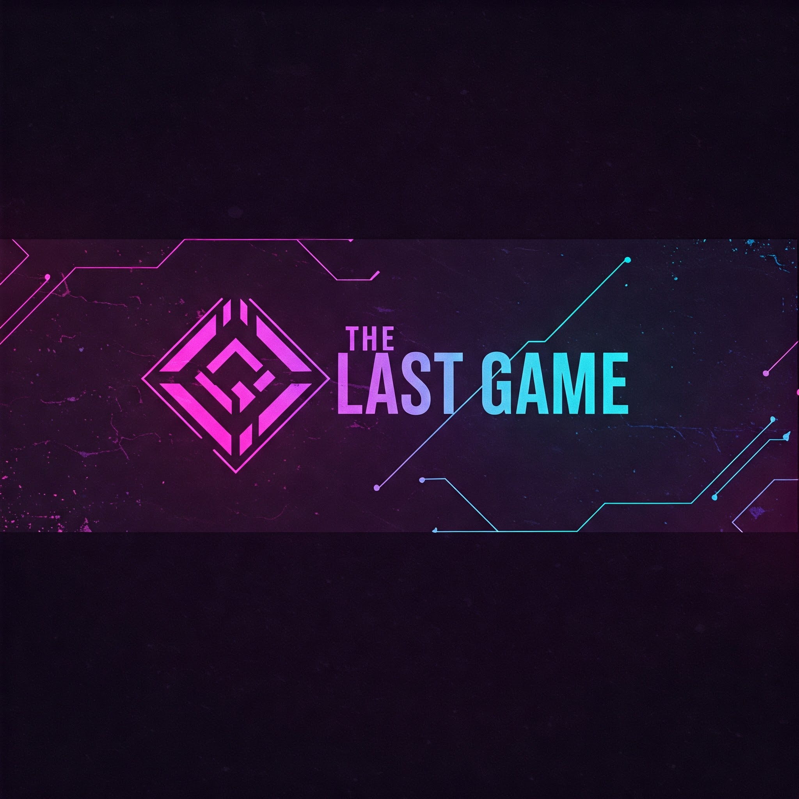


**Login and Theme Generator Color Scheme:**


- **Primary:** `#2D3748` (Dark Blue-Gray)
- **Secondary:** `#805AD5` (Purple)
- **Accent:** `#F6E05E` (Yellow)
- **Background:** `#1A202C` (Dark)
- **Text:** `#F7FAFC` (Light)


**Typography:**


- **Headings:** Inter  
- **Body:** Roboto Mono (for card text and game content)


**Design System:** Themes will be provided by AI (with parameters regarding contrast), based on the theme the user inputs


### iii. UI Flow

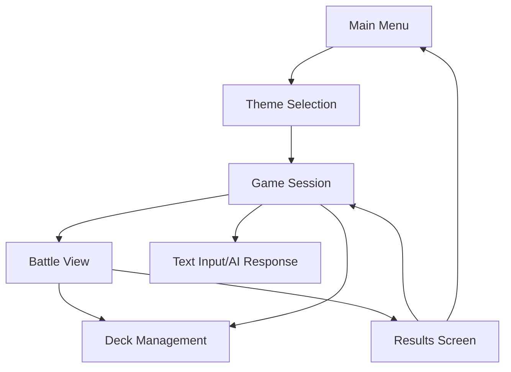

### iv. Input/Output Processing


#### Input Types


##### Text Commands
- Natural language input for game actions
- Card selection and play commands
- Navigation commands


##### Mouse/Touch Interactions
- Card dragging and dropping: Use card
- Button clicks: end turn, submit response, login(OAuth)
- Map navigation
- Menu selection

#### Output Types


##### Text Content
- AI-generated narrative
- Battle descriptions
- Card effects
- Event outcomes


##### Visual Elements
- Card Image renders
- Color theme generation

***Input-output expectations:***
  * User submits text response -> New updated story appears on the screen
  * User Clicks Oauth Provider -> User directed to sign in with OAuth Provider, then sent to their home dashboard
  * User Clicks Log out -> Data saved, User is returned to sign-in page
  * User Drags card to center during battle -> Card is used, some effect takes place, Boss is hit with effect
  * User submits no response -> Text appears on screen warning user they must enter something
  * User performs card action with no mana -> Warning appears on screen, the card is not used.
  * User card move destroys boss -> User sent to result page with AI summary of the battle and story
  * User clicks continue on result screen -> User returned to the game session and Text Input/Ai Response screen to continue story
  * User selects Item/Reward -> Item/Reward becomes a card for use in fights, appears in their deck

### v. Component Architecture


#### Core Components

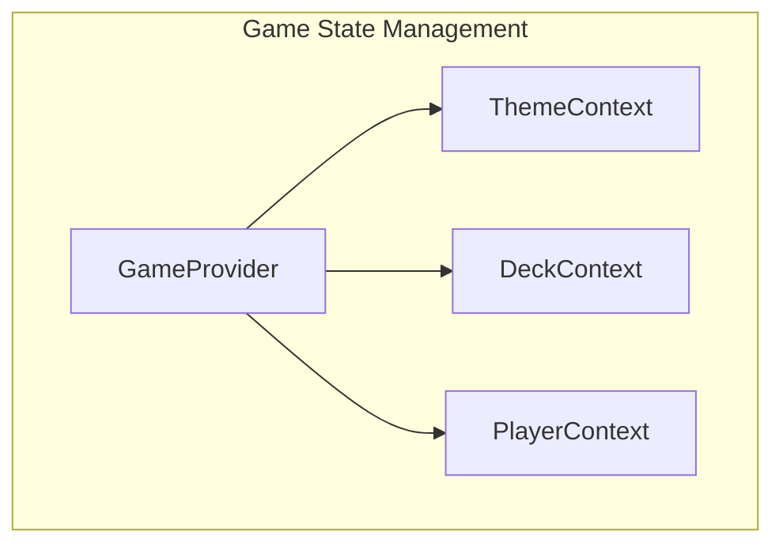


#### Internal Interfaces


#### Component Hierarchy

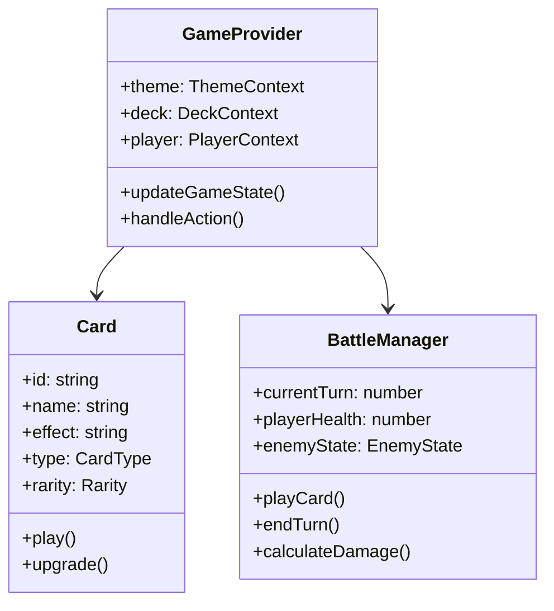


### vi. Implementation Strategy


#### Phase 1: Core Game Loop
- Basic UI components
- Card management system
- Battle mechanics
- Theme switching


#### Phase 2: AI Integration
- Text command processing
- Dynamic content generation
- Adaptive difficulty


#### Phase 3: Polish & Optimization
- Animation system
- Performance optimization
- Responsive design
- Accessibility features


---


# Low Level Design
Note: This document was generated with the assistance of ChatGPT

This document details our low-level design. With stakeholder expectations set up in the high-level design, this low-level design shows how we will implement features to satisfy players, game developers, and business operators. We cover the backend and front-end implementation to show how our program will be designed and how we will create an interactive and smooth experience for users and for future game developers of the game to look back on and consider our implementation when creating new content. We cover performance considerations that will improve playability for players and create more efficiency for business owners. We also cover security design to keep players safe and reduce liability for business owners. We also outline our deployment strategy so business owners know how the game will be deployed to an audience. As we enter the development phase aspects of this document may change to reflect new ideas and fix problems we run into.

**Table of Contents for Low-Level Design:**

1. Game Development Backlog
2. Programming Languages, Libraries, and Frameworks
3. Backend Design
4. Database Design
5. FrontEnd Design
6. External Service Implementations
7. Security Design
8. Performance
9. Deployment Strategy


## **1. Game Development Backlog**

### **Sprint 2: Core Systems & AI Experimentation (Backend + Initial Frontend)**

#### **Database Team:**
- [ ] **Set up User table:** Store authentication data, user profile details, and metadata for player progress.
- [ ] **Set up Run table:** Store each game session's progress, including choices made and card usage.
- [ ] **Set up Card tables:** Define schema for different card types, attributes, rarity levels, and effects.

#### **Backend Team:**
- [ ] **Implement Authentication System:** OAuth integration (Google, email/password) using Supabase or Firebase.
- [ ] **Create foundational Game Engine & API Endpoints:**
  - Define routes for game state updates.
  - Implement functions for tracking player progress, stats, and story.
  - Handle card interactions in API responses.
- [ ] **Create Card Management System:**
  - CRUD operations for creating, storing, and retrieving cards.
  - Define internal rules for buffs, debuffs, and status effects.
- [ ] **Set up AI LLM Interface (Initial Mock Responses):**
  - Basic connection to an AI API (e.g., OpenAI, Mistral, Claude).
  - Interface should generate mock responses that simulate in-game interactions.
- [ ] **AI Model Testing & Prompt Engineering:**
  - Experiment with multiple LLMs (GPT-4, Claude, Mistral, etc.) to assess response quality.
  - Start designing/experimenting with structured prompts that align with narrative-driven gameplay.
  - Test AI’s ability to generate **meaningful** stories and responses.

#### **Front-End Team**
#### **UI Development for Core Player Navigation**
- [ ] **Create Sign-in / Sign-up Pages:**
  - Basic UI with authentication integration.
  - Error handling for login failures.
- [ ] **Create Main Character Screen:**
  - Displays user stats, character progress, new character button.
- [ ] **Create Character Selection Screen:**
  - Allows players to choose between different starting characters with unique attributes.
- [ ] **Develop AI Text Input Page:**
  - Simple interface for text-based interactions.
  - Mock responses should be rendered dynamically.


#### **Expectations:**

**By the end of this sprint:**

  - Users should be able to sign in
  - Users should be authenticated on the backend and frontend with supabase/oauth
  - Users should be able to create or select a new character
  - Characters should be stored in the database and accessed through the backend
  - Players should be able to type a response and receive a response(even if just a mock response at first)
  - Back should be able to create mock-up cards and store in the database      

---

### **Sprint 3: AI Integration & Combat System Development**

### **Backend**
#### **Database Team:**
- [ ] **Expand Card Table:**
  - Store additional attributes (mana cost, rarity, effect types).
  - Implement support for deck-building mechanics.

#### **Backend Team:**
- [ ] **Integrate AI into LLM Interface:**
  - Replace mock responses with real AI-generated interactions.
  - Implement token limits, input sanitization, and response formatting.
- [ ] **Implement AI Image Interface (AI-Generated Cards & Assets):**
  - Connect to an AI image generation API (e.g., DALL·E, Stability AI).
  - Generate visuals dynamically for new cards or unique bosses.
- [ ] **Enhance Game Engine with Boss Creation System:**
  - AI-driven bosses with unique abilities and patterns.
  - Implement scaling difficulty for encounters(make bosses have equal level/card power to character).

#### **Front-End Team**
#### **Combat & Deck Mechanics UI**
- [ ] **Develop Battle Screen:**
  - Display turn-based battle interface.
  - Show enemy boss, player stats, and cards in hand.
- [ ] **Create Card Deck Component:**
  - UI for selecting and playing cards.
  - Implement drag-and-drop interactions.
- [ ] **Implement Internal Battle Logic for Boss Battles:**
  - Ensure AI-generated bosses have attack patterns.
  - Sync game state with backend API.

#### Expectations:

**By the end of this sprint:**

  * Users should receive AI generated story responses
  * Backend should generate, store, and send ai story responses to client
  * Backend should be able to receive card description and generate image and card stats which should be stored in db
  * Backend should be able to create Boss description, and image and send to client
  * Players should be able to initiate battle, see boss with its stats and image
  * Players should be able to play cards by dragging and dropping, cards should apply effects to user or boss
        


  

---

### **Sprint 4: Monetization, Rewards, and Final Polish**

### **Backend**
#### **Database Team:**
- [ ] **Create Payment Transaction Table:**
  - Store user purchases.

#### **Backend Team:**
- [ ] **Generate Card Descriptions Dynamically via AI LLM Interface:**
  - Convert item descriptions into unique, AI-generated card text.
  - Improve AI’s ability to balance game mechanics when generating card effects.
- [ ] **Implement Payment Interface:**
  - Integrate Stripe or another payment processor.
  - Enable purchasing the game.

#### **Front-End Team**
#### **Finalizing UI & Visual Enhancements**
- [ ] **Create Reward Screen:**
  - Displays unlocked cards, ai battle summary, and earned items after battles.
- [ ] **Final UI Styling & UX Polish:**
  - Improve animations and transitions.
  - Ensure smooth navigation between screens.
  - Add accessibility features like screen reader support


#### Expectations:
    
**By the end of this sprint:**

  * Players should see a battle summary with ai generated text after defeating the boss
  * Backend should generate unique item descriptions based on the boss the user beat
  * Players should be able to select which item after a boss fight to keep and turn into card
  * Animations should be smooth.
  * Users should see unique visual effects applied during battle
  * Users should be able to buy the game before being granted access
      

---

#### **Next Steps After Sprint 4:**
Once Sprint 3 is completed, the game should be **fully playable** with AI-driven battles, deck-building, and monetization features. Given extra time, we could focus on:

* **Bug Fixing & Optimization**
* **Multiplayer Features** (Co-op battles, pvp)   


---

## 2. Programming Languages, Libraries, and Frameworks

This section outlines the key programming languages, libraries, and frameworks that will be used in our system. The selections are based on project requirements such as performance, scalability, and long-term maintainability.

### Backend

- **Programming Language: Go**
  - *Why:* Go is a statically typed, compiled language known for its performance, simplicity, and excellent support for concurrent programming. These features make it an ideal choice for building a high-performance game server that can efficiently handle multiple simultaneous connections. While robust, the language has a fairly simple syntax which will make it easier for those on the team who don't yet know it to learn.

- **Framework: chi**
  - *Why:* chi is a lightweight and idiomatic HTTP router for Go, designed for building RESTful APIs. Its minimalistic design and composability allow for rapid development while keeping the backend lean and maintainable.

- **Payment Integration Library: stripe-go**
  - *Why:* stripe-go is the official Go library for integrating Stripe’s payment processing capabilities into our backend. It provides robust, secure methods for handling payments, managing subscriptions, and processing refunds. This integration ensures that financial transactions are handled efficiently and safely, while seamlessly aligning with our Go-based architecture.

### Front End

- **React with TypeScript**
  - *Why:* React provides a powerful framework for building interactive user interfaces, while TypeScript adds static typing, reducing runtime errors and improving code maintainability. This combination ensures a scalable and robust front-end development experience. React will also allow us to reuse UI elements in multiple screens, which will help us reuse components as new game content is added in the future.
 
- **Additional Frontend Libraries:**
  - **Fetch API**
    - *Why:* Used for making HTTP requests to our backend, ensuring smooth communication between the client and server.
  - **React Router**
    - *Why:* Manages in-app navigation, ensuring a seamless user experience as players move between different views.
  - **CSS Frameworks (Tailwind CSS)**
    - *Why:* Provides pre-built components and utility classes that expedite the development of a responsive and user-friendly interface. It will allow us to build a styled UI faster and help with designing new pages and content in the future.
  - **Stripe Elements**
    - *Why:* Stripe Elements are pre-built UI components designed to securely collect payment information from users. They simplify the integration of payment forms, ensure PCI compliance, and provide customizable components that work seamlessly with our React and TypeScript stack, delivering a secure and consistent checkout experience.

### How these choices affect development and performance

- **Performance and Scalability:**  
  Both Go and React are optimized for high performance and scalability. Go's efficient concurrency handling may be crucial for managing a high volume of simultaneous requests, while React's virtual DOM and component-based architecture ensure a smooth and responsive user experience. We won't be focusing on concurrency yet, but Go's capabilities will allow us in the future to add concurrency if we need performance boosts.

- **Ease of Development & Maintainability:**  
  Go's simplicity and clear syntax lower the learning curve and reduce complexity, making the backend easier to maintain over time. Meanwhile, React combined with TypeScript offers enhanced code quality and predictability on the frontend, facilitating long-term maintenance and reducing the risk of bugs.

- **Ecosystem and Community Support:**  
  The vast ecosystems around Go and React mean access to extensive libraries, frameworks, and community support. This ensures that any challenges encountered can be swiftly addressed with proven solutions and best practices.

- **Modularity and Flexibility:**  
  By leveraging specialized libraries (like chi for routing, stripe-go for payment integration, and Stripe Elements for secure payment UI components), the system remains modular. This modularity allows individual components to be updated or replaced independently as the system evolves, aligning with future requirements and technological advancements.

---

## 3. Low-level Design Backend
Subsystem Design: The following section details our backend design. At this point, we've decided that the backend will not be broken into classes for 2 main reasons. The first is we are using Go so it doesn't have a traditional class or inheritance system, but instead uses structs. Also as we designed our low level we have changed some things from our high level. Most of the game logic that the backend was going to use is now being implemented on the front end. The backend will serve the purpose of getting data from the database, updating and storing data, and creating AI content. So we think relying on functions and a more imperative approach to the backend is more appropriate and at this moment and do not see a clear use of classes. This may change during development. Below we have broken our interfaces from high level into functions and some into smaller subcomponents. Security design and implementation will be covered in the security section.


### User Authentication & Authorization
**AuthService**  
- `validate_token(token: str) -> bool`  
  *Checks if the token is valid.*  
- `get_user_data(user_id: str) -> dict`  
  *Retrieves user data from DB.*  
- `check_purchase_status(user_id: str) -> bool`  
  *Confirms game purchase.*  

### Game Engine
This engine is going to be broken into 2 parts the main game manager that updates/saves character progression that will be used to send data to the client and the API layer that defines endpoints for the client to call, Game engine makes sure data is formatted correctly to be sent to the client:


**Endpoints:**

- `/getcards/id:` The server should return all cards belonging to character to client

- `/createcard:` Client passes card description selected to server, server returns a card object as json

- `/getgame/id:` server returns game run(story text, player stats(health, mana))( json)

- `/getsummary:` server returns a summary of the story(json)

- `/getstoryall:` server returns all story text

- `/playerresponse:` client passes user prompt to server, server continued story text

- `/createbattle:` server returns boss details as json(damage, health, url image)

- `/battleresults:` client passes boss outcome(win or lose) server returns ai summary of battle and items to choose from which will be turned into cards.

- `/createnewgame:` the client should pass the game description and character description, server then will create new game, and create a new character(using game engines`create_character(char_description)`) and run. Game and character will be returned as JSON.


**GameEngine (Backend)**  

- `get_character_state(user_id: str, char_id: str) -> JSON object`  
  *Loads saved game state(character stats/object) from Database*

- `get_cards(user_id: str, char_id: str) -> JSON object`
  *Gets deck of cards for the character from Database*
  
- `generate_story(player_input: str) -> JSON object`  
  *Uses AI language model interface to generate the next story segment and sends it to the client.*
  
- `item_selection(item_selection: str, player_id: str) -> JSON Object`  
  *Processes player choice, returns card*

- `create_character(char_description) -> JSON object`
  
  *Creates and stores new characters in database, calls ai image interface to make character image, returns character details stored in json*
  
  
- `create_boss_battle(player_id: str) -> Json object`  
  *Returns Json of boss object*


- `finalize_battle(player_id: str, outcome: str, player_stats: str) -> JSON Object`  
      *Store player health and stats in DB,
      Create a card from Card Management,
      and return the JSON of the new card.*

- `save_game_state(user_id: str, game_state: dict)`  
  *Saves game progress.*  

**Priority: High**

**Why:** The backend game engine is the access point for the client to communicate. Its responsibilities such as saving data the client gives and creating JSON objects that can be returned to the client are vital to making our game work

### Card Management
**CardManager**  
- `generate_card(item_description: dict, player_id: str) -> dict`  
  *Given card attributes, creates, saves, and returns a new card.*

- `get_player_cards(player_id: str) -> list`  
  *Retrieves player's card inventory.*
  
- `use_card(card_id: str, player_id: str) -> dict`  
  *Uses a card in battle.*
  
- `upgrade_card(card_id: str, player_id: str) -> dict`  
  *Upgrades an existing card.*  

### Payment Interface
**PaymentService(could have)**  
- `process_payment(user_id: str, amount: float) -> dict`  
  *Handles payment processing.*
  
- `save_transaction(user_id: str, transaction: dict)`
  
  *Stores a transaction record.*
  
- `get_transaction_history(user_id: str) -> list`  
  *Retrieves user payment history.*  

**Priority:** Low

**Why:** Payment functionality will only be implemented once the game is playable, without a game to play there is nothing to purchase.


---

### AI Image Generator Interface
**AIImageGenerator**  
- `generate_card_image(description: str) -> str`  
  *Generates an image for a card, stores in S3 bucket, and returns URL.*
  
- `generate_boss_image(description: str) -> str`  
  *Generates an image for a boss, stores in an S3 bucket, and returns url.*

- `generate_character_image(description: str)`
  *Generates image that will be used to represent the character in-game, returns url*


  
**Rationale:** This subcomponent will be responsible for communicating with the external AI image generator service. Both functions will have a custom prompt built for the type of image it is trying to make. More information on how AI integration will work in section 

**Priority**: High

**Why**: Image generation will be vital in providing unique visuals for users. Card images will be deemed the highest priority of all image creation, followed by boss images and character. The reason being is we want cards to be unique, we can use default icons to represent player and boss in battle if needed.


---

### AI Language Model Interface
**AI Story Generator**(connects to external AI LLM for generating content)
- `generate_story_text(user_prompt: str) -> str`  
  *Prompts Ai with user input and custom prompt to Generate dynamic story content. Returns story text*
  
- `generate_boss_encounter_story(user_input: str) -> str`  
  *Generates an encounter with boss, returns story text*

- `summarize_story(story_data: list) -> str`  
  *Provides a story summary based on the list of all previous text.*

- `generate_item_options(AI_Text: str ) -> str`
  *Prompts the ai to generate a story where multiple objects can be picked up. generates attributes of each object that match card attributes*

- `parse_items(item_descriptions: str) -> dict`
  *Filters through item description to find keywords to build an card object later, returns dictionary of items and their attributes*


**AI Entity creator(connects to exteral AI LLM)**
  - `generate_boss_entity(story_text: str) -> dict`
      *Uses AI to crate boss attributes, interacts with AI image generator to return boss image url, returns these attribtes below*
    
      - **Boss_Entity attributes**
        - **name**: string
        - **health**: int
        - **mana**: int
        - **damage_amount**: int
        - **description**: string
        - **boss_card**: list of cards generated for boss
        - **Image_URL**: str
   
  - `generate_character_entity(character_description: str) -> dict`
      *Prompts AI to create character attributes, interacts with AI image generator to generate character image url, returns these attribtes below*
    
      - **Character_Entity attributes**
        - **name**: string
        - **health**: int
        - **mana**: int
        - **description**: string
        - **Image_URL**: str
   
**Priority**: High

**Why:** It's vital to our program to have a system that creates attributes for other enties. Character entities will be prioritized over bosses initially since we want text and character creation to work early on. Once boss battles are implemented boss entites will be worked on.
    


**Rationale:** We've broken the AI-Language model interface into 2 subcomponents. Since they will each have different prompts and data output. The story generator is broken into multiple functions that perform different tasks, based on the need. For example, general story generation will be prompted differently than when we want to generate a description of a boss encounter. Also, we need custom prompts for generating story with items. We created the AI entity creator to focus on taking story and entity descriptions and turning them into entity attributes that can be stored or passed to the client.

---


**Explanation:** Why We're Not Using Classes in Our GO Server:

In designing our backend server using Go (Golang), we've opted not to implement object-oriented programming (OOP) with classes for several key reasons. Instead, we focus on using Go's strengths, such as its simplicity, performance, and suitability for the request-based nature of our application. Below is an explanation of why classes aren't necessary for the backend system described in the design document.

Our backend primarily handles requests (API calls) from clients, processes data, and returns responses in the form of JSON objects. The design revolves around straightforward interactions such as retrieving game data, processing user input, and generating content. These interactions are better suited to Go’s simple function-based approach rather than an OOP model, which can introduce unnecessary complexity in the form of class definitions and inheritance hierarchies.

For example, our GameEngine manages game data and communicates with services like CardManager and AIStoryGenerator, but these interactions are handled through functions that receive arguments, process them, and return results, without the need to wrap these operations in classes.

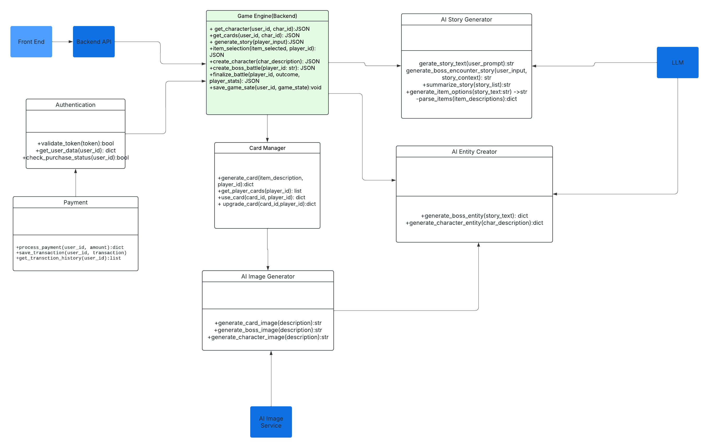

---

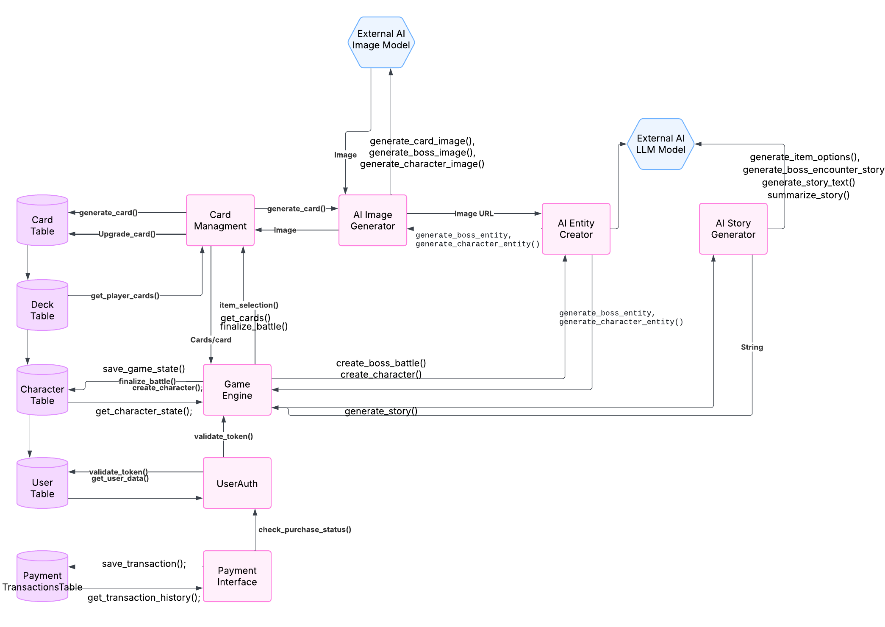

Note: We've designed extra database tables in database design in case we implement multiplayer features and need to store more details. Our priority will be single player though and will only use other tables if we need to store more for increasing the number of saves locations/states or for storing details that need to be shared with a party.

---


## 4. Database Design

### 1. Purpose
The database for *The Last Game* serves as the backbone for storing and managing **user data, game progress, deck compositions, combat logs, and financial transactions**. It ensures **data integrity, persistence, and security**, facilitating smooth interactions between the client, game engine, and third-party services like **Stripe for payments and AI models for procedural content generation**.

The database is implemented using **Supabase**, providing built-in **authentication, storage, and real-time capabilities** to streamline development and scalability.

---

### 2. Database Schema and Entities

The database follows a **relational structure** and adheres to **third normal form (3NF)** to minimize redundancy and maintain data integrity. It consists of several core tables, each serving a specific function within the game.

The Database Schema is defined by this diagram. Note: Underline denotes primary keys and italics denotes foreign key (these are not mutually exclusive). Two primary keys indicate a composite primary key. 


#### 2.1 Tables

- **Users** – Stores player accounts and authentication details, including purchase status and metadata required for game access.
- **Runs** – Represents individual roguelike playthroughs, tracking session progress and associated player data.
- **CharacterStats** – Maintains current health, mana, and other attributes of the player's in-game character during a run.
- **CharacterStatusEffects** – Tracks temporary buffs, debuffs, and other status effects applied to the player's character.
- **StatusEffects** – Defines all possible status effects in combat, including their mechanics and descriptions.
- **Cards** – Stores the generated cards, including their type, cost, and in-game effects.
- **PlayerCards** – Tracks the player's deck composition by linking individual cards to a specific run.
- **CardKeywords** – Establishes relationships between cards and gameplay keywords that define their effects.
- **Keywords** – Defines all possible card-related keywords and their descriptions.
- **CombatSession** – Represents active combat encounters, determining whether a battle is ongoing.
- **CombatParticipants** – Links players and enemies to a specific combat session, tracking their involvement making co-op possible.
- **CombatActions** – Logs each turn’s actions, including card plays and their resulting effects.
- **PaymentsTransactions** – Records financial transactions related to game purchases and any future in-game monetization.

This structured schema ensures efficient storage, retrieval, and management of game data while supporting **scalability, integrity, and performance optimization**.

---

### 3. Normalization & Data Integrity
The database is structured to maintain **3NF normalization**, ensuring:
- **Minimal redundancy** – No unnecessary duplicate data.
- **Efficient joins** – Indexed **foreign keys** optimize queries.
- **Atomic transactions** – **Run-based tables** ensure clear **session tracking**.

---

### 4. Indexing Strategies
To improve performance, the following indexes are implemented:

1. **Primary Indexes (Auto-Indexed)**  
   - `user_id`, `run_id`, `combat_id`, `card_id` (ensures fast lookups)
   
2. **Foreign Key Indexes** (to speed up joins)  
   - `player_cards(user_id)`, `combat_participants(combat_id)`, `payments_transactions(user_id)`
   
3. **Composite Indexes**  
   - **Card lookups:** `(card_id, type_id)` for filtering by **card type**.
   - **Combat logs:** `(combat_id, timestamp)` for retrieving **actions in order**.

---

### 5. Performance Considerations
#### 5.1 Query Optimization
- **Lazy Loading for Combat Logs** – Only fetch the **last 10 turns** instead of all combat logs.
- **Partitioning Transactions** – **Payment logs older than 1 year** are archived to reduce load.
- **Asynchronous Writes for AI-Generated Data** – **AI-generated images/cards** are stored **after** gameplay, preventing UI delay.


---

### 6. Security Measures
#### 6.1 User Data Protection
- **OAuth Authentication (via Supabase)** – Users authenticate securely via Google, Microsoft, etc.

#### 6.2 Secure Transactions
- **Stripe Integration** – No credit card data is stored, only `stripe_payment_id` references.
- **Rate Limiting on Transactions** – Prevents **fraudulent purchases** via API abuse.

#### 6.3 Preventing SQL Injection
- **Prepared Statements** – All queries use **parameterized SQL** to prevent injection attacks.
- **Role-Based Access Control (RBAC)** – Users can only **read/write their own game data** for the most part (They should be able to read the CharacterStats rows of anyone they are currently in an active comabt session with).

---

#### 7. Integration with Other Components
The database interacts with **several core systems**:

| **Component**      | **Interaction** |
|--------------------|----------------|
| **Game Engine**   | Reads/writes **combat logs, player actions/details, and status effects** |
| **Card Management** | Stores **user decks, available cards, and AI-generated card metadata** |
| **AI Services**   | Stores **generated card descriptions, story logs, and procedural game elements** |
| **Payment Interface** | Logs **successful/failed payments** |
| **Frontend UI**  | Fetches through backend game engine **game progress, deck contents, and transaction history** |

---

### 8. Justification & Rationale
The database was designed with **performance, security, and extensibility** in mind:

**Why Supabase?**  
- Provides **authentication, real-time queries, and cloud scalability** with minimal overhead.  
- **Alternative Considered:** PostgreSQL (Supabase is built on PostgreSQL but adds cloud-based auth & API).

**Why Relational (SQL) Instead of NoSQL?**  
- **Strong consistency** is required for combat interactions and purchases.  
- **Joins are frequent** (e.g., fetching a player’s deck & combat status).  
- **Previous Experience** with SQL.
- **Alternative Considered:** NoSQL (Firestore) – but complex relationships made SQL a better fit.


**Why store AI generated Content in the database?**  
- Generated cards and stories need to be **stored for later use and story summary**.  


---
## 5. Frontend Low-Level Design

### Overview

The frontend application is built using React with TypeScript, following a component-based architecture. The application integrates with the backend services through RESTful APIs and manages game state using React Context and local state management.

## Type Definitions & Interfaces

### Core Types

#### Game Progress
- Game progress will contain the current story node, players inventory at the time, and the date the player last played the game. 

```typescript

type GameProgress = {
  currentStoryNode: string;
  inventory: Card[];
  lastPlayed: Date;
};
```
#### Card
- The card type will contain attributes and descriptions of the card. It will also have a link to the S3 bucket where we store the card image. Cards will have both attributes and effects, to provide a wide range of options for the player. 
```typescript

type Card = {
  id: string;
  name: string;
  description: string;
  imageUrl: string;
  type: CardType;
  attributes: CardAttributes;
  effects: CardEffect[];
};

type CardType = 'attack' | 'defense' | 'buff' | 'special';
type EffectType = 'damage' | 'heal' | 'buff' | 'debuff';
type CardAttributes = {
  cost: number;
  power: number;
  duration?: number;
};

type CardEffect = {
  type: EffectType;
  value: number;
  duration?: number;
};

```
#### Game State and Player Story Nodes
- We need a way to store story information, for when players leave and exit the game. We also 

```typescript
type GameState = {
  currentStory: StoryNode;
  playerState: PlayerState;
  bossState?: BossState;
  inventory: Card[];
};

type StoryNode = {
  id: string;
  content: string;
  choices: Choice[];
  items?: Item[];
};

type Choice = {
  id: string;
  text: string;
  nextNodeId: string;
  consequences?: GameStateChange[];
};
```


#### Battle Types
```
type BossState = {
  id: string;
  name: string;
  health: number;
  maxHealth: number;
  imageUrl: string;
  abilities: BossAbility[];
};

type BossAbility = {
  name: string;
  damage: number;
  effects: CardEffect[];
};
```

### API Interfaces

```typescript
interface GameAPI {
  startGame(): Promise<GameState>;
  makeChoice(choiceId: string): Promise<GameState>;
  useCard(cardId: string, targetId?: string): Promise<GameState>;
  collectItem(itemId: string): Promise<Card>;
  saveProgress(gameState: GameState): Promise<void>;
}

interface AuthAPI {
  login(credentials: LoginCredentials): Promise<User>;
  logout(): Promise<void>;
  register(userData: RegistrationData): Promise<User>;
  resetPassword(email: string): Promise<void>;
}

interface CardAPI {
  getCards(): Promise<Card[]>;
  upgradeCard(cardId: string): Promise<Card>;
  getCardDetails(cardId: string): Promise<Card>;
}
```

## Component Architecture

### Core Components

#### CardComponent
```typescript
interface CardProps {
  card: Card;
  isPlayable: boolean;
  onUse?: (cardId: string) => void;
  className?: string;
}

const Card: React.FC<CardProps> = ({ card, isPlayable, onUse, className }) => {
  // Component implementation
};
```

#### StoryDisplay
```typescript
interface StoryDisplayProps {
  node: StoryNode;
  onChoiceSelected: (choiceId: string) => void;
}

const StoryDisplay: React.FC<StoryDisplayProps> = ({ node, onChoiceSelected }) => {
  // Component implementation
};
```

#### BattleInterface
```typescript
interface BattleInterfaceProps {
  playerState: PlayerState;
  bossState: BossState;
  availableCards: Card[];
  onCardPlayed: (cardId: string) => void;
}

const BattleInterface: React.FC<BattleInterfaceProps> = ({
  playerState,
  bossState,
  availableCards,
  onCardPlayed,
}) => {
  // Component implementation
};
```

#### Inventory
```typescript
interface InventoryProps {
  cards: Card[];
  onCardSelected: (card: Card) => void;
}

const Inventory: React.FC<InventoryProps> = ({ cards, onCardSelected }) => {
  // Component implementation
};
```

### Layout Components

#### GameLayout
```typescript
interface GameLayoutProps {
  children: React.ReactNode;
  showInventory?: boolean;
  showStats?: boolean;
}

const GameLayout: React.FC<GameLayoutProps> = ({
  children,
  showInventory,
  showStats,
}) => {
  // Component implementation
};
```

### Pages

#### HomePage
```typescript
const HomePage: React.FC = () => {
  // Implementation for landing page
};
```

#### GamePage
```typescript
const GamePage: React.FC = () => {
  // Main game implementation
};
```

#### BattlePage
```typescript
const BattlePage: React.FC = () => {
  // Battle system implementation
};
```

#### InventoryPage
```typescript
const InventoryPage: React.FC = () => {
  // Card collection and management implementation
};
```

#### AuthPages
```typescript
const LoginPage: React.FC = () => {
  // Login implementation
};

const RegisterPage: React.FC = () => {
  // Registration implementation
};
```

### State Management

#### Game Context
```typescript
interface GameContextType {
  gameState: GameState;
  dispatch: React.Dispatch<GameAction>;
}

type GameAction =
  | { type: 'UPDATE_STORY'; payload: StoryNode }
  | { type: 'USE_CARD'; payload: { cardId: string; targetId?: string } }
  | { type: 'COLLECT_ITEM'; payload: Item }
  | { type: 'UPDATE_PLAYER_STATE'; payload: Partial<PlayerState> };

const GameContext = React.createContext<GameContextType | undefined>(undefined);
```

### Auth Context
```typescript
interface AuthContextType {
  user: User | null;
  login: (credentials: LoginCredentials) => Promise<void>;
  logout: () => Promise<void>;
}

const AuthContext = React.createContext<AuthContextType | undefined>(undefined);
```

### API Integration

#### API Client
```typescript
class APIClient {
  private baseUrl: string;
  private token: string | null;

  constructor(baseUrl: string) {
    this.baseUrl = baseUrl;
    this.token = null;
  }

  setToken(token: string) {
    this.token = token;
  }

  async get<T>(endpoint: string): Promise<T> {
    // Implementation
  }

  async post<T>(endpoint: string, data: any): Promise<T> {
    // Implementation
  }

  async put<T>(endpoint: string, data: any): Promise<T> {
    // Implementation
  }

  async delete(endpoint: string): Promise<void> {
    // Implementation
  }
}
```

#### API Hooks
```typescript
function useGame() {
  const [gameState, setGameState] = useState<GameState | null>(null);

  // Implementation
}

function useCards() {
  const [cards, setCards] = useState<Card[]>([]);

  // Implementation
}

function useBattle() {
  const [battleState, setBattleState] = useState<BattleState | null>(null);

  // Implementation
}
```
## UML Diagram
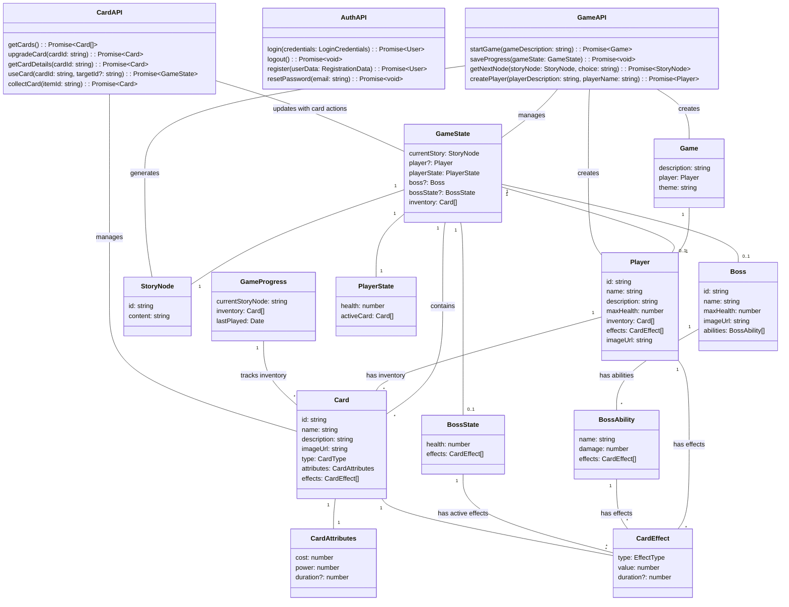


### Additional UI Prototypes

Below are the newly added UI prototypes showcasing the main screens of the application. Each prototype is accompanied by a brief explanation of its purpose, key elements, and how it fits into the overall user flow.

---

### 1. Login Screen

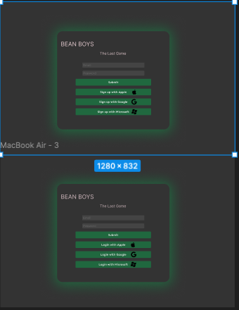

**Purpose:**
- Provide users with a straightforward way to log in or register.
- Offer multiple sign-in options (e.g., Google, Microsoft) for convenience.

**Key Elements:**
- **Email & Password Fields:** Standard text inputs for credentials.
- **Social Login Buttons:** Quick authentication through external providers.
- **Submit Button:** Triggers login or registration flow.

**Flow Integration:**
1. **User enters credentials** (or chooses a social login).
2. **On success**, user is directed to the main game dashboard or character creation screen.

---

### 2. Character Creation

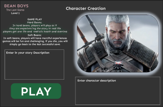

**Purpose:**
- Allow players to customize their game experience before starting.
- Select difficulty (“Hard” or “Merciful” modes), choose a game mode (single-player, multiplayer), and input character details.
- Optionally generate an AI-created avatar image based on the user’s description.

**Key Elements:**
- **Difficulty & Mode Selectors:** Radio buttons or dropdowns for selecting how challenging or story-driven the game will be.
- **Character Description Input:** Text field for the user to describe their character. This description is used to generate a personalized avatar image via AI.
- **Play Button:** Commits selections and initializes the game session.

**Flow Integration:**
1. **User selects difficulty level** (e.g., Hard or Merciful).
2. **User chooses game mode** (single-player, co-op, etc.).
3. **User enters a character description** and sees an AI-generated avatar.
4. **Clicking “Play”** starts the game and loads the initial story node.

---

### 3. Deck View

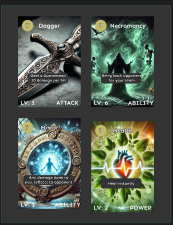

**Purpose:**
- Display the user’s current collection of cards.
- Provide detailed information on each card’s level, type (Attack, Ability, Power), and effects.

**Key Elements:**
- **Card Grid/List:** Each card is shown with its name, level, and an image.
- **Card Details:** Hovering or clicking on a card can reveal more in-depth stats or upgrade options.
- **Navigation Back to Game:** A clear way to return to the main story or battle interface.

**Flow Integration:**
1. **User opens the Deck screen** from a navigation menu or button.
2. **User reviews available cards**, possibly upgrades or discards them.
3. **Returning to the main game** continues story progression or battle interactions.

---

### 4. Chest Opening

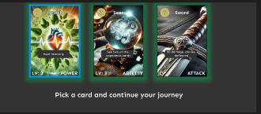

**Purpose:**
- Present a reward or loot screen where the user can pick one new card to add to their deck.
- Occurs after certain story milestones, battles, or quest completions.

**Key Elements:**
- **Three Card Options:** Each with a unique effect, type, or rarity.
- **Selection Prompt:** “Pick a card and continue your journey.”
- **Add to Deck:** The chosen card is added to the user’s inventory for future battles.

**Flow Integration:**
1. **User completes an event** (defeats a boss, completes a quest, etc.).
2. **A chest screen appears** with three random card rewards.
3. **User selects one card** to keep, which is then stored in their deck/inventory.

---

### 5. Battle View

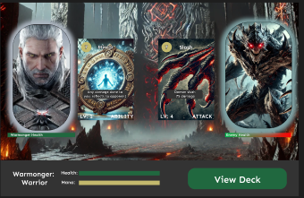

**Purpose:**
- Facilitate real-time or turn-based combat against bosses or other players (1v1 or multiplayer co-op).
- Display each participant’s health, chosen cards, and current status.

**Key Elements:**
- **Player & Enemy Portraits:** Show health bars, mana (if applicable), and character images.
- **Chosen Cards:** Each side reveals the card they’re playing this turn (attack, defense, ability, etc.).
- **View Deck Button:** Allows quick access to the player’s card collection to plan the next move.

**Flow Integration:**
1. **Battle starts** (boss encounter, PvP, or co-op).
2. **Players select cards** to play each round (using the “View Deck” button to choose).
3. **Round resolves**, showing damage dealt, healing, or buffs/debuffs applied.
4. **Repeat until** one side is victorious or the battle ends.

---

### How These Screens Fit Into the Overall Experience

1. **Login** → 2. **Character Creation** → 3. **Main Story/Battles**
   - Users begin at the login screen, authenticate, and create or load their character.
   - Once the character is set, they enter the main game flow, which can include battles, story progression, and deck management.

2. **Deck & Chest Interactions** are auxiliary:
   - Players access the **Deck View** at any time to strategize or upgrade.
   - **Chest Opening** occurs after significant milestones, rewarding players with new cards.

3. **Battle View** is central to combat encounters:
   - Displays real-time updates on health, mana, and card usage.
   - Integrates seamlessly with the deck system, allowing players to select the best cards for each encounter.

---
Note:  
All images shown are prototypes and subject to change based on ongoing user testing and feedback. Accessibility features such as proper color contrast, keyboard navigation, and ARIA labels are integrated to ensure inclusivity and a positive user experience.


UserFlow:
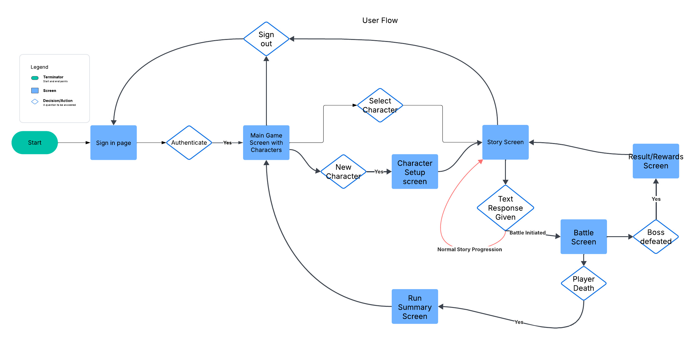

---

## 6. External Interface Implementation

### AI integration:
### AI Finetuning
The AI that will be used to dynamically generate the content for *The Last Game* must be capable of producing a consistent, highly structured output for the following purposes:

1. **Story Generation**
2. **Card Description Generation**
3. **Card Image Generation**
4. **Enemy Generation**
5. **Boss Generation**

Together, these four types of AI-generated content will result in a complete toolset for AI generation of *Last Game*'s content.

#### Finetuned Generation
We will finetune several AI models to perform some of these tasks, while others shouldn't require finetuning. This is an example of the finetuning process (according to GPT-4o):

1. Define Output Structure
- Determine the exact format you need (e.g., JSON, XML, Markdown, tables).
- Create a schema or template to ensure consistency.
2. Prepare Training Data
- Collect high-quality examples of structured outputs.
- Format the data in a way that aligns with the intended output.
- Use diverse examples covering edge cases.
3. Preprocess Data
- Tokenize and clean the data to remove inconsistencies.
- Convert outputs into prompt-response pairs for supervised fine-tuning.
- Label the dataset clearly with proper separators or delimiters.
4. Fine-Tune the Model
- Use LoRA (Low-Rank Adaptation) or full fine-tuning with OpenAI’s fine-tuning API.
- Implement reinforcement learning (RLHF) to refine structured output adherence.
- Train with loss functions that emphasize structure adherence (e.g., token-level constraints).
5. Implement Prompt Engineering
- Design few-shot examples to guide the model toward structured responses.
- Use system instructions and templates for predictable outputs.
- Experiment with temperature and top-k/top-p sampling for consistency.
6. Validate and Evaluate
- Run the model on test prompts and compare against expected structured outputs.
- Measure precision, recall, and F1 scores for structure adherence.

This is just an example of the process that will be used to finetune each model, but more generally speaking, we will need to prepare data sets that include examples of correctly structured prompts and responses. Once we have these, we can use them to produce an AI model that is much more consistent at creating correctly structured output.

The following generative tasks will require finetuned models. They are each listed with examples of finetuning data: 
#### Story Generation
##### Structure of Story Content
- The AI generated story must respond with several types of content:
  - The story must be able to produce card rewards to build the player's deck.
  - The story must produce enemy descriptions to be passed to the enemy generation model.
  - The story must define when the user goes into combat.
- In order to parse the AI generated content and correctly trigger game events and update the game engine state, the output of the story generation AI must be concise and use specific words when certain events should be triggered.

#### Example Story Data

**Example 1**

    Context: You see before you a path branching in two directions through the dark forest. Down the left fork of the path, you can hear distant, eerie chattering, as if there is something waiting for you. Down the right fork, you see faint lights drifting through the trees, obscured by the foliage just enough that it is impossible to tell what exactly is producing them.

    Prompt: I carefully take the left path, making sure to watch for enemies.

    Output: Despite your best efforts to be careful, you inadvertently stumble upon several [angry wood elves]. They immediately draw their knives and move towards you. **Combat begins.**
**Analysis:**
- The AI used the provided context to produce a logical outcome to the player's action.
- The AI used the words, `**Combat begins.**` to indicate to the game engine that combat should be initiated.
- The AI generated a short description of the enemy, indicated by square brackets: `[angry wood elves]`.
  - This description can be saved and passed into the enemy generator as input.

### Card Description Generation
#### Structure of Card Description
- This model is possibly the most important finetuning operation for *Last Game*.
- It is vital to the functioning of the game that the card descriptions be extremely concise and parsable so that the game engine will be able to understand how to interact with the game state.
- The AI generated card descriptions must follow these conventions:
  - The description must include parsable keywords that have consistent meanings.
    - Most keywords will be directly followed by a numerical value, indicating the duration or intensity of the previous keyword's effect.
  - The description must not hallucinate by telling the user that a certain effect will take place when the game engine is incapable of correctly parsing and carrying out said effect.
  - The AI should be able to consistently match the theme of the current game through the tone and word choice in the card descriptions.

#### Example Card Description Data

**Example 1**

    Context: You hack into the secure weapon storage room of the Federation trading vessel. As the electronic lock disengages and the door opens, you see a pedestal in the center of the small room holding a:

    Prompt (internal): Generate 3 card descriptions that fit an item that could be found given the provided context.

    Output: 
    Title: **Laser Gun**
    Description: Deal 10 damage. Apply 2 Blind.
    Cost: 2

    Title: **Plasma Blade**
    Description: Deal 24 damage.
    Cost: 3

    Title: **Impulse Grenade**
    Description: Deal 7 damage to all enemies. Apply 1 Stunned to all enemies.
    Cost: 2

**Analysis:**
- The AI used the context provided by the story generation AI to understand that it should create a sci-fi themed card, and that it should be some type of weapon.
- The AI generated three options for the user that all had:
  - A title for the card.
  - A description with keywords such as `Deal 10 damage` or `Apply 1 Stunned to all enemies`
  - An associated mana cost, based on the usefulness of the card.
    - This could potentially be calculated based on the numerical values in the card description.

### Enemy Generation
#### Structure of Enemy Generation
- This model needs to take a short description of the enemy and generate a short list of moves that the enemy will rotate through during combat. 
- Each move should have a description, just like cards do.
  - The move should be generated with the same set of keywords that we defined for cards.

#### Example Enemy Generation

**Example 1**

    Prompt: Generate the moveset and health of [angry wood elves]

    Output: 
    Health: 18

    Title: **Stab**
    Description: Deal 3 damage.

    Title: **Woodland Magic*
    Description: Apply 3 Blind to all enemies.

**Analysis:**
- The AI generated two attacks that an angry wood elf might perform.
- Each attack had:
  - A title
  - A description with appropriate keyword usage and numerical values.
- Even if the prompt is given with an enemy description that implies a plurality of enemies, the AI should only generate one moveset per prompt. In this case, the [angry wood elves] would act as one entity in combat.

### Boss Generation
#### Structure of Boss Generation
- This model is essentially the same as the enemy generator, and in fact we could potentially use the same model. Our prompt would have to include a parameter that signals the AI that the moveset and health should be more suited to a boss.
- Bosses should have longer movesets and more health than typical enemies.

####

**Example 1**

    Prompt: Generate the moveset, description, and health of [Balrog] as a Boss.

    Output:
    Health: 100
    Description: A demonic being of pure evil, shrouded in fire, and holding a long, flaming whip.

    Title: **Fire Whip**
    Description: Deal 17 damage. Apply 3 Slowed.

    Title: **Infernal Rage**
    Description: Gain 5 Strength.

    Title: **Evil Incarnate**
    Description: Deal 10 damage to all enemies. Apply 3 Weakened to all enemies.

    Title: **Death Grip**
    Description Deal 25 damage.

**Analysis:**
- The AI generated a boss type enemy with extra health and more powerful moves at a higher quantity than a typical enemy.
- The move titles fit the theme of the enemy's name.

## Non-finetuned Generation
The following categories of AI generated content will not require finetuning:

### Image Generation
#### Structure of Image Generation
- Images should be generated based on the context for story-related images.
- Card images should be generated based on the name and description of the card.
  - Card images will just be artwork, they won't have any of the numerical or text-based information embedded in the image.
- Boss images should be generated based on the description and name of the boss.

#### Examples of Image Generation

**Example 1**

`Prompt: Generate an image of a [plasma blade] that has the description: [Deal 24 damage.]`


**Example 2**

`Prompt: Generate an image of this moment in a story: [You see before you a path branching in two directions through the dark forest. Down the left fork of the path, you can hear distant, eerie chattering, as if there is something waiting for you. Down the right fork, you see faint lights drifting through the trees, obscured by the foliage just enough that it is impossible to tell what exactly is producing them.]`


**Example 3**

`Prompt: Generate an image of a [Balrog] boss. It is described as: [A demonic being of pure evil, shrouded in fire, and holding a long, flaming whip.]`


##### Finetuning technologies
There are several options that we have for finetuning models. If we decide to use GPT-4o, they have a user-friendly interface on their [website](https://platform.openai.com/docs/guides/fine-tuning#when-to-use-fine-tuning) to finetune any number of models. Otherwise, we can use `huggingface.co` and a repository called `Unsloth` to finetune a model such as Deepseek R1 on one of our own computers. We are going to be testing a few during development to determine which models perform the best for our use cases.

Once the AI model to be used is finalized, the example data sets will need to be created for each finetuned model. Each data set should ideally have more than 10 example prompts and responses. 

---


### Stripe Integration

This section details how Stripe will be integrated into our low-level design, covering both backend and frontend implementations to ensure secure, efficient, and PCI-DSS compliant payment processing. More details can be seen in the security design.

#### Overview

We will use Stripe to handle all payment processing tasks. The integration leverages:
- **Backend:** The `stripe-go` library to interact securely with Stripe’s API.
- **Frontend:** Stripe Elements for securely capturing payment details and tokenizing sensitive card data.

This approach ensures that our system never handles raw card data directly, meeting PCI-DSS requirements and utilizing Stripe Radar for fraud detection.

#### Backend Integration

- **Payment Integration Library:** `stripe-go`
  - **Purpose:** Official Go library for integrating with Stripe’s payment processing system.
  - **Responsibilities:**
    - Creating and managing charges, subscriptions, and refunds.
    - Communicating securely with Stripe's API.
    - Recording transaction details and handling payment-related errors.
  - **Flow:**
    1. **Receive Payment Token:** The backend receives a token or `paymentMethodId` from the frontend.
    2. **Create Charge:** Using `stripe-go`, a charge is created against the token.
    3. **Record Transaction:** Transaction details are stored in the database for future reference.
  - **Security Measures:**
    - **PCI-DSS Compliance:** Stripe’s tokenization means the backend does not process raw card data.
    - **Fraud Detection:** Leverage Stripe Radar to monitor and mitigate fraudulent transactions.

#### Frontend Integration

- **Library:** Stripe Elements
  - **Purpose:** Provides pre-built, customizable UI components to collect and tokenize card details.
  - **Responsibilities:**
    - Rendering secure payment forms within our React/TypeScript application.
    - Tokenizing card details into a secure token or `paymentMethodId` that can be safely transmitted to the backend.
  - **Additional Tools:**
    - **React with TypeScript:** Ensures a robust, scalable, and maintainable front-end.
    - **Fetch API:** Handles HTTP requests to the backend for payment processing.
  - **Flow:**
    1. **Render Payment Form:** Use Stripe Elements to collect the user’s payment information.
    2. **Tokenization:** Card details are tokenized by Stripe, producing a token or `paymentMethodId`.
    3. **Send to Backend:** The token is sent via an HTTP request to the backend.
    4. **Transaction Confirmation:** The backend processes the payment and returns transaction status to update the UI.


---

## 7. Low-Level Security Design

This document details the security mechanisms and implementation strategies for the AI-driven multiplayer RPG game. It extends the high-level security design by breaking down each requirement into actionable components—complete with code samples, recommended libraries, and justification for each decision. Where possible, code snippets are included to show how you might implement these concepts in a Go-based backend, though the overall principles apply regardless of specific programming language or framework.


### 1. Introduction

This section provides a comprehensive view of the low-level security measures for our AI-driven multiplayer RPG game. Each section details specific mechanisms—from authentication and encryption to multiplayer cheat detection—supported by example code and justifications. The goal is to ensure robust protection against cyber threats while maintaining a seamless user experience.

---

### 2. Authentication & Authorization

#### 2.1 OAuth 2.0 Flow with Third-Party Providers

**Chosen Providers:** Google, Microsoft, and Apple  
**Why:**  
- Eliminates the need to store and manage passwords in our system.  
- Leverages robust security features from providers (MFA, suspicious login detection, etc.).  
- Users benefit from seamless login without creating separate credentials.

##### 2.1.1 Detailed Flow

1. **User selects Provider** (e.g., “Sign in with Google”).  
2. **Authorization Request**: The frontend (React/TypeScript) redirects the user to the provider’s authorization endpoint.  
3. **OAuth Consent Screen**: The provider presents a consent screen requesting profile permissions.  
4. **Token Exchange**: On success, the provider returns an authorization code to the backend (Go).  
5. **Validation & Token Issuance**:  
   - The backend exchanges the authorization code for an ID token and access token.  
   - Verifies the ID token signature.  
   - Issues a short-lived **JWT** (access token) to the client if valid.  
6. **Frontend Stores Access Token**: The React app stores the token securely (HTTP-only, Secure cookie).

##### 2.1.2 Code Example (Go)

```go
package main

import (
    "context"
    "fmt"
    "log"
    "net/http"

    "golang.org/x/oauth2"
    "golang.org/x/oauth2/google"
)

var googleOauthConfig = &oauth2.Config{
    ClientID:     "YOUR_GOOGLE_CLIENT_ID",
    ClientSecret: "YOUR_GOOGLE_CLIENT_SECRET",
    RedirectURL:  "https://your-game.com/oauth/callback",
    Scopes:       []string{"email", "profile"},
    Endpoint:     google.Endpoint,
}

// Handler to initiate OAuth login
func GoogleLoginHandler(w http.ResponseWriter, r *http.Request) {
    // State should be random and unguessable
    state := "random-state-string"
    url := googleOauthConfig.AuthCodeURL(state, oauth2.AccessTypeOffline)
    http.Redirect(w, r, url, http.StatusTemporaryRedirect)
}

// Callback after user grants or denies permission
func GoogleCallbackHandler(w http.ResponseWriter, r *http.Request) {
    code := r.URL.Query().Get("code")
    token, err := googleOauthConfig.Exchange(context.Background(), code)
    if err != nil {
        log.Println("OAuth token exchange failed:", err)
        http.Error(w, "Authentication failed", http.StatusUnauthorized)
        return
    }

    // (Optional) Validate ID token from Google
    // Then generate your own short-lived access token for your game
    // e.g., yourJWT, err := generateJWT(userID, userRole)

    fmt.Fprintf(w, "Received Google token. Access Token: %s", token.AccessToken)
    // Next: Store or forward the JWT to the client securely (e.g., HTTP-Only cookie)
}
```
#### 2.2 Token-Based Authentication with JWT

Type: JSON Web Token (JWT)
Reasons:
-	Stateless: Eliminates server session storage.
-	Role & Permission Embedding: Allows user data to be encapsulated in token.
-	Short-Lived: Minimizes risk window if token is compromised.

##### 2.2.1 Token Structure
-	Access Token: ~15 minutes. Contains user ID, roles, expiry (exp claim).
-	Refresh Token: ~7 days. Stored in an HTTP-only, Secure, SameSite cookie.

##### 2.2.2 Rotation & Revocation
-	Refresh Token Rotation: Issue a new refresh token each time it’s used, invalidating the old one.
-	Server-Side Revocation List: Track invalid/expired refresh tokens in a cache or database.

##### 2.2.3 Code Example (Go)
```go
package main

import (
    "fmt"
    "net/http"
    "time"

    "github.com/golang-jwt/jwt/v4"
)

var secretKey = []byte("YOUR_SECURE_SECRET_KEY")

func generateAccessToken(userID string, roles []string) (string, error) {
    claims := jwt.MapClaims{
        "user_id": userID,
        "roles":   roles,
        "exp":     time.Now().Add(15 * time.Minute).Unix(),
    }
    token := jwt.NewWithClaims(jwt.SigningMethodHS256, claims)
    return token.SignedString(secretKey)
}

func generateRefreshToken(userID string) (string, error) {
    claims := jwt.MapClaims{
        "user_id": userID,
        "exp":     time.Now().Add(7 * 24 * time.Hour).Unix(),
        "scope":   "refresh_token",
    }
    token := jwt.NewWithClaims(jwt.SigningMethodHS256, claims)
    return token.SignedString(secretKey)
}

// Example middleware for validating the access token
func AuthMiddleware(next http.Handler) http.Handler {
    return http.HandlerFunc(func(w http.ResponseWriter, r *http.Request) {
        tokenStr := r.Header.Get("Authorization") // Typically "Bearer <JWT>"
        if tokenStr == "" {
            http.Error(w, "Missing token", http.StatusUnauthorized)
            return
        }

        token, err := jwt.Parse(tokenStr, func(t *jwt.Token) (interface{}, error) {
            return secretKey, nil
        })

        if err != nil || !token.Valid {
            http.Error(w, "Invalid token", http.StatusUnauthorized)
            return
        }

        // Token is valid; proceed
        next.ServeHTTP(w, r)
    })
}
```
#### 2.3 Two-Factor Authentication (2FA)

Optional for high-value accounts or by user preference.
-	Implementation: Time-Based One-Time Password (TOTP).
-	Libraries (Go): github.com/pquerna/otp or github.com/dgryski/dgoogauth.
-	Flow:
	1.	User scans a QR code for enrollment.
	2.	On login, user provides a 6-digit TOTP.
	3.	Server verifies the code before issuing tokens.

### 3. Data Protection & Privacy

#### 3.1 Encryption of Sensitive Data at Rest
-	Key Management: Use a secure vault (e.g., HashiCorp Vault, AWS KMS).
-   Algorithm: AES-256 in GCM mode for authenticated encryption.
```go
package security

import (
    "crypto/aes"
    "crypto/cipher"
    "crypto/rand"
    "encoding/base64"
    "errors"
    "io"
)

func EncryptData(plaintext string, key []byte) (string, error) {
    block, err := aes.NewCipher(key)
    if err != nil {
        return "", err
    }

    aesGCM, err := cipher.NewGCM(block)
    if err != nil {
        return "", err
    }

    nonce := make([]byte, aesGCM.NonceSize())
    if _, err := io.ReadFull(rand.Reader, nonce); err != nil {
        return "", err
    }

    ciphertext := aesGCM.Seal(nonce, nonce, []byte(plaintext), nil)
    return base64.StdEncoding.EncodeToString(ciphertext), nil
}

func DecryptData(ciphertextBase64 string, key []byte) (string, error) {
    ciphertext, err := base64.StdEncoding.DecodeString(ciphertextBase64)
    if err != nil {
        return "", err
    }

    block, err := aes.NewCipher(key)
    if err != nil {
        return "", err
    }

    aesGCM, err := cipher.NewGCM(block)
    if err != nil {
        return "", err
    }

    nonceSize := aesGCM.NonceSize()
    if len(ciphertext) < nonceSize {
        return "", errors.New("ciphertext too short")
    }

    nonce, encrypted := ciphertext[:nonceSize], ciphertext[nonceSize:]
    plaintext, err := aesGCM.Open(nil, nonce, encrypted, nil)
    if err != nil {
        return "", err
    }

    return string(plaintext), nil
}
```
#### 3.2 Data in Transit
	•	TLS 1.3 for HTTPS connections.
	•	Reason: Prevents eavesdropping and man-in-the-middle (MITM) attacks, reduces handshake overhead.

#### 3.3 Anonymized Analytics
-  	Implementation: Strip PII or use hashed identifiers.
-  	Compliance: GDPR/CCPA by design—only store aggregated or anonymized metrics.

### 4. Payment Security (Stripe Integration)
	1.	PCI-DSS Compliance via Stripe: We never handle raw card data directly.
	2.	Stripe Radar: Built-in fraud detection.
	3.	Implementation Flow:
	•	Frontend (React): Use Stripe Elements or Payment Intents to tokenize card details.
	•	Backend (Go): Receives a token/paymentMethodId from the frontend and creates a charge using the Stripe Go library.

#### 4.1 Example Code (Go)
```go
package payments

import (
    "fmt"
    "log"

    "github.com/stripe/stripe-go"
    "github.com/stripe/stripe-go/charge"
    // or "github.com/stripe/stripe-go/paymentintent"
)

func init() {
    // Set your Stripe secret key
    stripe.Key = "sk_test_XXXXXXXXXXXXXXXXXXXXXXXX"
}

// ProcessPayment handles the final charge with Stripe
func ProcessPayment(amountInCents int64, currency, paymentMethodID, customerID string) error {
    // Using Charges API as an example; PaymentIntents is recommended for modern flows
    chParams := &stripe.ChargeParams{
        Amount:   stripe.Int64(amountInCents),
        Currency: stripe.String(currency),
        Customer: stripe.String(customerID),
        // If you're using Payment Method IDs, you might need additional fields:
        PaymentMethod: stripe.String(paymentMethodID),
    }
    chParams.SetStripeAccount("acct_xxxxxx") // If using Connect or multiple accounts

    // Create the charge
    ch, err := charge.New(chParams)
    if err != nil {
        log.Printf("Stripe charge error: %v", err)
        return err
    }

    // If successful, handle business logic (e.g., updating in-game currency)
    fmt.Printf("Charge successful: %s\n", ch.ID)
    return nil
}
```
### 5. Mitigating Common Attacks

#### 5.1 DDoS Protection
1.	Rate Limiting & Throttling
	-	Libraries: golang.org/x/time/rate
2.	Traffic Monitoring & IP Filtering
	-	Tools: AWS WAF, Cloudflare, or NGINX filters.
3.	CDN & Load Balancing
	-	Use a CDN for static assets and load balancers (e.g., AWS ELB) to evenly distribute traffic.

#### 5.2 SQL Injection & Input Validation
1.	Parameterized Queries: Use database/sql or GORM to avoid string concatenation.
2.	Strict Input Validation: Validate data on both client (React) and server (Go).
```go
// Example using GORM for a user table
func getUserByUsername(db *gorm.DB, username string) (*User, error) {
    var user User
    err := db.Where("username = ?", username).First(&user).Error
    if err != nil {
        return nil, err
    }
    return &user, nil
}

#### 5.3 XSS & CSRF
	•	Content Security Policy (CSP): Set Content-Security-Policy headers to limit allowed scripts.
	•	CSRF Tokens: Include unique tokens for state-changing requests.

import "github.com/gorilla/csrf"

func main() {
    csrfMiddleware := csrf.Protect(
        []byte("32-byte-long-auth-key"),
        csrf.Secure(true), // Use HTTPS
    )

    r := mux.NewRouter()
    r.HandleFunc("/game/update", gameUpdateHandler)
    http.ListenAndServe(":8080", csrfMiddleware(r))
}
```
#### 5.4 Brute Force & Account Takeovers
-	Account Lockouts & CAPTCHA: Temporary lock after multiple failed attempts.
-	IP Monitoring: Track repeated failures from a single IP; ban or throttle if suspicious.

### 6. Secure Multiplayer & Fair Play

#### 6.1 Server-Side Game Logic Validation
- All critical decisions (e.g., card draws, damage calculation) validated server-side.
-	Client is treated as untrusted. This prevents data tampering by malicious clients.

#### 6.2 Cheat Detection

Approach: Analyze patterns like win rates, resource changes, or suspicious input frequencies.
```go
package multiplayer

import (
    "fmt"
    "time"
)

// GameAction represents an in-game action performed by the player.
type GameAction struct {
    ActionType     string
    ResourceChange int
    Timestamp      time.Time
}

// checkForCheats analyzes recent actions for anomalies.
func checkForCheats(playerID string, actions []GameAction) bool {
    highResourceGainCount := 0
    for _, a := range actions {
        // Example heuristic: if resource gain is suspiciously large
        if a.ResourceChange > 1000 { // threshold is arbitrary
            highResourceGainCount++
        }
    }

    if highResourceGainCount > 3 {
        fmt.Printf("Player %s flagged for potential cheating.\n", playerID)
        return true
    }
    return false
}

// Example usage in a game update handler
func ApplyActions(playerID string, actions []GameAction) {
    if checkForCheats(playerID, actions) {
        // Potentially freeze account or revert actions
    } else {
        // Proceed with normal update
    }
}
```
Additional Measures:
-	Logging all player actions.
-	Machine Learning or pattern-based anomaly detection for advanced cheat detection.

#### 6.3 Secure WebSocket Connections

Using wss:// with TLS ensures real-time data is protected from eavesdropping and tampering.

Below is a simple Go snippet using the Gorilla WebSocket library:
```go
package websockets

import (
    "log"
    "net/http"

    "github.com/gorilla/websocket"
)

var upgrader = websocket.Upgrader{
    // CheckOrigin can be used to handle cross-origin requests.
    // Adjust for your production use case or pass in a separate function.
    CheckOrigin: func(r *http.Request) bool {
        return r.Header.Get("Origin") == "https://your-game.com"
    },
}

// HandleWebSocket upgrades the HTTP connection to a WebSocket.
func HandleWebSocket(w http.ResponseWriter, r *http.Request) {
    // Upgrade to a WebSocket
    conn, err := upgrader.Upgrade(w, r, nil)
    if err != nil {
        log.Printf("WebSocket upgrade error: %v", err)
        return
    }
    defer conn.Close()

    // Basic read/write pump
    for {
        messageType, message, err := conn.ReadMessage()
        if err != nil {
            log.Printf("Read error: %v", err)
            break
        }

        // Process or relay the message securely.
        // You can also do server-side validation of gameplay actions here.

        err = conn.WriteMessage(messageType, message)
        if err != nil {
            log.Printf("Write error: %v", err)
            break
        }
    }
}
```
1.	TLS/HTTPS: The server endpoint should be behind an HTTPS reverse proxy or an HTTP server configured with TLS certificates to ensure data in transit is always encrypted.
2.	Heartbeat/Ping: Implement a regular ping/pong mechanism to detect dropped or spoofed connections.
3.	Server-Side Validation: Verify all game actions or commands received through the WebSocket before applying them.

-----

### 7.0 Prompt Injection Protection for AI Features

#### 7.1 Input Sanitization

Ensure all user-generated content (UGC) that goes into AI prompts is cleaned of potentially malicious instructions.
```go
package aiprotect

import (
    "regexp"
    "strings"
)

// sanitizeInput removes or escapes harmful patterns.
// For advanced use, consider more robust libraries or specialized logic.
func sanitizeInput(input string) string {
    // Example: remove HTML tags
    tagRegex := regexp.MustCompile(`<.*?>`)
    sanitized := tagRegex.ReplaceAllString(input, "")

    // Additional steps: remove code blocks, suspicious tokens, etc.
    // This is a simplistic approach; tailor to your AI model's requirements.
    sanitized = strings.ReplaceAll(sanitized, "```", "")
    // Possibly remove other suspicious sequences or override commands

    return sanitized
}
```
#### 7.2 Context Isolation
-	Approach: Keep system instructions and user messages in separate strings/parameters.
-	Example: If using GPT-based APIs, supply a system prompt that the user cannot override. Only pass sanitized user input into the “user” role message.

#### 7.3 Output Validation
-	Check AI-generated output for disallowed content or commands before displaying to users.
-	Implementation: Could be a second pass where you scan for sensitive info or attempt to parse the AI output for malicious instructions.

### 8. Disaster Recovery & Incident Response

#### 8.1 Automated Backups
-	Frequency: Daily backups of databases (encrypted).
-	Retention: Keep multiple versions to allow rolling back.

#### 8.2 Incident Detection & Alerts
- Centralized Logging: Tools like ELK Stack, AWS CloudWatch for real-time log aggregation.
-	Real-Time Alerts: Automated triggers on suspicious logs or spikes in traffic (e.g., Slack notifications, PagerDuty).

#### 8.3 Post-Incident Audits
- Log Retention: Keep security logs for at least 90 days (or per compliance).
- 	Root Cause Analysis: Document vulnerabilities or misconfigurations and fix them.

#### 8.4 Sample Code for Logging and Recovery

Below is a simplified example showing how you might handle error logging and trigger backup procedures in Go:
```go
package recovery

import (
    "fmt"
    "io/ioutil"
    "log"
    "os"
    "time"
)

// LogAndAlert logs the error locally and sends an alert via an external system (Slack, email, etc.).
func LogAndAlert(err error) {
    if err == nil {
        return
    }

    timestamp := time.Now().Format(time.RFC3339)
    logLine := fmt.Sprintf("[%s] ERROR: %v\n", timestamp, err)
    
    // Log to a file
    f, fileErr := os.OpenFile("incident.log", os.O_APPEND|os.O_CREATE|os.O_WRONLY, 0644)
    if fileErr == nil {
        defer f.Close()
        f.WriteString(logLine)
    } else {
        log.Printf("Failed to open incident log file: %v", fileErr)
    }

    // Send an alert to an external system (pseudo-code)
    sendAlertToSlack(logLine)
}

func sendAlertToSlack(message string) {
    // Example: Call Slack Webhook or some other alerting mechanism
    // This is pseudo-code and not production-ready.
    log.Printf("Slack alert sent: %s", message)
}

// BackupData is a placeholder for your actual backup logic.
func BackupData() error {
    // Example: reading a data file and saving to a backup location
    data, err := ioutil.ReadFile("game_database_dump.sql")
    if err != nil {
        return err
    }

    backupFileName := fmt.Sprintf("backup_%s.sql", time.Now().Format("20060102_150405"))
    err = ioutil.WriteFile("/backups/"+backupFileName, data, 0644)
    if err != nil {
        return err
    }

    log.Printf("Backup created: %s", backupFileName)
    return nil
}

// Example usage in an incident scenario
func TriggerRecovery() {
    // 1. Generate a fresh backup if possible
    err := BackupData()
    if err != nil {
        LogAndAlert(fmt.Errorf("backup failed: %w", err))
    }

    // 2. Additional steps: disable compromised services, rotate credentials, etc.
    // ...
}
```
1.	LogAndAlert: Logs errors to a local file and sends a notification to Slack (or any third-party alerting service).
2.	BackupData: Demonstrates reading a database dump file and writing it to a secure backup location. In a real system, you might call a database or use cloud-based snapshots.
3.	TriggerRecovery: Illustrates how to automatically run the backup process and take additional steps in response to an incident.
-----

####  Summary & Conclusion

By integrating industry-standard security measures—OAuth 2.0, short-lived JWTs, robust encryption (AES-256, TLS 1.3), thorough validations for common attack vectors, Stripe for secure payments, cheat detection subsystems, secure WebSocket connections, and AI prompt injection defenses—the game ensures both strong protection for player data and a fair playing environment. Coupled with a well-defined incident response plan (including automated backups, real-time alerts, and post-incident audits), this design aims to maintain both integrity and availability of the game’s multiplayer infrastructure.

Key Takeaways:
  - Defense-in-Depth: Multiple layers of security (authentication, encryption, WAF/CDN, logging).
  - Least Privilege: Minimal permissions for each user/service.
  - Visibility & Monitoring: Detailed logs, real-time alerts, and post-incident audits.
  - Continuous Improvement: Regular pentesting, code reviews, and audits as threats evolve.

Note: Always store sensitive data (e.g., encryption keys, Stripe secrets) in secure environment variables or secret management solutions. Keep separate credentials for development, staging, and production environments, and follow the principle of least privilege for all user roles.


---

## 8. System Performance

Ensuring optimal system performance is crucial for maintaining a seamless gaming experience, particularly as player engagement increases. It's important for player that the game runs smoothly and that requests for content are quick. Likewise it is important for the business owner to have an efficient system to cut down on cost and improve the player experience to attract and keep players.. This section addresses potential bottlenecks and how the system handles an increase in load.

### Potential Bottlenecks & Mitigation Strategies

1. **Database Performance**
   - **Bottleneck:** Increased concurrent queries from a growing user base may slow down game state retrieval and card collection updates.
   - **Mitigation:**
     - Implement database indexing to optimize query performance.
     - Utilize caching mechanisms (e.g., Redis) for frequently accessed data, such as user game state and card inventory.
     - Optimize database queries and use connection pooling to handle high traffic efficiently.
     - Put more Game logic on the front end to reduce the number of server requests
     
2. **AI-Generated Story & Image Processing**
   - **Bottleneck:** AI language model and AI image generation API calls may introduce latency, impacting real-time gameplay.
   - **Mitigation:**
     - Pre-generate and cache frequently used story elements and card images.
     - Implement asynchronous processing for AI requests to prevent blocking gameplay interactions.
     - Utilize a load balancer to distribute AI generation requests efficiently.
     
3. **Server Load & Scalability**
   - **Bottleneck:** High user concurrency may overwhelm the backend, leading to slower API response times.
   - **Mitigation:**
     - Deploy auto-scaling instances to dynamically adjust server capacity based on traffic.
     - Use a CDN (Content Delivery Network) to distribute assets and reduce server load.
     - Implement rate limiting to prevent abuse and ensure fair resource allocation.

4. **Authentication & Payment Processing**
   - **Bottleneck:** Increased authentication requests and payment transactions could lead to delays in login and purchase verification.
   - **Mitigation:**
     - Leverage Supabase’s authentication caching to minimize redundant authentication checks.
     - Use asynchronous processing for payment verification to avoid blocking gameplay progression.
     - Implement queue-based processing to handle peak transaction loads smoothly.

5. **Game Engine & Card Management Performance**
   - **Bottleneck:** Processing real-time game actions (e.g., battles, inventory updates) may introduce performance lag.
   - **Mitigation:**
     - Offload intensive game calculations to background workers to reduce response time.
     - Use efficient data structures to store and retrieve card details and game state quickly.
     - Optimize the game logic execution flow to minimize redundant computations.

### Handling Increased Load

As the player base grows, the system must scale effectively. The following measures will be in place to ensure smooth operation under increased load:

1. **Horizontal Scaling**
   - Load balance API requests across multiple instances to prevent any single point of failure.
   - Implement containerization (e.g., Docker, Kubernetes) to deploy and manage scalable microservices.

2. **Asynchronous Processing & Message Queues**
   - Use message queues (e.g., RabbitMQ, Kafka) to process non-urgent tasks in the background.
   - Implement event-driven architecture for handling game events and AI-generated content asynchronously.

3. **Optimized API Gateway**
   - Use an API gateway to efficiently route and manage API requests.
   - Implement request batching to reduce redundant API calls and improve response times.

4. **Monitoring & Performance Optimization**
   - Continuously monitor API response times, database query performance, and server health.
   - Implement automated alerts and logging to detect and address performance issues proactively.

By applying these strategies, the system will maintain high performance while ensuring scalability as the game evolves and attracts more players.

---


## 9. Development Strategy
This document outlines the deployment strategy for our AI-driven roguelike game. The backend server will be hosted on an AWS EC2 instance, with Supabase handling authentication and database storage. The deployment process ensures high availability, zero-downtime updates, and secure communication using Cloudflare Origin Certificates.

Additionally, AI models will be accessed via [Fireworks](https://fireworks.ai) for various in-game features. Generated images will be stored in an AWS S3 bucket for efficient retrieval.

### Infrastructure setup

#### EC2 Instance configuration
*   Instance type: t2.micro (for initial deployment because it is free. We can easily scale up if we require extra compute resources later)
*   Operating sytem: Ubuntu 22.04 LTS
*   Networking:
    *   Security group allowing TCP traffic on ports 22 and 443
        *   22 for SSH   
        *   443 for HTTPS
        *   No 80 for HTTP because this backend will act as an API. Clients attempting to connect via HTTP will be rejected.
*   Persistent storage: 20GB
    *   Nothing extra should be stored on the EC2

#### Nginx configuration
*   Installed via `sudo apt install nginx`
*   Configured to:
    *   Terminate TLS using Cloudflare Origin Certificates
    *   Reverse proxy traffic to the game server
    *   Support blue-green deployment (switching between server versions seamlessly)

#### AI Integration via Fireworks
*   AI Models: Accessed via Fireworks API for in-game mechanics and interactions.
*   Image Generation: Fireworks will be used to generate in-game images dynamically.
*   Storage: AI-generated images will be stored in an AWS S3 bucket for fast access.
*   Security: S3 permissions will be managed using IAM policies to restrict unauthorized access.

#### S3 Bucket Configuration
*   Bucket Name: ai-roguelike-game-images
*   Region: us-west-2
*   Storage Class: STANDARD
*   Permissions:
    *   Private by default.
    *   IAM policy restricting access to authorized roles.
    *   Pre-signed URLs used for controlled access.
*   Lifecycle Rules:
    *   Retain images for 90 days before automatic deletion.
    *   Move unused images to GLACIER storage after 30 days.

### Deployment process

#### Initial setup
1.  SSH into the EC2 instance
    ```bash
    ssh gameuser@ec2-instance-ip
    ```
2.  Install dependencies:
    ```bash
    sudo apt update && sudo apt install -y nginx git unzip
    ```
3.  Set up the working directory:
    ```bash
    mkdir -p /home/gameuser/game && cd /home/gameuser/game
    ```
4.  Install Cloudflare Origin Certificates:
    ```bash
    sudo cp origin.pem /etc/nginx/cloudflare-origin.crt
    sudo cp private.pem /etc/nginx/cloudflare-origin.key
    ```
#### Blue-Green Deployment Strategy
*   The game server binary is deployed as either game_server_A or game_server_B.
*   Nginx routes traffic to the active binary while keeping the other on standby.
*   A health check ensures the new binary is functional before switching traffic.   

**Systemd Service Configuration**

`/etc/systemd/system/game.service`:
```systemd
[Unit]
Description=AI Roguelike Game Server
After=network.target

[Service]
User=gameuser
Group=gameuser
WorkingDirectory=/home/gameuser/game
ExecStart=/home/gameuser/game/current_game_binary --env /etc/last_game.env
Restart=always
EnvironmentFile=/etc/last_game.env

[Install]
WantedBy=multi-user.target
```

**Nginx Configuration**

`/etc/nginx/sites-available/game`:
```nginx
upstream game_backend {
    server 127.0.0.1:8080 max_fails=3 fail_timeout=10s;
    server 127.0.0.1:8081 backup;  # New version (inactive until promoted)
}

server {
    listen 443 ssl;
    server_name api.our-domain.com;

    ssl_certificate /etc/nginx/cloudflare-origin.crt;
    ssl_certificate_key /etc/nginx/cloudflare-origin.key;

    location / {
        proxy_pass http://game_backend;
        proxy_set_header Host $host;
        proxy_set_header X-Real-IP $remote_addr;
        proxy_set_header X-Forwarded-For $proxy_add_x_forwarded_for;
    }
}
```
