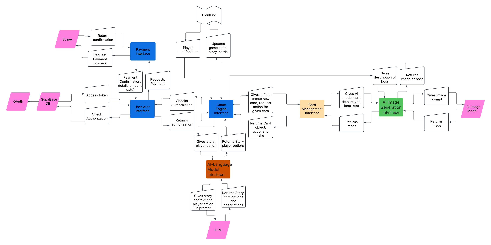

AI Note: This Design document was created with the assistance of ChatGpt.
# Group 5: High-Level Design Document: The Last Game

 ### **Design Summary:**

This document outlines the high-level design of a text-based AI game that offers users a dynamic, interactive experience through AI-generated stories and card collection mechanics. The system operates on a client-server architecture, where the client serves as the user interface (UI) in a web application, and the server handles the complex game logic, user data, and integration with external services. The backend features multiple interfaces to manage user authentication, AI-driven story generation, card management, game state, and payment processing.

Key components include the client-side frontend for interaction, a server-side API layer for communication, and a database to persist user data. External services such as Stripe for payments, OAuth for secure authentication, and AI services for story and image generation are integrated into the system. The design leverages modular interfaces, separating concerns between game logic, user data management, and external services, allowing for scalability and easy future expansion.

The game engine interfaces with a custom AI language model for dynamic storytelling and integrates with external image generation services to create unique visuals for cards. Card management, including generation, upgrades, and collection, is handled independently to ensure smooth game progression. Additionally, secure data handling, including authentication and payment transactions, is achieved through integration with Supabase and Stripe.

## Table Of Contents
1. Stakeholder Expectations

2. Game Design

3. System overview

   
4. Backend Design

   
   2.1 System Overview

   
   2.2 Internal Interfaces
   
      1. User Authentication Interface
      2. Game Engine Interface
      3. Card Management Interface
      4. Database Interface
      5. Payment Interface
      6. AI Image Generation Interface
      7. AI-Language Model Interface
         
   2.3 External Interfaces
   
      1. Stripe
      2. AI Language Model
      3. AI Image Generator service
      4. OAuth
      5. Supabase
         
6. Database Design
   
      1. Actions and Responsibilities
      2. Communication with other Components
      3. Tables and Entities
  
   
9. Risks and Security Design
    
    1. Authentication and Authorization
    2. Data Protection and Privacy
    3. Payment Security with Stripe
    4. Mitigating Common Attacks
    5. Secure Multiplayer and Fairplay
    6. Disaster Recover & Incident Response
    
   
11. UI Design
   

**1 . Stakeholder Expectations:**

1. **Game Players:**
   - **Engagement & Enjoyment:** Players expect an immersive and evolving gaming experience powered by AI. The AI-generated stories should feel dynamic, with player choices significantly impacting the narrative, ensuring replayability.
   - **Customization & Progression:** The card collection system should feel unique for each player based on the story they are experiencing. Players want to see meaningful rewards tied to their in-game actions and feel a sense of accomplishment. 
   - **Visual Appeal:** Players expect unique card visuals that are generated through AI, adding to the game's charm and personalization. UI should be easy to navigate and use.
   - **Security & Privacy:** Players are concerned about the security of their data, especially during payments and personal information storage. They expect a secure authentication process (OAuth) and protection of their game history and progress.
   - **Accessibility & Convenience:** Players expect easy access to the game through a web interface, intuitive game flow, and secure sign-ins without the need for managing multiple passwords.

2. **Game Developers/Operators:**
   - **Scalability & Flexibility:** The development team expects the system to be easily scalable and flexible for future feature expansion, such as adding more cards, boss battles, or in-game events.
   - **Maintainability:** Developers expect the system to be modular, with clear separation of concerns between the client-side and server-side components, facilitating maintenance and bug fixes.
   - **Security & Compliance:** The security design, including encryption, fraud protection, and adherence to privacy regulations, is crucial for the development team to ensure compliance and protect user data.
   - **External Service Integration:** Developers expect seamless integration with third-party services (Stripe, AI models, OAuth) for payment processing, authentication, and story generation.

3. **Business Stakeholders (Product Owners/Investors):**
   - **Monetization & Payment Handling:** Business stakeholders expect the integration with Stripe to support seamless in-game purchases, ensuring a reliable and secure transaction process for users, with potential for future monetization.
   - **User Acquisition & Retention:** Business stakeholders expect the game’s dynamic content and personalized experiences (via AI) to drive player engagement, retention, and growth. The game’s potential to scale should allow for new content and features that can attract and retain a large user base.
   - **Analytics & Data Management:** Stakeholders expect robust analytics on user behavior, progress, and in-game purchases, allowing for data-driven decision-making and targeted updates or new features.
   - **Security & Trust:** Business stakeholders are also invested in the system’s security and the reputation of the platform. Protecting user data and ensuring safe gameplay experiences is essential for maintaining user trust and preventing any negative public relations or financial impact from security breaches.

Overall, each stakeholder group expects a seamless, secure, and engaging experience, with a system designed for scalability and ease of expansion.

## 3. System Overview

The system follows a client-server architecture where the client is a web application that communicates with a backend server to handle game state, user accounts, card collections, payments, and story generation. The server-side logic will be responsible for processing game logic, generating dynamic stories using AI language models, and managing data persistence.

---

## Key Components

### **Client (Web Interface)**

- **Frontend (UI)**: Provides users with an interface for interacting with the game, such as creating accounts, initiating game sessions, viewing storylines, and interacting with the game world (e.g., collecting cards, battling bosses).
  
- **Game State Management**: The client stores temporary game states and interactions while interacting with the server to update game progress.

---

### **Backend (Server)**

- **API Layer**: The server exposes RESTful APIs to facilitate communication with the client. It will be responsible for handling requests like card collection updates, story generation, and game state management. Handled with Game Engine Interface.
  
- **Internal Backend Interfaces**: The core of the backend, which handles the AI-generated story, card interactions and generation, and game logic (including user progress and boss battles).

- **Database**: A relational database to persist game data, user accounts, card collections, game progress, and transaction history.

---

### **External Services**

- **Stripe**: For handling payments and purchasing the game.

- **AI Language Model**: An AI-based model that generates stories for the game. This can be an API for a pre-trained model like GPT-4 or a custom language model.

- **AI Image Generation**: An external service to generate card images based on AI models, providing users with unique visual content for the game.

- **OAuth**: For handling authentication and providing extra security for the user. Supabase will be integrated to handle OAuth and authentication.(Handled by Supabase.
  
- **Supabase**: Database used for authentication, storing game state, images, and card data.

---

## Design Rationale

Client-Server separation ensures a clear division of responsibilities, allowing the backend to manage game logic and storage, while the frontend focuses on delivering an interactive experience. REST APIs provide a standard interface for communication, ensuring scalability and ease of integration with external services (like Stripe and the AI models). AI-driven story generation and card image generation provide a unique and dynamic user experience.

---

## 4. Backend Design

---

### Internal Interfaces

#### i. **User Authentication & Authorization Interface**

- **Purpose**: Validates user authorization using Supabase and OAuth for secure access.
  
- **Actions**:
  - Uses Supabase to validate user has permission to access game data, allowing the Game Engine to retrieve user information.
  
- **Communication with Other Interfaces**:
  - **Internal**:
    - **Database**: Interacts with the user table to store credentials and securely hash passwords (via Supabase).
    - **Game Engine**: Grants access to the user's game state data after successful validation.
    - **Payment**: Confirms user’s purchase status via the Payment Interface.
  - **External**:
    - **OAuth**: Supabase will uses OAuth to exchange the authorization code for an access token. Which will be used for validating whether user has access.
    - **Supabase**: Checks access tokens and allows the backend to retrieve user data.
  
- **Rationale**: The User Authentication & Authorization Interface ensures secure user access and handles user login via OAuth or email/password, depending on user choice. With Supabase managing both OAuth and database storage, there is no need for a separate internal user authentication system, simplifying both the user login and data retrieval process. This interface will be fairly simple and just check that supabase has authenticated a user before granting access to user data.

---

#### ii. **Game Engine (Story Generation & Game Logic) Interface**

- **Purpose**: Powers dynamic story generation, manages game flow, player choices, and game logic.
  
- **Actions**:
  - **Story Generation**: Requests internal AI Language Model to generate story content.
  - **Handle Player Actions**: Processes player choices (e.g., collecting items, battling bosses).
  - **Card & Buff Management**: Manages cards and buffs during in-game interactions.(card Management interface is responsible for updating,creating, and returning card actions. Game engine interface is responsible for applying the effects in game and to the client)
  - **Boss Battle Simulation**: Executes logic for combat and progression.
  
- **Communication with Other Interfaces**:
  - **Internal**:
    - **Card Management**: Gives card details to card management for creating new cards based on player actions. Card managment will send back card details and actions.
    - **Database**: Saves player’s progress and updates inventory during interactions.
    - **AI Image Interface**: Requests images for game content like boss fights.
    - **AI-Language Model Interface**: Generates story updates based on player input.
  
- **Rationale**: This interface serves as the central hub for game progression. It coordinates between multiple systems (card management, database, story generation) to deliver a consistent experience, keeping the flow of the game intact.

---

#### iii. **Card Management Interface**

- **Purpose**: Handles the collection, use, and upgrades of cards within the game.
  
- **Actions**:
  - **Card Generation**: Creates new cards based on in-game events and item descriptions.
  - **Card Usage**: Allows players to use cards for battles or buffs.
  - **Card Collection**: Tracks and updates the player's card inventory.
  - **Card Upgrades**: Manages potential future upgrades of cards.
  
- **Communication with Other Interfaces**:
  - **Internal**:
    - **Game Engine**: Updates card collection and usage during events.
    - **Database**: Stores card inventory and updates each card's use or collection.
    - **AI Image Generation**: Requests images for newly generated cards.
  
- **Rationale**: By separating card management, the game engine remains focused on game flow, while the Card Management Interface takes care of card creation and updates independently. This allows for easy future expansion of card-related features.

---

#### iv. **Database Interface (with Supabase Integration)**

- **Purpose**: Manages all persistent data, such as user accounts, game progress, cards, and transaction records using Supabase.(See Database Interface design for more details)

- **Actions**:
  - **Store User Data**: Saves user credentials (hashed passwords) and other relevant information.
  - **Store Game State**: Tracks player’s game progress, inventory, decisions, and stats.
  - **Transaction Logs**: stores all payment transactions and tracks in-game purchases(if implemented in the future).
  - **Game History**: Saves past game sessions to allow users to resume their gameplay.
  - **Card Collection Management**: Stores and updates the player’s card collection.

- **Communication with Other Interfaces**:
  - **Internal**:
    - **User Authentication Interface**: Stores and retrieves user credentials via Supabase authentication.
    - **Game Engine**: Retrieves and updates user game state and progress.
    - **Card Management**: Stores and updates player’s card inventory.
    - **Payment Interface**: Stores transactions for purchases and in-game items.
  - **External**:
    - **Supabase**: Handles authentication, queries, and storage of user and game-related data.

- **Rationale**: Supabase provides a powerful backend-as-a-service solution with built-in database management, authentication, and real-time capabilities. By using Supabase for data storage, we can focus on building out the game mechanics and user experience. The **Database Interface** will abstract the complexity of interacting with Supabase, allowing for seamless data management.

---

#### v. **Payment Interface (Stripe Integration)**

- **Purpose**: Facilitates in-game purchases and the initial purchase of the game using Stripe.
  
- **Actions**:
  - **Purchase Game**: Handles payment processing through Stripe API.
  - **Transaction History**: Logs purchases to verify user’s game access.
  
- **Communication with Other Interfaces**:
  - **Internal**:
    - **Database**: Stores transaction records and verifies user access.
    - **User Authentication**: Updates user access after a successful payment.
  
- **External**:
  - **Stripe API**: Processes payments and returns transaction statuses.
  
- **Rationale**: A separate Payment Interface allows for clean management of financial transactions. It ensures the game can be easily updated in the future if more payment options are required. This is more of a could have for us, so it will not be highly prioritized during our implementation. 

---

#### vi. **AI Image Generation Interface**

- **Purpose**: Generates custom images for cards and other in-game visuals.
  
- **Actions**:
  - **Card Image Generation**: Requests images based on card attributes.
  - **Image Storage**: Stores generated images to the database.
  - **Boss Image Generation**: Generates visuals for bosses or enemies.
  - **Validation**: Ensures generated images are valid and usable.
  
- **Communication with Other Interfaces**:
  - **Internal**:
    - **Card Management**: Card managment requests images for newly generated cards and is sent back image or error.
    - **Game Engine**: Game engine requests images for boss encounters.
  - **External**:
    - **Image Generation API**: Generates images based on given descriptions.
  
- **Rationale**: This interface isolates image generation to a single component, allowing easy changes and enhancements in the future. It simplifies image management and keeps the logic for visual elements modular. Having logic for image generation seperate allows other components to use the interface without needing to know how it works.

---

#### vii. **AI-Language Model Interface**

- **Purpose**: Powers the AI-driven storylines for the game.
  
- **Actions**:
  - **Story Generation**: Generates narrative elements based on game state and user input.
  - **Boss Battle Descriptions**: Provides descriptions for bosses and encounters.
  - **Quality Control/Validation**: Ensures generated stories are in the correct format.
  - **Story Summary**: Provides summaries of major story beats.
  
- **Communication with Other Interfaces**:
  - **Internal**:
    - **Game Engine**: Requests story updates based on user choices.
    - **Database**: Stores story progress and player decisions.
  - **External**:
    - **AI-Language Model API**: Communicates with the LLM to generate dynamic narratives.
  
- **Rationale**: The AI-Language Model is key to the game’s dynamic narrative. Separating this functionality allows easy scalability and flexibility, ensuring stories are generated seamlessly.

---

### External Interfaces

---

#### i. **Stripe Integration**

- **Purpose**: Handles all financial transactions for the game, from initial purchase to in-game purchases.
  
- **Communication**:
  - **Backend → Stripe**: Sends transaction details to Stripe.
  - **Stripe → Backend**: Returns transaction status (success/failure).

- **Rationale**: Payment is handled externally to reduce security concerns within the game’s backend. Stripe allows secure, easy payment processing.

---

#### ii. **AI Language Model (LLM)**

- **Purpose**: Generates dynamic, AI-powered storylines.

- **Communication**:
  - **Internal AI-Language Model Interface → LLM API**: Sends user input to LLM to generate stories.
  - **LLM → Internal AI-Language Model Interface**: Returns generated story content.

- **Rationale**: By using an external LLM, we can scale and improve the narrative quality without maintaining complex AI models in-house.

---

#### iii. **AI Image Generation Service**

- **Purpose**: Provides unique images for cards and in-game visuals like bosses.

- **Communication**:
  - **AI image generation internal interfac → Image Generation API**: Requests for image creation.
  - **Image Generation API → AI image generation internal interface**: Returns generated image data.

- **Rationale**: Isolating image generation to a single interface allows flexibility in switching image providers or refining visuals in the future. Using external service allows us to avoid needing powerful computers to run the models locally.

---

#### iv. **OAuth Authentication Service**

- **Purpose**: Manages user authentication via OAuth providers (e.g., Google, Facebook) for secure login.(note supabase will responsible for using OAuth)

- **Communication**:
  - **Supabase**: Verifies user and provides session tokens.
  
- **Rationale**: OAuth authentication reduces the overhead of managing user passwords. Supabase will simplify OAuth handling and session management.

---

#### v. **Supabase**

- **Purpose**: Provides backend services for user management, including authentication (via OAuth or email) and game data storage.

- **Communication**:
  - **Backend → Supabase**: Communicates for tasks like sign-up, sign-in, game progress, and transactions.
  - **Supabase → Backend**: Returns user data, game state, and authentication details.

- **Rationale**: Supabase provides a comprehensive, out-of-the-box solution for user management, session handling, and database interactions, allowing us to focus on game development.

---

### Interface Rationale

We divided our project into these interfaces to separate logic and ensure flexibility. This modular approach will make debugging easier and provide a solid foundation for future feature additions. Each interface is designed to handle a specific concern, ensuring that the overall system remains organized and adaptable.

***Interface Interaction Overview***

## 5. Database Interface

### Purpose
Manages all **persistent game data**, integrating with [Supabase](https://supabase.com/) for user authentication and storage. This interface ensures consistency and durability for essential information like:

- **User Accounts** 
- **Game State** 
- **Card Collections** 
- **Transaction Records** 
- **Story Progress & History** 

---

### i. Actions / Responsibilities

1. **Store User Data**  
   - Create new user records
   - Store minimal profile info (username, email, etc.) and passwords securely
   - Maintain ban status if necissary
   - Store purchase status (accounts can be created before purchase)

2. **Store & Retrieve Game State**  
   - **Runs** (playthroughs): Current HP, mana, deck contents, progress through the story, etc.  
   - **Permanent Death**: Mark runs as inactive/completed upon the user’s HP reaching 0 (in line with Roguelike rules).
   - Multiplayer session info (if the user is playing co-op).

3. **Transaction Logs**  
   - Record successful or failed payment attempts from the **Payment Interface** (Stripe).
   - Update user access once purchases are confirmed.

4. **Game History & Analytics**  
   - Optionally store each finished run or partial logs for replay, analytics, or user records.
   - Keep track of user decisions or story branches if you want advanced analytics or a “resume” feature.

5. **Card Collection Management**  
   - Store the user’s current deck: which cards they own, how many duplicates, any upgrades, etc.
   - Store global definitions for each type of card (Attack, Ability, Power) and link them to user decks.
   - Support card generation (as the cards are generated by AI, there shouldn't be a stored number of preset cards as new and unique cards being added will be a constant, although there should be a master table of all cards generated so far)

---

### ii. Communication With Other Components

- **User Authentication Interface**  
  - **Reads/Writes** user data (account creation, password hashes, OAuth tokens).
  - Verifies user has purchased the game before granting broader permissions.

- **Game Engine**  
  - **Retrieves** and **stores** user runs (HP, deck composition, current scenario).
  - Logs and updates combat states or story progress.

- **Card Management**  
  - **Saves** newly generated cards in the user’s deck.
  - **Reads** card definitions from a master list (e.g., from a `cards` table).
  - Updates deck composition upon collecting or removing cards.

- **Payment Interface**  
  - **Writes** transaction records for successful Stripe payments.
  - **Reads** user purchase status to confirm game access.

- **AI-Language Model Interface** (Optional)  
  - Log and retrieve narrative progress for story building.

- **AI Image Generation Interface** (Optional)  
  - Store references to generated images in the database (e.g., linking them to specific cards or enemies).
  - 
<!--NOTE THIS SPECIFICATION MAY CHANGE AS WE MIGHT USE BIT BUCKETS FOR STORAGE-->
---

### iii. Tables & Entities

#### 1. Users Table

- **Fields:**
  - `user_id` (PK)  
  - `email` or `username`  
  - `password_hash`
  - `created_at`, `updated_at`  
  - `purchase_status` 

#### 2. Runs (Playthroughs)

- **Fields:**
  - `run_id` (PK)  
  - `user_id` (FK → `users.user_id`)  
  - `current_hp`, `max_hp`  
  - `mana_capacity`
  - `is_active` (bool) — **false** when the run ends (death)  
  - `started_at`, `ended_at`  
  - `status_effects` (JSON) to track non-combat statuses.  

#### 3. Cards

- **Fields:**
  - `card_id` (PK)  
  - `title`, `type` (Attack, Ability, Power)  
  - `mana_cost`  
  - `description` *(text)*  
  - `keywords` *(JSON or text)* — e.g., `["Damage(6)","Weakened(2)"]`  
  - `image_reference` (for AI-generated images)  
- **Notes:**  
  - This table is the **master list** of all card definitions.  
  - The actual user deck references these by `card_id`.

#### 4. Player_Cards (Decks)

- **Fields:**
  - `deck_entry_id` (PK)  
  - `run_id` (FK → `runs.run_id`)  
  - `card_id` (FK → `cards.card_id`)  
  - `quantity`  
- **Notes:**  
  - Many-to-many relationship: a run can have many cards, and a card can exist in many runs (with different quantities).  
  - This effectively tracks each run’s **deck** composition.

#### 5. Combat / Encounters

- **`combat` Table**  
  - `combat_id` (PK)  
  - `run_id` (FK)  
  - `is_active` (bool)  

- **`combat_participants` Table**  
  - `combat_id` (FK)  
  - `participant_id` (PK)  
  - `entity_type` (“player” or “enemy”)  
  - `entity_id` (points to either `users` or `enemies` if it’s an enemy type)  
  - `current_hp`  
  - `status_effects` (JSON)

- **`combat_actions` Table** (logging each turn)  
  - `action_id` (PK)  
  - `combat_id` (FK)  
  - `participant_id` (FK)  
  - `card_id` (FK or null)  
  - `action_type` (Attack, Defend, etc.)  
  - `details` (JSON: damage done, targets, etc.)  
  - `timestamp`

#### 6. Payments / Transactions

- **Fields:**
  - `transaction_id` (PK)  
  - `user_id` (FK)  
  - `stripe_payment_id` or `transaction_ref`  
  - `amount`  
  - `currency`  
  - `status` (success, failed, etc.)  
  - `created_at`  
- **Notes:**  
  - The **Payment Interface** writes to this table upon receiving success/fail from Stripe.  
  - If `status = 'success'`, you might set the user’s `has_paid` to `true`.

#### 7. Other Potential Tables

- **Enemies**: Depends on how we structure these encounters determines if its worth storing these. 
- **SessionParticipants** (for co-op): Mapping multiple users (and runs) into a single session.

# 6. Security Design
This document was generated with the assistance of ChatGPT, which provided efficient and well-structured explanations for our chosen security measures. It helped articulate our reasoning more clearly and concisely than I could have expressed on my own, ensuring a thorough and well-documented approach to our security design.

## i. Authentication and Authorization
To secure user accounts and prevent unauthorized access, I chose **OAuth** for authentication. This is an industry-standard approach that removes the need for our game to store and manage passwords directly, reducing security risks.

- **OAuth Implementation:** Players will log in using trusted third-party authentication providers like Google, Microsoft, or Apple. This makes it easier for players to sign in without having to remember new credentials while also leveraging the security measures that these platforms already have in place.
- **Token-Based Authentication:** After a successful login, a short-lived access token will be issued, while a refresh token could be used to maintain session continuity. I chose this approach because it balances security and user convenience. This would keep users logged in without forcing them to re-login multiple times.
- **Two-Factor Authentication (2FA):** This will be an optional feature for users who want to add security, particularly for accounts with high in-game value. I included this because it mitigates account takeovers but won't be mandatory unless we store sensitive personal data like credit cards.

## ii. Data Protection & Privacy
Protecting player data is a top priority. I designed our approach based on encryption best practices and compliance with industry regulations.

- **Encryption of Sensitive Data:** Any personally identifiable information (PII) or game-related data will be encrypted where necessary. I chose this because it minimizes risks in case of data leaks while ensuring compliance with security standards.
- **Anonymized Analytics:** Analytics data will be aggregated and anonymized before storage to comply with regulations like GDPR and CCPA. This ensures that player data remains private while still allowing us to analyze game trends.
- **Secure Communication:** I chose TLS 1.3 encryption for client-server communication because it prevents eavesdropping and MITM (Man-in-the-Middle) attacks. TLS 1.3 is also faster than previous versions because it only requires one round trip instead of two. This is especially useful for multiplayer gaming, where latency matters.

## iii. Payment Security with Stripe
Since we could be handling in-game transactions, I decided to use Stripe as our payment processor.

- Stripe is a widely trusted payment provider with built-in security measures like PCI DSS compliance and fraud detection. It also supports multiple payment methods, including credit cards, Apple Pay, and Google Pay, making it easy for players to complete transactions securely.
- Instead of handling credit card details directly, we will use Stripe’s tokenization system to process payments securely. This means we never store sensitive payment data ourselves, reducing our security liability.
- Stripe includes real-time fraud detection, which helps prevent unauthorized transactions. I chose this because it adds an extra layer of security to in-game purchases and prevents chargebacks due to fraudulent activity.

## iv. Mitigating Common Attacks
Since online games are often targeted by cyber threats, I designed a set of security measures to protect our game from common attacks.

### 1. DDoS Protection
DDoS attacks can cause major disruptions in multiplayer games, so I implemented multiple layers of defense:

- **Rate Limiting & Throttling:** Limits excessive requests from a single source to prevent bot-driven traffic spikes.
- **Traffic Monitoring & IP Filtering:** Detects unusual traffic patterns and blocks suspicious requests before they affect gameplay.
- **CDN & Load Balancing:** A Content Delivery Network (CDN) distributes game assets efficiently, and load balancing ensures fair distribution of incoming traffic across servers.

### 2. SQL Injection & Input Validation
Malicious actors may attempt to manipulate game database queries via SQL injection. Preventative measures include:

- **Parameterized Queries & ORM (Object-Relational Mapping):** Using Django ORM or SQL ensures all user inputs are automatically sanitized before being used in queries.
- **Strict Input Validation:** We ensure that all user input (usernames, chat messages, deck names) is validated before being processed, reducing the risk of malicious data being injected.

### 3. Cross-Site Scripting (XSS) and Cross-Site Request Forgery (CSRF)
To prevent unauthorized script execution and malicious actions via the web interface:

- **Content Security Policy (CSP):** Restricts execution of inline scripts and untrusted external sources. This prevents attackers from injecting harmful scripts into the game.
- **CSRF Tokens:** Every authenticated request requiring user action will include **unique CSRF tokens** to prevent unauthorized actions from malicious websites. This ensures that only requests originating from authorized users are accepted.

### 4. Account Takeovers & Brute Force Attacks
To prevent attackers from guessing login credentials:

- **Account Lockouts & CAPTCHA:** After a certain number of failed login attempts, the system will **lock the account temporarily** and require a CAPTCHA verification. This makes it more difficult for attackers to use automated scripts to guess passwords.
- **IP Monitoring:** Repeated failed login attempts from a single IP will trigger **temporary bans** to deter brute-force attacks. This helps prevent attackers from systematically guessing login credentials.

### 5. Prompt Injection Protection
Given the integration of AI-driven features, prompt injection attacks pose a potential threat where malicious inputs could manipulate AI responses:

- **Input Sanitization:** All user inputs interacting with AI components will undergo strict sanitization to remove harmful code or hidden instructions.
- **Context Isolation:** The AI’s processing context will be isolated, ensuring that user-generated content cannot alter system-level instructions or modify AI behavior unexpectedly.
- **Output Validation:** AI-generated outputs will be validated to detect and block any unauthorized commands or sensitive data disclosures before reaching the user interface.

## v. Secure Multiplayer & Fair Play
Since the game features **multiplayer components**, additional security measures are needed to **prevent cheating, exploits, and unauthorized modifications.**

- **Server-Side Game Logic Validation:** All crucial game logic (e.g., deck-building, in-game purchases) will be validated **on the server**, preventing client-side tampering. This ensures that users cannot manipulate game data on their own devices.
- **Cheat Detection Algorithms:** Player behavior will be **analyzed for anomalies**, such as **impossible win rates, artificially inflated resources, or modified game files.** This allows us to detect and prevent cheating.
- **Secure WebSocket Connections:** Multiplayer communication will use **secure WebSocket connections** with end-to-end encryption to prevent interception. This ensures that player interactions remain private and tamper-proof.

## vi. Disaster Recovery & Incident Response
A well-defined **disaster recovery plan** ensures security incidents are handled effectively:

- **Automated Backups:** Game data will be backed up **daily** with encrypted storage. This ensures that data can be restored in the event of a failure.
- **Incident Detection & Alerts:** Security incidents will trigger **real-time alerts**, allowing administrators to respond quickly. This ensures that any security threats are addressed as soon as they arise.
- **Post-Incident Audits:** All security events will be **logged** and **audited** to improve future security measures. This helps refine security strategies and prevent similar issues in the future.

## Conclusion
The security strategy outlined above ensures **robust protection against cyber threats** while maintaining a seamless user experience. By incorporating **OAuth authentication, encryption, DDoS protection, anti-cheat measures, and prompt injection defenses,** the game will be resilient to attacks, safeguarding both user data and gameplay integrity.
