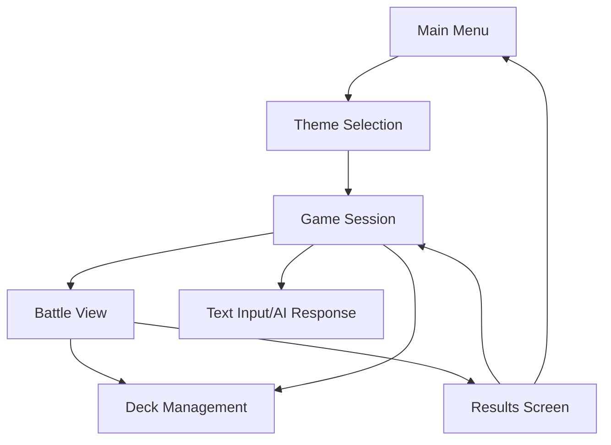
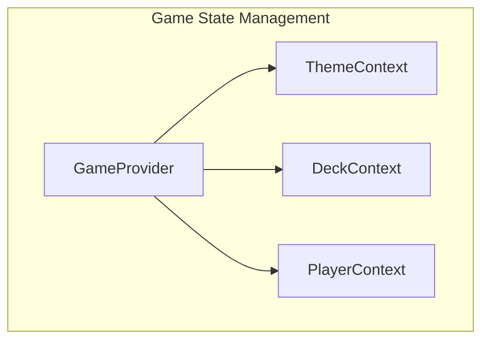
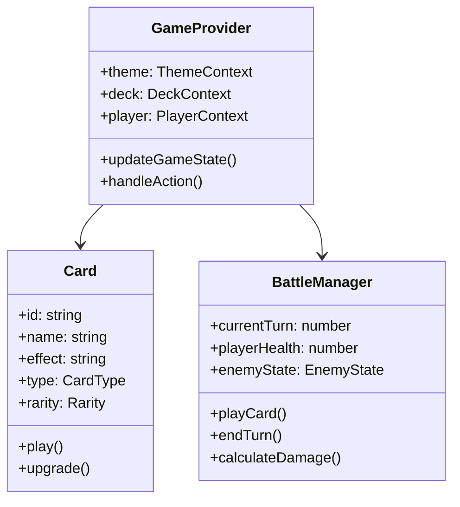

# High-Level Design Document: Roguelike Deck-Building Game Frontend

## 1. Hardware Platform

- **Primary Platform:** Web Application  
- **Target Devices:** Desktop and Tablet browsers (minimum viewport width 768px)  
- **Technology Stack:** React 18+, TypeScript, Tailwind CSS  
- **Supported Browsers:** Chrome 90+, Firefox 90+, Safari 14+, Edge 90+

## 2. User Interface Design

### Branding & Theme

**Color Scheme:**

- **Primary:** `#2D3748` (Dark Blue-Gray)
- **Secondary:** `#805AD5` (Purple)
- **Accent:** `#F6E05E` (Yellow)
- **Background:** `#1A202C` (Dark)
- **Text:** `#F7FAFC` (Light)

**Typography:**

- **Headings:** Inter  
- **Body:** Roboto Mono (for card text and game content)

**Design System:** Dark theme with neon accents for cyberpunk, adjustable for other themes

### UI Flow

## 3. Input/Output Processing

### Input Types

#### Text Commands
- Natural language input for game actions
- Card selection and play commands
- Navigation commands

#### Mouse/Touch Interactions
- Card dragging and dropping
- Button clicks
- Map navigation
- Menu selection

### Output Types

#### Text Content
- AI-generated narrative
- Battle descriptions
- Card effects
- Event outcomes

#### Visual Elements
- Card renders
- Battle animations
- Map visualization
- UI feedback

## 4. Component Architecture

### Core Components

### Internal Interfaces

#### Component Hierarchy

## 5. Security Considerations

### Application Security
- XSS protection through React's built-in escaping
- CSRF protection for API calls
- Input sanitization for text commands

### Data Security
- Local storage encryption for game state
- Secure transmission of player actions
- Rate limiting for API calls

## 6. Implementation Strategy

### Phase 1: Core Game Loop
- Basic UI components
- Card management system
- Battle mechanics
- Theme switching

### Phase 2: AI Integration
- Text command processing
- Dynamic content generation
- Adaptive difficulty

### Phase 3: Polish & Optimization
- Animation system
- Performance optimization
- Responsive design
- Accessibility features

---

