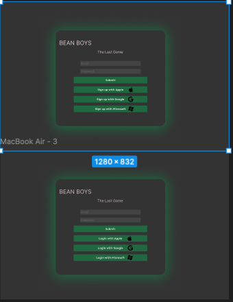
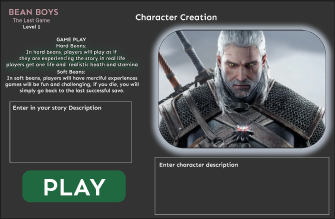
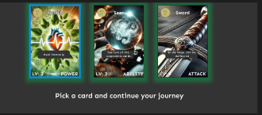
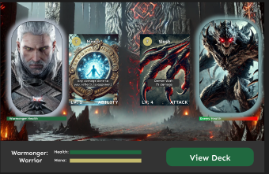

# Low Level Design


Note: Chat GPT was used to help generate sections of this


## **Game Development Backlog**

### **Sprint 2: Core Systems & AI Experimentation (Backend + Initial Frontend)**

### **Backend Team**
#### **Database Setup:**
- [ ] **Set up User table:** Store authentication data, user profile details, and metadata for player progress.
- [ ] **Set up Run table:** Store each game session's progress, including choices made and card usage.
- [ ] **Set up Card tables:** Define schema for different card types, attributes, rarity levels, and effects.

#### **Backend-Server Development:**
- [ ] **Implement Authentication System:** OAuth integration (Google, email/password) using Supabase or Firebase.
- [ ] **Create foundational Game Engine & API Endpoints:**
  - Define routes for game state updates.
  - Implement functions for tracking player progress, stats, and story.
  - Handle card interactions in API responses.
- [ ] **Create Card Management System:**
  - CRUD operations for creating, storing, and retrieving cards.
  - Define internal rules for buffs, debuffs, and status effects.
- [ ] **Set up AI LLM Interface (Initial Mock Responses):**
  - Basic connection to an AI API (e.g., OpenAI, Mistral, Claude).
  - Interface should generate mock responses that simulate in-game interactions.
- [ ] **AI Model Testing & Prompt Engineering:**
  - Experiment with multiple LLMs (GPT-4, Claude, Mistral, etc.) to assess response quality.
  - Start designing/experimenting with structured prompts that align with narrative-driven gameplay.
  - Test AI’s ability to generate **meaningful** stories and responses.

### **Front-End Team**
#### **UI Development for Core Player Navigation**
- [ ] **Create Sign-in / Sign-up Pages:**
  - Basic UI with authentication integration.
  - Error handling for login failures.
- [ ] **Create Main Character Screen:**
  - Displays user stats, character progress, new character button.
- [ ] **Create Character Selection Screen:**
  - Allows players to choose between different starting characters with unique attributes.
- [ ] **Develop AI Text Input Page:**
  - Simple interface for text-based interactions.
  - Mock responses should be rendered dynamically.


    #### **Expectations:**
    **By the end of this sprint:**
      - Users should be able to sign in
      - Users should be authenticated on backend and frontend with supabase/oauth
      - Users should be able to create or select a new character
      - Characters should be stored in database and accessed through backend
      - Players should be able to type response and receive a response(even if just a mock response at first)
      - Back should be able to create mock up cards and store in database      

---

## **Sprint 3: AI Integration & Combat System Development**

### **Backend Team**
#### **Database Enhancements:**
- [ ] **Expand Card Table:**
  - Store additional attributes (mana cost, rarity, effect types).
  - Implement support for deck-building mechanics.

#### **Backend Development:**
- [ ] **Integrate AI into LLM Interface:**
  - Replace mock responses with real AI-generated interactions.
  - Implement token limits, input sanitization, and response formatting.
- [ ] **Implement AI Image Interface (AI-Generated Cards & Assets):**
  - Connect to an AI image generation API (e.g., DALL·E, Stability AI).
  - Generate visuals dynamically for new cards or unique bosses.
- [ ] **Enhance Game Engine with Boss Creation System:**
  - AI-driven bosses with unique abilities and patterns.
  - Implement scaling difficulty for encounters(make bosses have equal level/card power to character).

### **Front-End Team**
#### **Combat & Deck Mechanics UI**
- [ ] **Develop Battle Screen:**
  - Display turn-based battle interface.
  - Show enemy boss, player stats, and cards in hand.
- [ ] **Create Card Deck Component:**
  - UI for selecting and playing cards.
  - Implement drag-and-drop interactions.
- [ ] **Implement Internal Battle Logic for Boss Battles:**
  - Ensure AI-generated bosses have attack patterns.
  - Sync game state with backend API.

  #### **Expectations:**
    **By the end of this sprint:**
      * Users should be recieve AI generated story responses
      * Backend should generate,store, and send ai story responses to client
      * Backend should be able to receive card description and generate image and card stats which should be stored in db
      * Backend should be able to create Boss description, and image and send to client
      * Players should be able to initiate battle, see boss with its stats and image
      * Players should be able to play cards by dragging and dropping, cards should apply effects to user or boss
        


  

---

## **Sprint 4: Monetization, Rewards, and Final Polish**

### **Backend Team**
#### **Database Enhancements:**
- [ ] **Create Payment Transaction Table:**
  - Store user purchases.

#### **Backend Development:**
- [ ] **Generate Card Descriptions Dynamically via AI LLM Interface:**
  - Convert item descriptions into unique, AI-generated card text.
  - Improve AI’s ability to balance game mechanics when generating card effects.
- [ ] **Implement Payment Interface:**
  - Integrate Stripe or another payment processor.
  - Enable purchasing the game.

### **Front-End Team**
#### **Finalizing UI & Visual Enhancements**
- [ ] **Create Reward Screen:**
  - Displays unlocked cards, ai battle summary, and earned items after battles.
- [ ] **Final UI Styling & UX Polish:**
  - Improve animations and transitions.
  - Ensure smooth navigation between screens.
  - Add accessibility features like screen reader support
     
    #### **Expectations:**
    **By the end of this sprint:**
    
      * Players should see a battle summary with ai generated text after defeating boss
      * Backend should generate unique item descriptions based on boss the user beat
      * Players should be able select which item after a boss fight to keep and turn into card
      * Animations should be smooth.
      * Users should see unique visual effects applied during battle
      * Users should be able to buy the game before being granted access
      

---

### 🚀 **Next Steps After Sprint 3:**
Once Sprint 3 is completed, the game should be **fully playable** with AI-driven battles, deck-building, and monetization features. Given extra time, we could focus on:

[] **Bug Fixing & Optimization**  
[] **Multiplayer Features** (Co-op battles, pvp)   

---


## Low-level Design Backend
Subsystem Design: The following section details our backend design. At this point, we've decided that the backend will not be broken into classes for 2 main reasons. The first is we are using Go so it doesn't have a tradition class or inheritance system, but instead uses structs. Also as we designed our low level we have changed some things from our high level. Most of the game logic that the backend was going to use is now being implemented on the front end. The backend will serve the purpose of getting data from the database, updating and storing data, and creating AI content. So we think relying on functions and a more imperative approach to the backend is more appropriate and at this moment and do not see a clear use of classes. This may change during development. Below we have broken our interfaces from highlevel into functions and some into smaller subcomponents.


### User Authentication & Authorization
**AuthService**  
- `validate_token(token: str) -> bool`  
  *Checks if the token is valid.*  
- `get_user_data(user_id: str) -> dict`  
  *Retrieves user data from DB.*  
- `check_purchase_status(user_id: str) -> bool`  
  *Confirms game purchase.*  

### Game Engine
This engine is going to be broken into 2 parts the main game manager that updates/saves character progression that will be used to send data to client and the API layer that defines endpoints for client to call, Game engine makes sure data is formated correctly to be sent to client:


**Endpoints:**

- `/getcards/id:` The server should return all cards belonging to character to client

- `/createcard:` Client passes card description selected to server, server returns a card object as json

- `/getgame/id:` server returns game run(story text, player stats(health, mana))( json)

- `/getsummary:` server returns a summary of the story(json)

- `/getstoryall:` server returns all story text

- `/playerresponse:` client passes user prompt to server, server continued story text

- `/createbattle:` server returns boss details as json(damage, health, url image)

- `/battleresults:` client passes boss outcome(win or lose) server returns ai summary of battle and items to choose from which will be turned into cards.

- `/createnewgame:` the client should pass the game description and character description, server then will create new game, and create a new character(using game engines`create_character(char_description)`) and run.         Game and character will be returned as JSON.


**GameEngine (Backend)**  

- `get_character_state(user_id: str, char_id: str) -> JSON object`  
  *Loads saved game state(character stats/object) from Database*

- `get_cards(user_id: str, char_id: str) -> JSON object`
  *Gets deck of cards for the character from Database*
  
- `generate_story(player_input: str) -> JSON object`  
  *Uses AI language model interface to generate the next story segment and sends it to the client.*
  
- `item_selection(item_selection: str, player_id: str) -> JSON Object`  
  *Processes player choice, returns card*

- `create_character(char_description) -> JSON object`
  *Creates and stores new character in database, calls ai image interface to make character image, returns character details stored in json*
  
  
- `create_boss_battle(player_id: str) -> Json object`  
  *Returns Json of boss object*


- `finalize_battle(player_id: str, outcome: str, player_stats: str) -> JSON Object`  
      *Store player health and stats in DB,
      Create a card from Card Management,
      and return the JSON of the new card.*

- `save_game_state(user_id: str, game_state: dict)`  
  *Saves game progress.*  

**Priority: High**

**Why:** The backend game engines is the access point for the client to communicate. Its responsibilities such as saving data client gives and creating JSON object that can be returned to the client are vital to make our game work

### Card Management
**CardManager**  
- `generate_card(item_description: dict, player_id: str) -> dict`  
  *Given card attributes, creates, saves, and returns a new card.*

- `get_player_cards(player_id: str) -> list`  
  *Retrieves player's card inventory.*
  
- `use_card(card_id: str, player_id: str) -> dict`  
  *Uses a card in battle.*
  
- `upgrade_card(card_id: str, player_id: str) -> dict`  
  *Upgrades an existing card.*  

### Payment Interface
**PaymentService(could have)**  
- `process_payment(user_id: str, amount: float) -> dict`  
  *Handles payment processing.*
  
- `save_transaction(user_id: str, transaction: dict)`
  
  *Stores a transaction record.*
  
- `get_transaction_history(user_id: str) -> list`  
  *Retrieves user payment history.*  

**Priority:** Low

**Why:** Payment functionality will only be implemented once the game is playable, without a game to play their is nothing to purchase.


---

### AI Image Generator Interface
**AIImageGenerator**  
- `generate_card_image(description: str) -> str`  
  *Generates an image for a card, stores in S3 bucket, and returns URL.*
  
- `generate_boss_image(description: str) -> str`  
  *Generates an image for a boss, stores in an S3 bucket, and returns url.*

- `generate_character_image(description: str)`
  *Generates image that will be used to represent the character in-game, returns url*


  
**Rationale:** This subcomponent will be responsible for communicating with the external AI image generator service. Both functions will have a custom prompt built for the type of image it is trying to make. More information on how AI integration will work in section 

**Priority**: High

**Why**: Image generation will be vital in providing unique visuals for users. Card images will be deemed the highest priority of all image creation, followed by boss images and character. The reason being is we want cards to be unique, we can use default icons to represent player and boss in battle if needed.


---

### AI Language Model Interface
**AI Story Generator**(connects to external AI LLM for generating content)
- `generate_story_text(user_prompt: str) -> str`  
  *Prompts Ai with user input and custom prompt to Generate dynamic story content. Returns story text*
  
- `generate_boss_encounter_story(user_input: str) -> str`  
  *Generates an encounter with boss, returns story text*

- `summarize_story(story_data: list) -> str`  
  *Provides a story summary based on the list of all previous text.*

- `generate_item_options(AI_Text: str ) -> str`
  *Prompts the ai to generate a story where multiple objects can be picked up. generates attributes of each object that match card attributes*

- `parse_items(item_descriptions: str) -> dict`
  *Filters through item description to find keywords to build an card object later, returns dictionary of items and their attributes*


**AI Entity creator(connects to externam AI LLM)**
  - `generate_boss_entity(story_text: str) -> dict`
      *Uses AI to crate boss attributes, interacts with AI image generator to return boss image url, returns these attribtes below*
    
      - **Boss_Entity attributes**
        - **name**: string
        - **health**: int
        - **mana**: int
        - **damage_amount**: int
        - **description**: string
        - **boss_card**: list of cards generated for boss
        - **Image_URL**: str
   
  - `generate_character_entity(character_description: str) -> dict`
      *Prompts AI to create character attributes, interacts with AI image generator to generate character image url, returns these attribtes below*
    
      - **Character_Entity attributes**
        - **name**: string
        - **health**: int
        - **mana**: int
        - **description**: string
        - **Image_URL**: str
   
**Priority**: High

**Why:** It's vital to our program to have a system that creates attributes for other enties. Character entities will be prioritized over bosses initially since we want text and character creation to work early on. Once boss battles are implemented boss entites will be worked on.
    


**Rationale:** We've broken the AI Language model interface into 2 subcomponents. Since they will each have different prompts and data output. The story generator is broken into multiple functions that perform different tasks, based on the need. For example, general story generation will be prompted differently than when we want to generate a description of a boss encounter. Also we need custom prompts for generating story with items. We created the AI entity creator to focus on taking story and entity descriptions and turning them into entity attributes that can be stored or passed to the client.

---


**Explanation:** Why We're Not Using Classes in Our GO Server...
In designing our backend server using Go (Golang), we've opted not to implement object-oriented programming (OOP) with classes for several key reasons. Instead, we focus on using Go's strengths, such as its simplicity, performance, and suitability for the request-based nature of our application. Below is an explanation of why classes aren't necessary for the backend system described in the design document.

Our backend primarily handles requests (API calls) from clients, processes data, and returns responses in the form of JSON objects. The design revolves around straightforward interactions such as retrieving game data, processing user input, and generating content. These interactions are better suited to Go’s simple function-based approach rather than an OOP model, which can introduce unnecessary complexity in the form of class definitions and inheritance hierarchies.

For example, our GameEngine manages game data and communicates with services like CardManager and AIStoryGenerator, but these interactions are handled through functions that receive arguments, process them, and return results, without the need to wrap these operations in classes.


---

---


## Frontend Low-Level Design

### Overview

The frontend application is built using React with TypeScript, following a component-based architecture. The application integrates with the backend services through RESTful APIs and manages game state using React Context and local state management.

## Type Definitions & Interfaces

### Core Types

#### Game Progress
- Game progress will contain the current story node, players inventory at the time, and the date the player last played the game. 

```typescript

type GameProgress = {
  currentStoryNode: string;
  inventory: Card[];
  lastPlayed: Date;
};
```
#### Card
- The card type will contain attributes and descriptions of the card. It will also have a link to the S3 bucket where we store the card image. Cards will have both attributes and effects, to provide a wide range of options for the player. 
```typescript

type Card = {
  id: string;
  name: string;
  description: string;
  imageUrl: string;
  type: CardType;
  attributes: CardAttributes;
  effects: CardEffect[];
};

type CardType = 'attack' | 'defense' | 'buff' | 'special';
type EffectType = 'damage' | 'heal' | 'buff' | 'debuff';
type CardAttributes = {
  cost: number;
  power: number;
  duration?: number;
};

type CardEffect = {
  type: EffectType;
  value: number;
  duration?: number;
};

```
#### Game State and Player Story Nodes
- We need a way to store story information, for when players leave and exit the game. We also 

```typescript
type GameState = {
  currentStory: StoryNode;
  playerState: PlayerState;
  bossState?: BossState;
  inventory: Card[];
};

type StoryNode = {
  id: string;
  content: string;
  choices: Choice[];
  items?: Item[];
};

type Choice = {
  id: string;
  text: string;
  nextNodeId: string;
  consequences?: GameStateChange[];
};
```


#### Battle Types
```
type BossState = {
  id: string;
  name: string;
  health: number;
  maxHealth: number;
  imageUrl: string;
  abilities: BossAbility[];
};

type BossAbility = {
  name: string;
  damage: number;
  effects: CardEffect[];
};
```

### API Interfaces

```typescript
interface GameAPI {
  startGame(): Promise<GameState>;
  makeChoice(choiceId: string): Promise<GameState>;
  useCard(cardId: string, targetId?: string): Promise<GameState>;
  collectItem(itemId: string): Promise<Card>;
  saveProgress(gameState: GameState): Promise<void>;
}

interface AuthAPI {
  login(credentials: LoginCredentials): Promise<User>;
  logout(): Promise<void>;
  register(userData: RegistrationData): Promise<User>;
  resetPassword(email: string): Promise<void>;
}

interface CardAPI {
  getCards(): Promise<Card[]>;
  upgradeCard(cardId: string): Promise<Card>;
  getCardDetails(cardId: string): Promise<Card>;
}
```

## Component Architecture

### Core Components

#### CardComponent
```typescript
interface CardProps {
  card: Card;
  isPlayable: boolean;
  onUse?: (cardId: string) => void;
  className?: string;
}

const Card: React.FC<CardProps> = ({ card, isPlayable, onUse, className }) => {
  // Component implementation
};
```

#### StoryDisplay
```typescript
interface StoryDisplayProps {
  node: StoryNode;
  onChoiceSelected: (choiceId: string) => void;
}

const StoryDisplay: React.FC<StoryDisplayProps> = ({ node, onChoiceSelected }) => {
  // Component implementation
};
```

#### BattleInterface
```typescript
interface BattleInterfaceProps {
  playerState: PlayerState;
  bossState: BossState;
  availableCards: Card[];
  onCardPlayed: (cardId: string) => void;
}

const BattleInterface: React.FC<BattleInterfaceProps> = ({
  playerState,
  bossState,
  availableCards,
  onCardPlayed,
}) => {
  // Component implementation
};
```

#### Inventory
```typescript
interface InventoryProps {
  cards: Card[];
  onCardSelected: (card: Card) => void;
}

const Inventory: React.FC<InventoryProps> = ({ cards, onCardSelected }) => {
  // Component implementation
};
```

### Layout Components

#### GameLayout
```typescript
interface GameLayoutProps {
  children: React.ReactNode;
  showInventory?: boolean;
  showStats?: boolean;
}

const GameLayout: React.FC<GameLayoutProps> = ({
  children,
  showInventory,
  showStats,
}) => {
  // Component implementation
};
```

## Pages

### HomePage
```typescript
const HomePage: React.FC = () => {
  // Implementation for landing page
};
```

### GamePage
```typescript
const GamePage: React.FC = () => {
  // Main game implementation
};
```

### BattlePage
```typescript
const BattlePage: React.FC = () => {
  // Battle system implementation
};
```

### InventoryPage
```typescript
const InventoryPage: React.FC = () => {
  // Card collection and management implementation
};
```

### AuthPages
```typescript
const LoginPage: React.FC = () => {
  // Login implementation
};

const RegisterPage: React.FC = () => {
  // Registration implementation
};
```

## State Management

### Game Context
```typescript
interface GameContextType {
  gameState: GameState;
  dispatch: React.Dispatch<GameAction>;
}

type GameAction =
  | { type: 'UPDATE_STORY'; payload: StoryNode }
  | { type: 'USE_CARD'; payload: { cardId: string; targetId?: string } }
  | { type: 'COLLECT_ITEM'; payload: Item }
  | { type: 'UPDATE_PLAYER_STATE'; payload: Partial<PlayerState> };

const GameContext = React.createContext<GameContextType | undefined>(undefined);
```

### Auth Context
```typescript
interface AuthContextType {
  user: User | null;
  login: (credentials: LoginCredentials) => Promise<void>;
  logout: () => Promise<void>;
}

const AuthContext = React.createContext<AuthContextType | undefined>(undefined);
```

## API Integration

### API Client
```typescript
class APIClient {
  private baseUrl: string;
  private token: string | null;

  constructor(baseUrl: string) {
    this.baseUrl = baseUrl;
    this.token = null;
  }

  setToken(token: string) {
    this.token = token;
  }

  async get<T>(endpoint: string): Promise<T> {
    // Implementation
  }

  async post<T>(endpoint: string, data: any): Promise<T> {
    // Implementation
  }

  async put<T>(endpoint: string, data: any): Promise<T> {
    // Implementation
  }

  async delete(endpoint: string): Promise<void> {
    // Implementation
  }
}
```

### API Hooks
```typescript
function useGame() {
  const [gameState, setGameState] = useState<GameState | null>(null);

  // Implementation
}

function useCards() {
  const [cards, setCards] = useState<Card[]>([]);

  // Implementation
}

function useBattle() {
  const [battleState, setBattleState] = useState<BattleState | null>(null);

  // Implementation
}
```
### Additional UI Prototypes

Below are the newly added UI prototypes showcasing the main screens of the application. Each prototype is accompanied by a brief explanation of its purpose, key elements, and how it fits into the overall user flow.

---

### 1. Login Screen



**Purpose:**
- Provide users with a straightforward way to log in or register.
- Offer multiple sign-in options (e.g., Google, Microsoft) for convenience.

**Key Elements:**
- **Email & Password Fields:** Standard text inputs for credentials.
- **Social Login Buttons:** Quick authentication through external providers.
- **Submit Button:** Triggers login or registration flow.

**Flow Integration:**
1. **User enters credentials** (or chooses a social login).
2. **On success**, user is directed to the main game dashboard or character creation screen.

---

### 2. Character Creation



**Purpose:**
- Allow players to customize their game experience before starting.
- Select difficulty (“Hard” or “Merciful” modes), choose a game mode (single-player, multiplayer), and input character details.
- Optionally generate an AI-created avatar image based on the user’s description.

**Key Elements:**
- **Difficulty & Mode Selectors:** Radio buttons or dropdowns for selecting how challenging or story-driven the game will be.
- **Character Description Input:** Text field for the user to describe their character. This description is used to generate a personalized avatar image via AI.
- **Play Button:** Commits selections and initializes the game session.

**Flow Integration:**
1. **User selects difficulty level** (e.g., Hard or Merciful).
2. **User chooses game mode** (single-player, co-op, etc.).
3. **User enters a character description** and sees an AI-generated avatar.
4. **Clicking “Play”** starts the game and loads the initial story node.

---

### 3. Deck View


**Purpose:**
- Display the user’s current collection of cards.
- Provide detailed information on each card’s level, type (Attack, Ability, Power), and effects.

**Key Elements:**
- **Card Grid/List:** Each card is shown with its name, level, and an image.
- **Card Details:** Hovering or clicking on a card can reveal more in-depth stats or upgrade options.
- **Navigation Back to Game:** A clear way to return to the main story or battle interface.

**Flow Integration:**
1. **User opens the Deck screen** from a navigation menu or button.
2. **User reviews available cards**, possibly upgrades or discards them.
3. **Returning to the main game** continues story progression or battle interactions.

---

### 4. Chest Opening



**Purpose:**
- Present a reward or loot screen where the user can pick one new card to add to their deck.
- Occurs after certain story milestones, battles, or quest completions.

**Key Elements:**
- **Three Card Options:** Each with a unique effect, type, or rarity.
- **Selection Prompt:** “Pick a card and continue your journey.”
- **Add to Deck:** The chosen card is added to the user’s inventory for future battles.

**Flow Integration:**
1. **User completes an event** (defeats a boss, completes a quest, etc.).
2. **A chest screen appears** with three random card rewards.
3. **User selects one card** to keep, which is then stored in their deck/inventory.

---

### 5. Battle View



**Purpose:**
- Facilitate real-time or turn-based combat against bosses or other players (1v1 or multiplayer co-op).
- Display each participant’s health, chosen cards, and current status.

**Key Elements:**
- **Player & Enemy Portraits:** Show health bars, mana (if applicable), and character images.
- **Chosen Cards:** Each side reveals the card they’re playing this turn (attack, defense, ability, etc.).
- **View Deck Button:** Allows quick access to the player’s card collection to plan the next move.

**Flow Integration:**
1. **Battle starts** (boss encounter, PvP, or co-op).
2. **Players select cards** to play each round (using the “View Deck” button to choose).
3. **Round resolves**, showing damage dealt, healing, or buffs/debuffs applied.
4. **Repeat until** one side is victorious or the battle ends.

---

### How These Screens Fit Into the Overall Experience

1. **Login** → 2. **Character Creation** → 3. **Main Story/Battles**
   - Users begin at the login screen, authenticate, and create or load their character.
   - Once the character is set, they enter the main game flow, which can include battles, story progression, and deck management.

2. **Deck & Chest Interactions** are auxiliary:
   - Players access the **Deck View** at any time to strategize or upgrade.
   - **Chest Opening** occurs after significant milestones, rewarding players with new cards.

3. **Battle View** is central to combat encounters:
   - Displays real-time updates on health, mana, and card usage.
   - Integrates seamlessly with the deck system, allowing players to select the best cards for each encounter.

---

**Note:**  
All images shown are prototypes and subject to change based on ongoing user testing and feedback. Accessibility features such as proper color contrast, keyboard navigation, and ARIA labels are integrated to ensure inclusivity and a positive user experience.


## System Performance

Ensuring optimal system performance is crucial for maintaining a seamless gaming experience, particularly as player engagement increases. Its important for out client that the game runs as smoothly as possible for users. This section addresses potential bottlenecks and how the system handles an increase in load.

### Potential Bottlenecks & Mitigation Strategies

1. **Database Performance**
   - **Bottleneck:** Increased concurrent queries from a growing user base may slow down game state retrieval and card collection updates.
   - **Mitigation:**
     - Implement database indexing to optimize query performance.
     - Utilize caching mechanisms (e.g., Redis) for frequently accessed data, such as user game state and card inventory.
     - Optimize database queries and use connection pooling to handle high traffic efficiently.
     - Put more Game logic on the front end to reduce the number of server requests
     
2. **AI-Generated Story & Image Processing**
   - **Bottleneck:** AI language model and AI image generation API calls may introduce latency, impacting real-time gameplay.
   - **Mitigation:**
     - Pre-generate and cache frequently used story elements and card images.
     - Implement asynchronous processing for AI requests to prevent blocking gameplay interactions.
     - Utilize a load balancer to distribute AI generation requests efficiently.
     
3. **Server Load & Scalability**
   - **Bottleneck:** High user concurrency may overwhelm the backend, leading to slower API response times.
   - **Mitigation:**
     - Deploy auto-scaling instances to dynamically adjust server capacity based on traffic.
     - Use a CDN (Content Delivery Network) to distribute assets and reduce server load.
     - Implement rate limiting to prevent abuse and ensure fair resource allocation.

4. **Authentication & Payment Processing**
   - **Bottleneck:** Increased authentication requests and payment transactions could lead to delays in login and purchase verification.
   - **Mitigation:**
     - Leverage Supabase’s authentication caching to minimize redundant authentication checks.
     - Use asynchronous processing for payment verification to avoid blocking gameplay progression.
     - Implement queue-based processing to handle peak transaction loads smoothly.

5. **Game Engine & Card Management Performance**
   - **Bottleneck:** Processing real-time game actions (e.g., battles, inventory updates) may introduce performance lag.
   - **Mitigation:**
     - Offload intensive game calculations to background workers to reduce response time.
     - Use efficient data structures to store and retrieve card details and game state quickly.
     - Optimize the game logic execution flow to minimize redundant computations.

### Handling Increased Load

As the player base grows, the system must scale effectively. The following measures will be in place to ensure smooth operation under increased load:

1. **Horizontal Scaling**
   - Load balance API requests across multiple instances to prevent any single point of failure.
   - Implement containerization (e.g., Docker, Kubernetes) to deploy and manage scalable microservices.

2. **Asynchronous Processing & Message Queues**
   - Use message queues (e.g., RabbitMQ, Kafka) to process non-urgent tasks in the background.
   - Implement event-driven architecture for handling game events and AI-generated content asynchronously.

3. **Optimized API Gateway**
   - Use an API gateway to efficiently route and manage API requests.
   - Implement request batching to reduce redundant API calls and improve response times.

4. **Monitoring & Performance Optimization**
   - Continuously monitor API response times, database query performance, and server health.
   - Implement automated alerts and logging to detect and address performance issues proactively.

By applying these strategies, the system will maintain high performance while ensuring scalability as the game evolves and attracts more players.

## Programming Languages, Libraries, and Frameworks

This section outlines the key programming languages, libraries, and frameworks that will be used in our system. The selections are based on project requirements such as performance, scalability, and long-term maintainability.

### Backend

- **Programming Language: Go**
  - *Why:* Go is a statically typed, compiled language known for its performance, simplicity, and excellent support for concurrent programming. These features make it an ideal choice for building a high-performance game server that can efficiently handle multiple simultaneous connections. While robust the language has fairly simple syntax which will make it easier for those on the team who don't yet know it to learn.

- **Framework: chi**
  - *Why:* chi is a lightweight and idiomatic HTTP router for Go, designed for building RESTful APIs. Its minimalistic design and composability allow for rapid development while keeping the backend lean and maintainable.


### Front End
- **React with TypeScript**
  - *Why:* React provides a powerful framework for building interactive user interfaces, while TypeScript adds static typing, reducing runtime errors and improving code maintainability. This combination ensures a scalable and robust front-end development experience. React will also allow us to reuse UI elements in multiple screens which will help us reuse components as new game content is added in the future.
 
- **Additional Frontend Libraries:**
  - **Fetch API**
    - *Why:* Used for making HTTP requests to our backend, ensuring smooth communication between the client and server.
  - **React Router**
    - *Why:* Manages in-app navigation, ensuring a seamless user experience as players move between different views.
  - **CSS Frameworks (Tailwind CSS)**
    - *Why:* Provides pre-built components and utility classes that expedite the development of a responsive and user-friendly interface. Will allow us to build a styled ui faster and help with designing new pages and content in the future.


### How these choices affect development and performance

- **Performance and Scalability:**  
  Both Go and React are optimized for high performance and scalability. Go's efficient concurrency handling may be crucial for managing a high volume of simultaneous requests, while React's virtual DOM and component-based architecture ensure a smooth and responsive user experience. We won't be focusing on concurrency yet, but go's capabilities will allow us in the future to add concurrency if we need performance boosts.

- **Ease of Development & Maintainability:**  
  Go's simplicity and clear syntax lower the learning curve and reduce complexity, making the backend easier to maintain over time. Meanwhile, React combined with TypeScript offers enhanced code quality and predictability on the frontend, facilitating long-term maintenance and reducing the risk of bugs.

- **Ecosystem and Community Support:**  
  The vast ecosystems around Go and React mean access to extensive libraries, frameworks, and community support. This ensures that any challenges encountered can be swiftly addressed with proven solutions and best practices.

- **Modularity and Flexibility:**  
  By leveraging specialized libraries (like chi for routing and stripe-go for payment integration), the system remains modular. This modularity allows individual components to be updated or replaced independently as the system evolves, aligning with future requirements and technological advancements.


## External Implementations


