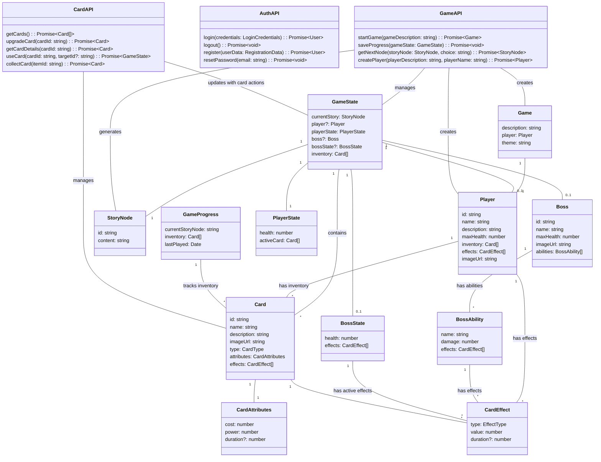

# Low Level Design
Note: This document was generated with the assistance of ChatGPT

This document details our low-level design. With stakeholder expectations set up in the high-level design, this low-level design shows how we will implement features to satisfy players, game developers, and business operators. We cover the backend and front-end implementation to show how our program will be designed and how we will create an interactive and smooth experience for users and for future game developers of the game to look back on and consider our implementation when creating new content. We cover performance considerations that will improve playability for players and create more efficiency for business owners. We also cover security design to keep players safe and reduce liability for business owners. We also outline our deployment strategy so business owners know how the game will be deployed to an audience. As we enter the development phase, aspects of this document may change to reflect new ideas and fix problems we run into.

This was our initial plan, at the bottom are some notes about what changed or wasn't implemented during development.

**Table of Contents for Low-Level Design:**

1. Game Development Backlog
2. Programming Languages, Libraries, and Frameworks
3. Backend Design
4. Database Design
5. FrontEnd Design
6. External Service Implementations
7. Security Design
8. Performance
9. Deployment Strategy
10. Updated Design Notes after development


## **1. Game Development Backlog**

### **Sprint 2: Core Systems & AI Experimentation (Backend + Initial Frontend)**

#### **Database Team:**
- [ ] **Set up User table:** Store authentication data, user profile details, and metadata for player progress.
- [ ] **Set up Run table:** Store each game session's progress, including choices made and card usage.
- [ ] **Set up Card tables:** Define schema for different card types, attributes, rarity levels, and effects.

#### **Backend Team:**
- [ ] **Implement Authentication System:** OAuth integration (Google, email/password) using Supabase or Firebase.
- [ ] **Create foundational Game Engine & API Endpoints:**
  - Define routes for game state updates.
  - Implement functions for tracking player progress, stats, and story.
  - Handle card interactions in API responses.
- [ ] **Create Card Management System:**
  - CRUD operations for creating, storing, and retrieving cards.
  - Define internal rules for buffs, debuffs, and status effects.
- [ ] **Set up AI LLM Interface (Initial Mock Responses):**
  - Basic connection to an AI API (e.g., OpenAI, Mistral, Claude).
  - Interface should generate mock responses that simulate in-game interactions.
- [ ] **AI Model Testing & Prompt Engineering:**
  - Experiment with multiple LLMs (GPT-4, Claude, Mistral, etc.) to assess response quality.
  - Start designing/experimenting with structured prompts that align with narrative-driven gameplay.
  - Test AI’s ability to generate **meaningful** stories and responses.

#### **Front-End Team**
#### **UI Development for Core Player Navigation**
- [ ] **Create Sign-in / Sign-up Pages:**
  - Basic UI with authentication integration.
  - Error handling for login failures.
- [ ] **Create Main Character Screen:**
  - Displays user stats, character progress, new character button.
- [ ] **Create Character Selection Screen:**
  - Allows players to choose between different starting characters with unique attributes.
- [ ] **Develop AI Text Input Page:**
  - Simple interface for text-based interactions.
  - Mock responses should be rendered dynamically.


#### **Expectations:**

**By the end of this sprint:**

  - Users should be able to sign in
  - Users should be authenticated on the backend and frontend with supabase/oauth
  - Users should be able to create or select a new character
  - Characters should be stored in the database and accessed through the backend
  - Players should be able to type a response and receive a response(even if just a mock response at first)
  - Back should be able to create mock-up cards and store in the database      

---

### **Sprint 3: AI Integration & Combat System Development**

### **Backend**
#### **Database Team:**
- [ ] **Expand Card Table:**
  - Store additional attributes (mana cost, rarity, effect types).
  - Implement support for deck-building mechanics.

#### **Backend Team:**
- [ ] **Integrate AI into LLM Interface:**
  - Replace mock responses with real AI-generated interactions.
  - Implement token limits, input sanitization, and response formatting.
- [ ] **Implement AI Image Interface (AI-Generated Cards & Assets):**
  - Connect to an AI image generation API (e.g., DALL·E, Stability AI).
  - Generate visuals dynamically for new cards or unique bosses.
- [ ] **Enhance Game Engine with Boss Creation System:**
  - AI-driven bosses with unique abilities and patterns.
  - Implement scaling difficulty for encounters(make bosses have equal level/card power to character).

#### **Front-End Team**
#### **Combat & Deck Mechanics UI**
- [ ] **Develop Battle Screen:**
  - Display turn-based battle interface.
  - Show enemy boss, player stats, and cards in hand.
- [ ] **Create Card Deck Component:**
  - UI for selecting and playing cards.
  - Implement drag-and-drop interactions.
- [ ] **Implement Internal Battle Logic for Boss Battles:**
  - Ensure AI-generated bosses have attack patterns.
  - Sync game state with backend API.

#### Expectations:

**By the end of this sprint:**

  * Users should receive AI generated story responses
  * Backend should generate, store, and send ai story responses to client
  * Backend should be able to receive card description and generate image and card stats which should be stored in db
  * Backend should be able to create Boss description, and image and send to client
  * Players should be able to initiate battle, see boss with its stats and image
  * Players should be able to play cards by dragging and dropping, cards should apply effects to user or boss
        


  

---

### **Sprint 4: Monetization, Rewards, and Final Polish**

### **Backend**
#### **Database Team:**
- [ ] **Create Payment Transaction Table:**
  - Store user purchases.

#### **Backend Team:**
- [ ] **Generate Card Descriptions Dynamically via AI LLM Interface:**
  - Convert item descriptions into unique, AI-generated card text.
  - Improve AI’s ability to balance game mechanics when generating card effects.
- [ ] **Implement Payment Interface:**
  - Integrate Stripe or another payment processor.
  - Enable purchasing the game.

#### **Front-End Team**
#### **Finalizing UI & Visual Enhancements**
- [ ] **Create Reward Screen:**
  - Displays unlocked cards, ai battle summary, and earned items after battles.
- [ ] **Final UI Styling & UX Polish:**
  - Improve animations and transitions.
  - Ensure smooth navigation between screens.
  - Add accessibility features like screen reader support


#### Expectations:
    
**By the end of this sprint:**

  * Players should see a battle summary with ai generated text after defeating the boss
  * Backend should generate unique item descriptions based on the boss the user beat
  * Players should be able to select which item after a boss fight to keep and turn into card
  * Animations should be smooth.
  * Users should see unique visual effects applied during battle
  * Users should be able to buy the game before being granted access
      

---

#### **Next Steps After Sprint 4:**
Once Sprint 3 is completed, the game should be **fully playable** with AI-driven battles, deck-building, and monetization features. Given extra time, we could focus on:

* **Bug Fixing & Optimization**
* **Multiplayer Features** (Co-op battles, pvp)   


---

## 2. Programming Languages, Libraries, and Frameworks

This section outlines the key programming languages, libraries, and frameworks that will be used in our system. The selections are based on project requirements such as performance, scalability, and long-term maintainability.

### Backend

- **Programming Language: Go**
  - *Why:* Go is a statically typed, compiled language known for its performance, simplicity, and excellent support for concurrent programming. These features make it an ideal choice for building a high-performance game server that can efficiently handle multiple simultaneous connections. While robust, the language has a fairly simple syntax which will make it easier for those on the team who don't yet know it to learn.

- **Framework: chi**
  - *Why:* chi is a lightweight and idiomatic HTTP router for Go, designed for building RESTful APIs. Its minimalistic design and composability allow for rapid development while keeping the backend lean and maintainable.

- **Payment Integration Library: stripe-go**
  - *Why:* stripe-go is the official Go library for integrating Stripe’s payment processing capabilities into our backend. It provides robust, secure methods for handling payments, managing subscriptions, and processing refunds. This integration ensures that financial transactions are handled efficiently and safely, while seamlessly aligning with our Go-based architecture.

### Front End

- **React with TypeScript**
  - *Why:* React provides a powerful framework for building interactive user interfaces, while TypeScript adds static typing, reducing runtime errors and improving code maintainability. This combination ensures a scalable and robust front-end development experience. React will also allow us to reuse UI elements in multiple screens, which will help us reuse components as new game content is added in the future.
 
- **Additional Frontend Libraries:**
  - **Fetch API**
    - *Why:* Used for making HTTP requests to our backend, ensuring smooth communication between the client and server.
  - **React Router**
    - *Why:* Manages in-app navigation, ensuring a seamless user experience as players move between different views.
  - **CSS Frameworks (Tailwind CSS)**
    - *Why:* Provides pre-built components and utility classes that expedite the development of a responsive and user-friendly interface. It will allow us to build a styled UI faster and help with designing new pages and content in the future.
  - **Stripe Elements**
    - *Why:* Stripe Elements are pre-built UI components designed to securely collect payment information from users. They simplify the integration of payment forms, ensure PCI compliance, and provide customizable components that work seamlessly with our React and TypeScript stack, delivering a secure and consistent checkout experience.

### How these choices affect development and performance

- **Performance and Scalability:**  
  Both Go and React are optimized for high performance and scalability. Go's efficient concurrency handling may be crucial for managing a high volume of simultaneous requests, while React's virtual DOM and component-based architecture ensure a smooth and responsive user experience. We won't be focusing on concurrency yet, but Go's capabilities will allow us in the future to add concurrency if we need performance boosts.

- **Ease of Development & Maintainability:**  
  Go's simplicity and clear syntax lower the learning curve and reduce complexity, making the backend easier to maintain over time. Meanwhile, React combined with TypeScript offers enhanced code quality and predictability on the frontend, facilitating long-term maintenance and reducing the risk of bugs.

- **Ecosystem and Community Support:**  
  The vast ecosystems around Go and React mean access to extensive libraries, frameworks, and community support. This ensures that any challenges encountered can be swiftly addressed with proven solutions and best practices.

- **Modularity and Flexibility:**  
  By leveraging specialized libraries (like chi for routing, stripe-go for payment integration, and Stripe Elements for secure payment UI components), the system remains modular. This modularity allows individual components to be updated or replaced independently as the system evolves, aligning with future requirements and technological advancements.

---

## 3. Low-level Design Backend
Subsystem Design: The following section details our backend design. At this point, we've decided that the backend will not be broken into classes for 2 main reasons. The first is we are using Go so it doesn't have a traditional class or inheritance system, but instead uses structs. Also as we designed our low level we have changed some things from our high level. Most of the game logic that the backend was going to use is now being implemented on the front end. The backend will serve the purpose of getting data from the database, updating and storing data, and creating AI content. So we think relying on functions and a more imperative approach to the backend is more appropriate and at this moment and do not see a clear use of classes. This may change during development. Below we have broken our interfaces from high level into functions and some into smaller subcomponents. Security design and implementation will be covered in the security section.


### User Authentication & Authorization
**AuthService**  
- `validate_token(token: str) -> bool`  
  *Checks if the token is valid.*  
- `get_user_data(user_id: str) -> dict`  
  *Retrieves user data from DB.*  
- `check_purchase_status(user_id: str) -> bool`  
  *Confirms game purchase.*  

### Game Engine
This engine is going to be broken into 2 parts the main game manager that updates/saves character progression that will be used to send data to the client and the API layer that defines endpoints for the client to call, Game engine makes sure data is formatted correctly to be sent to the client:


**Endpoints:**

- `/getcards/id:` The server should return all cards belonging to character to client

- `/createcard:` Client passes card description selected to server, server returns a card object as json

- `/getgame/id:` server returns game run(story text, player stats(health, mana))( json)

- `/getsummary:` server returns a summary of the story(json)

- `/getstoryall:` server returns all story text

- `/playerresponse:` client passes user prompt to server, server continued story text

- `/createbattle:` server returns boss details as json(damage, health, url image)

- `/battleresults:` client passes boss outcome(win or lose) server returns ai summary of battle and items to choose from which will be turned into cards.

- `/createnewgame:` the client should pass the game description and character description, server then will create new game, and create a new character(using game engines`create_character(char_description)`) and run. Game and character will be returned as JSON.


**GameEngine (Backend)**  

- `get_character_state(user_id: str, char_id: str) -> JSON object`  
  *Loads saved game state(character stats/object) from Database*

- `get_cards(user_id: str, char_id: str) -> JSON object`
  *Gets deck of cards for the character from Database*
  
- `generate_story(player_input: str) -> JSON object`  
  *Uses AI language model interface to generate the next story segment and sends it to the client.*
  
- `item_selection(item_selection: str, player_id: str) -> JSON Object`  
  *Processes player choice, returns card*

- `create_character(char_description) -> JSON object`
  
  *Creates and stores new characters in database, calls ai image interface to make character image, returns character details stored in json*
  
  
- `create_boss_battle(player_id: str) -> Json object`  
  *Returns Json of boss object*


- `finalize_battle(player_id: str, outcome: str, player_stats: str) -> JSON Object`  
      *Store player health and stats in DB,
      Create a card from Card Management,
      and return the JSON of the new card.*

- `save_game_state(user_id: str, game_state: dict)`  
  *Saves game progress.*  

**Priority: High**

**Why:** The backend game engine is the access point for the client to communicate. Its responsibilities such as saving data the client gives and creating JSON objects that can be returned to the client are vital to making our game work

### Card Management
**CardManager**  
- `generate_card(item_description: dict, player_id: str) -> dict`  
  *Given card attributes, creates, saves, and returns a new card.*

- `get_player_cards(player_id: str) -> list`  
  *Retrieves player's card inventory.*
  
- `use_card(card_id: str, player_id: str) -> dict`  
  *Uses a card in battle.*
  
- `upgrade_card(card_id: str, player_id: str) -> dict`  
  *Upgrades an existing card.*  

### Payment Interface
**PaymentService(could have)**  
- `process_payment(user_id: str, amount: float) -> dict`  
  *Handles payment processing.*
  
- `save_transaction(user_id: str, transaction: dict)`
  
  *Stores a transaction record.*
  
- `get_transaction_history(user_id: str) -> list`  
  *Retrieves user payment history.*  

**Priority:** Low

**Why:** Payment functionality will only be implemented once the game is playable, without a game to play there is nothing to purchase.


---

### AI Image Generator Interface
**AIImageGenerator**  
- `generate_card_image(description: str) -> str`  
  *Generates an image for a card, stores in S3 bucket, and returns URL.*
  
- `generate_boss_image(description: str) -> str`  
  *Generates an image for a boss, stores in an S3 bucket, and returns url.*

- `generate_character_image(description: str)`
  *Generates image that will be used to represent the character in-game, returns url*


  
**Rationale:** This subcomponent will be responsible for communicating with the external AI image generator service. Both functions will have a custom prompt built for the type of image it is trying to make. More information on how AI integration will work in section 

**Priority**: High

**Why**: Image generation will be vital in providing unique visuals for users. Card images will be deemed the highest priority of all image creation, followed by boss images and character. The reason being is we want cards to be unique, we can use default icons to represent player and boss in battle if needed.


---

### AI Language Model Interface
**AI Story Generator**(connects to external AI LLM for generating content)
- `generate_story_text(user_prompt: str) -> str`  
  *Prompts Ai with user input and custom prompt to Generate dynamic story content. Returns story text*
  
- `generate_boss_encounter_story(user_input: str) -> str`  
  *Generates an encounter with boss, returns story text*

- `summarize_story(story_data: list) -> str`  
  *Provides a story summary based on the list of all previous text.*

- `generate_item_options(AI_Text: str ) -> str`
  *Prompts the ai to generate a story where multiple objects can be picked up. generates attributes of each object that match card attributes*

- `parse_items(item_descriptions: str) -> dict`
  *Filters through item description to find keywords to build an card object later, returns dictionary of items and their attributes*


**AI Entity creator(connects to exteral AI LLM)**
  - `generate_boss_entity(story_text: str) -> dict`
      *Uses AI to crate boss attributes, interacts with AI image generator to return boss image url, returns these attribtes below*
    
      - **Boss_Entity attributes**
        - **name**: string
        - **health**: int
        - **mana**: int
        - **damage_amount**: int
        - **description**: string
        - **boss_card**: list of cards generated for boss
        - **Image_URL**: str
   
  - `generate_character_entity(character_description: str) -> dict`
      *Prompts AI to create character attributes, interacts with AI image generator to generate character image url, returns these attribtes below*
    
      - **Character_Entity attributes**
        - **name**: string
        - **health**: int
        - **mana**: int
        - **description**: string
        - **Image_URL**: str
   
**Priority**: High

**Why:** It's vital to our program to have a system that creates attributes for other enties. Character entities will be prioritized over bosses initially since we want text and character creation to work early on. Once boss battles are implemented boss entites will be worked on.
    


**Rationale:** We've broken the AI-Language model interface into 2 subcomponents. Since they will each have different prompts and data output. The story generator is broken into multiple functions that perform different tasks, based on the need. For example, general story generation will be prompted differently than when we want to generate a description of a boss encounter. Also, we need custom prompts for generating story with items. We created the AI entity creator to focus on taking story and entity descriptions and turning them into entity attributes that can be stored or passed to the client.

---


**Explanation:** Why We're Not Using Classes in Our GO Server:

In designing our backend server using Go (Golang), we've opted not to implement object-oriented programming (OOP) with classes for several key reasons. Instead, we focus on using Go's strengths, such as its simplicity, performance, and suitability for the request-based nature of our application. Below is an explanation of why classes aren't necessary for the backend system described in the design document.

Our backend primarily handles requests (API calls) from clients, processes data, and returns responses in the form of JSON objects. The design revolves around straightforward interactions such as retrieving game data, processing user input, and generating content. These interactions are better suited to Go’s simple function-based approach rather than an OOP model, which can introduce unnecessary complexity in the form of class definitions and inheritance hierarchies.

For example, our GameEngine manages game data and communicates with services like CardManager and AIStoryGenerator, but these interactions are handled through functions that receive arguments, process them, and return results, without the need to wrap these operations in classes.


---


Note: We've designed extra database tables in database design in case we implement multiplayer features and need to store more details. Our priority will be single player though and will only use other tables if we need to store more for increasing the number of saves locations/states or for storing details that need to be shared with a party.

---


## 4. Database Design

### 1. Purpose
The database for *The Last Game* serves as the backbone for storing and managing **user data, game progress, deck compositions, combat logs, and financial transactions**. It ensures **data integrity, persistence, and security**, facilitating smooth interactions between the client, game engine, and third-party services like **Stripe for payments and AI models for procedural content generation**.

The database is implemented using **Supabase**, providing built-in **authentication, storage, and real-time capabilities** to streamline development and scalability.

---

### 2. Database Schema and Entities

The database follows a **relational structure** and adheres to **third normal form (3NF)** to minimize redundancy and maintain data integrity. It consists of several core tables, each serving a specific function within the game.

The Database Schema is defined by this diagram. Note: Underline denotes primary keys and italics denotes foreign key (these are not mutually exclusive). Two primary keys indicate a composite primary key. 


#### 2.1 Tables

- **Users** – Stores player accounts and authentication details, including purchase status and metadata required for game access.
- **Runs** – Represents individual roguelike playthroughs, tracking session progress and associated player data.
- **CharacterStats** – Maintains current health, mana, and other attributes of the player's in-game character during a run.
- **CharacterStatusEffects** – Tracks temporary buffs, debuffs, and other status effects applied to the player's character.
- **StatusEffects** – Defines all possible status effects in combat, including their mechanics and descriptions.
- **Cards** – Stores the generated cards, including their type, cost, and in-game effects.
- **PlayerCards** – Tracks the player's deck composition by linking individual cards to a specific run.
- **CardKeywords** – Establishes relationships between cards and gameplay keywords that define their effects.
- **Keywords** – Defines all possible card-related keywords and their descriptions.
- **CombatSession** – Represents active combat encounters, determining whether a battle is ongoing.
- **CombatParticipants** – Links players and enemies to a specific combat session, tracking their involvement making co-op possible.
- **CombatActions** – Logs each turn’s actions, including card plays and their resulting effects.
- **PaymentsTransactions** – Records financial transactions related to game purchases and any future in-game monetization.

This structured schema ensures efficient storage, retrieval, and management of game data while supporting **scalability, integrity, and performance optimization**.

---

### 3. Normalization & Data Integrity
The database is structured to maintain **3NF normalization**, ensuring:
- **Minimal redundancy** – No unnecessary duplicate data.
- **Efficient joins** – Indexed **foreign keys** optimize queries.
- **Atomic transactions** – **Run-based tables** ensure clear **session tracking**.

---

### 4. Indexing Strategies
To improve performance, the following indexes are implemented:

1. **Primary Indexes (Auto-Indexed)**  
   - `user_id`, `run_id`, `combat_id`, `card_id` (ensures fast lookups)
   
2. **Foreign Key Indexes** (to speed up joins)  
   - `player_cards(user_id)`, `combat_participants(combat_id)`, `payments_transactions(user_id)`
   
3. **Composite Indexes**  
   - **Card lookups:** `(card_id, type_id)` for filtering by **card type**.
   - **Combat logs:** `(combat_id, timestamp)` for retrieving **actions in order**.

---

### 5. Performance Considerations
#### 5.1 Query Optimization
- **Lazy Loading for Combat Logs** – Only fetch the **last 10 turns** instead of all combat logs.
- **Partitioning Transactions** – **Payment logs older than 1 year** are archived to reduce load.
- **Asynchronous Writes for AI-Generated Data** – **AI-generated images/cards** are stored **after** gameplay, preventing UI delay.


---

### 6. Security Measures
#### 6.1 User Data Protection
- **OAuth Authentication (via Supabase)** – Users authenticate securely via Google, Microsoft, etc.

#### 6.2 Secure Transactions
- **Stripe Integration** – No credit card data is stored, only `stripe_payment_id` references.
- **Rate Limiting on Transactions** – Prevents **fraudulent purchases** via API abuse.

#### 6.3 Preventing SQL Injection
- **Prepared Statements** – All queries use **parameterized SQL** to prevent injection attacks.
- **Role-Based Access Control (RBAC)** – Users can only **read/write their own game data** for the most part (They should be able to read the CharacterStats rows of anyone they are currently in an active comabt session with).

---

#### 7. Integration with Other Components
The database interacts with **several core systems**:

| **Component**      | **Interaction** |
|--------------------|----------------|
| **Game Engine**   | Reads/writes **combat logs, player actions/details, and status effects** |
| **Card Management** | Stores **user decks, available cards, and AI-generated card metadata** |
| **AI Services**   | Stores **generated card descriptions, story logs, and procedural game elements** |
| **Payment Interface** | Logs **successful/failed payments** |
| **Frontend UI**  | Fetches through backend game engine **game progress, deck contents, and transaction history** |

---

### 8. Justification & Rationale
The database was designed with **performance, security, and extensibility** in mind:

**Why Supabase?**  
- Provides **authentication, real-time queries, and cloud scalability** with minimal overhead.  
- **Alternative Considered:** PostgreSQL (Supabase is built on PostgreSQL but adds cloud-based auth & API).

**Why Relational (SQL) Instead of NoSQL?**  
- **Strong consistency** is required for combat interactions and purchases.  
- **Joins are frequent** (e.g., fetching a player’s deck & combat status).  
- **Previous Experience** with SQL.
- **Alternative Considered:** NoSQL (Firestore) – but complex relationships made SQL a better fit.


**Why store AI generated Content in the database?**  
- Generated cards and stories need to be **stored for later use and story summary**.  


---
## 5. Frontend Low-Level Design

### Overview

The frontend application is built using React with TypeScript, following a component-based architecture. The application integrates with the backend services through RESTful APIs and manages game state using React Context and local state management.

## Type Definitions & Interfaces

### Core Types

#### Game Progress
- Game progress will contain the current story node, players inventory at the time, and the date the player last played the game. 

```typescript

type GameProgress = {
  currentStoryNode: string;
  inventory: Card[];
  lastPlayed: Date;
};
```
#### Card
- The card type will contain attributes and descriptions of the card. It will also have a link to the S3 bucket where we store the card image. Cards will have both attributes and effects, to provide a wide range of options for the player. 
```typescript

type Card = {
  id: string;
  name: string;
  description: string;
  imageUrl: string;
  type: CardType;
  attributes: CardAttributes;
  effects: CardEffect[];
};

type CardType = 'attack' | 'defense' | 'buff' | 'special';
type EffectType = 'damage' | 'heal' | 'buff' | 'debuff';
type CardAttributes = {
  cost: number;
  power: number;
  duration?: number;
};

type CardEffect = {
  type: EffectType;
  value: number;
  duration?: number;
};

```
#### Game State and Player Story Nodes
- We need a way to store story information, for when players leave and exit the game. We also 

```typescript
type GameState = {
  currentStory: StoryNode;
  playerState: PlayerState;
  bossState?: BossState;
  inventory: Card[];
};

type StoryNode = {
  id: string;
  content: string;
  choices: Choice[];
  items?: Item[];
};

type Choice = {
  id: string;
  text: string;
  nextNodeId: string;
  consequences?: GameStateChange[];
};
```


#### Battle Types
```
type BossState = {
  id: string;
  name: string;
  health: number;
  maxHealth: number;
  imageUrl: string;
  abilities: BossAbility[];
};

type BossAbility = {
  name: string;
  damage: number;
  effects: CardEffect[];
};
```

### API Interfaces

```typescript
interface GameAPI {
  startGame(): Promise<GameState>;
  makeChoice(choiceId: string): Promise<GameState>;
  useCard(cardId: string, targetId?: string): Promise<GameState>;
  collectItem(itemId: string): Promise<Card>;
  saveProgress(gameState: GameState): Promise<void>;
}

interface AuthAPI {
  login(credentials: LoginCredentials): Promise<User>;
  logout(): Promise<void>;
  register(userData: RegistrationData): Promise<User>;
  resetPassword(email: string): Promise<void>;
}

interface CardAPI {
  getCards(): Promise<Card[]>;
  upgradeCard(cardId: string): Promise<Card>;
  getCardDetails(cardId: string): Promise<Card>;
}
```

## Component Architecture

### Core Components

#### CardComponent
```typescript
interface CardProps {
  card: Card;
  isPlayable: boolean;
  onUse?: (cardId: string) => void;
  className?: string;
}

const Card: React.FC<CardProps> = ({ card, isPlayable, onUse, className }) => {
  // Component implementation
};
```

#### StoryDisplay
```typescript
interface StoryDisplayProps {
  node: StoryNode;
  onChoiceSelected: (choiceId: string) => void;
}

const StoryDisplay: React.FC<StoryDisplayProps> = ({ node, onChoiceSelected }) => {
  // Component implementation
};
```

#### BattleInterface
```typescript
interface BattleInterfaceProps {
  playerState: PlayerState;
  bossState: BossState;
  availableCards: Card[];
  onCardPlayed: (cardId: string) => void;
}

const BattleInterface: React.FC<BattleInterfaceProps> = ({
  playerState,
  bossState,
  availableCards,
  onCardPlayed,
}) => {
  // Component implementation
};
```

#### Inventory
```typescript
interface InventoryProps {
  cards: Card[];
  onCardSelected: (card: Card) => void;
}

const Inventory: React.FC<InventoryProps> = ({ cards, onCardSelected }) => {
  // Component implementation
};
```

### Layout Components

#### GameLayout
```typescript
interface GameLayoutProps {
  children: React.ReactNode;
  showInventory?: boolean;
  showStats?: boolean;
}

const GameLayout: React.FC<GameLayoutProps> = ({
  children,
  showInventory,
  showStats,
}) => {
  // Component implementation
};
```

### Pages

#### HomePage
```typescript
const HomePage: React.FC = () => {
  // Implementation for landing page
};
```

#### GamePage
```typescript
const GamePage: React.FC = () => {
  // Main game implementation
};
```

#### BattlePage
```typescript
const BattlePage: React.FC = () => {
  // Battle system implementation
};
```

#### InventoryPage
```typescript
const InventoryPage: React.FC = () => {
  // Card collection and management implementation
};
```

#### AuthPages
```typescript
const LoginPage: React.FC = () => {
  // Login implementation
};

const RegisterPage: React.FC = () => {
  // Registration implementation
};
```

### State Management

#### Game Context
```typescript
interface GameContextType {
  gameState: GameState;
  dispatch: React.Dispatch<GameAction>;
}

type GameAction =
  | { type: 'UPDATE_STORY'; payload: StoryNode }
  | { type: 'USE_CARD'; payload: { cardId: string; targetId?: string } }
  | { type: 'COLLECT_ITEM'; payload: Item }
  | { type: 'UPDATE_PLAYER_STATE'; payload: Partial<PlayerState> };

const GameContext = React.createContext<GameContextType | undefined>(undefined);
```

### Auth Context
```typescript
interface AuthContextType {
  user: User | null;
  login: (credentials: LoginCredentials) => Promise<void>;
  logout: () => Promise<void>;
}

const AuthContext = React.createContext<AuthContextType | undefined>(undefined);
```

### API Integration

#### API Client
```typescript
class APIClient {
  private baseUrl: string;
  private token: string | null;

  constructor(baseUrl: string) {
    this.baseUrl = baseUrl;
    this.token = null;
  }

  setToken(token: string) {
    this.token = token;
  }

  async get<T>(endpoint: string): Promise<T> {
    // Implementation
  }

  async post<T>(endpoint: string, data: any): Promise<T> {
    // Implementation
  }

  async put<T>(endpoint: string, data: any): Promise<T> {
    // Implementation
  }

  async delete(endpoint: string): Promise<void> {
    // Implementation
  }
}
```

#### API Hooks
```typescript
function useGame() {
  const [gameState, setGameState] = useState<GameState | null>(null);

  // Implementation
}

function useCards() {
  const [cards, setCards] = useState<Card[]>([]);

  // Implementation
}

function useBattle() {
  const [battleState, setBattleState] = useState<BattleState | null>(null);

  // Implementation
}
```
## UML Diagram



### Additional UI Prototypes

Below are the newly added UI prototypes showcasing the main screens of the application. Each prototype is accompanied by a brief explanation of its purpose, key elements, and how it fits into the overall user flow.

---

### 1. Login Screen


**Purpose:**
- Provide users with a straightforward way to log in or register.
- Offer multiple sign-in options (e.g., Google, Microsoft) for convenience.

**Key Elements:**
- **Email & Password Fields:** Standard text inputs for credentials.
- **Social Login Buttons:** Quick authentication through external providers.
- **Submit Button:** Triggers login or registration flow.

**Flow Integration:**
1. **User enters credentials** (or chooses a social login).
2. **On success**, user is directed to the main game dashboard or character creation screen.

---

### 2. Character Creation


**Purpose:**
- Allow players to customize their game experience before starting.
- Select difficulty (“Hard” or “Merciful” modes), choose a game mode (single-player, multiplayer), and input character details.
- Optionally generate an AI-created avatar image based on the user’s description.

**Key Elements:**
- **Difficulty & Mode Selectors:** Radio buttons or dropdowns for selecting how challenging or story-driven the game will be.
- **Character Description Input:** Text field for the user to describe their character. This description is used to generate a personalized avatar image via AI.
- **Play Button:** Commits selections and initializes the game session.

**Flow Integration:**
1. **User selects difficulty level** (e.g., Hard or Merciful).
2. **User chooses game mode** (single-player, co-op, etc.).
3. **User enters a character description** and sees an AI-generated avatar.
4. **Clicking “Play”** starts the game and loads the initial story node.

---

### 3. Deck View


**Purpose:**
- Display the user’s current collection of cards.
- Provide detailed information on each card’s level, type (Attack, Ability, Power), and effects.

**Key Elements:**
- **Card Grid/List:** Each card is shown with its name, level, and an image.
- **Card Details:** Hovering or clicking on a card can reveal more in-depth stats or upgrade options.
- **Navigation Back to Game:** A clear way to return to the main story or battle interface.

**Flow Integration:**
1. **User opens the Deck screen** from a navigation menu or button.
2. **User reviews available cards**, possibly upgrades or discards them.
3. **Returning to the main game** continues story progression or battle interactions.

---

### 4. Chest Opening


**Purpose:**
- Present a reward or loot screen where the user can pick one new card to add to their deck.
- Occurs after certain story milestones, battles, or quest completions.

**Key Elements:**
- **Three Card Options:** Each with a unique effect, type, or rarity.
- **Selection Prompt:** “Pick a card and continue your journey.”
- **Add to Deck:** The chosen card is added to the user’s inventory for future battles.

**Flow Integration:**
1. **User completes an event** (defeats a boss, completes a quest, etc.).
2. **A chest screen appears** with three random card rewards.
3. **User selects one card** to keep, which is then stored in their deck/inventory.

---

### 5. Battle View


**Purpose:**
- Facilitate real-time or turn-based combat against bosses or other players (1v1 or multiplayer co-op).
- Display each participant’s health, chosen cards, and current status.

**Key Elements:**
- **Player & Enemy Portraits:** Show health bars, mana (if applicable), and character images.
- **Chosen Cards:** Each side reveals the card they’re playing this turn (attack, defense, ability, etc.).
- **View Deck Button:** Allows quick access to the player’s card collection to plan the next move.

**Flow Integration:**
1. **Battle starts** (boss encounter, PvP, or co-op).
2. **Players select cards** to play each round (using the “View Deck” button to choose).
3. **Round resolves**, showing damage dealt, healing, or buffs/debuffs applied.
4. **Repeat until** one side is victorious or the battle ends.

---

### How These Screens Fit Into the Overall Experience

1. **Login** → 2. **Character Creation** → 3. **Main Story/Battles**
   - Users begin at the login screen, authenticate, and create or load their character.
   - Once the character is set, they enter the main game flow, which can include battles, story progression, and deck management.

2. **Deck & Chest Interactions** are auxiliary:
   - Players access the **Deck View** at any time to strategize or upgrade.
   - **Chest Opening** occurs after significant milestones, rewarding players with new cards.

3. **Battle View** is central to combat encounters:
   - Displays real-time updates on health, mana, and card usage.
   - Integrates seamlessly with the deck system, allowing players to select the best cards for each encounter.

---
Note:  
All images shown are prototypes and subject to change based on ongoing user testing and feedback. Accessibility features such as proper color contrast, keyboard navigation, and ARIA labels are integrated to ensure inclusivity and a positive user experience.


UserFlow:


---

## 6. External Interface Implementation

### AI integration:
### AI Finetuning
The AI that will be used to dynamically generate the content for *The Last Game* must be capable of producing a consistent, highly structured output for the following purposes:

1. **Story Generation**
2. **Card Description Generation**
3. **Card Image Generation**
4. **Enemy Generation**
5. **Boss Generation**

Together, these four types of AI-generated content will result in a complete toolset for AI generation of *Last Game*'s content.

#### Finetuned Generation
We will finetune several AI models to perform some of these tasks, while others shouldn't require finetuning. This is an example of the finetuning process (according to GPT-4o):

1. Define Output Structure
- Determine the exact format you need (e.g., JSON, XML, Markdown, tables).
- Create a schema or template to ensure consistency.
2. Prepare Training Data
- Collect high-quality examples of structured outputs.
- Format the data in a way that aligns with the intended output.
- Use diverse examples covering edge cases.
3. Preprocess Data
- Tokenize and clean the data to remove inconsistencies.
- Convert outputs into prompt-response pairs for supervised fine-tuning.
- Label the dataset clearly with proper separators or delimiters.
4. Fine-Tune the Model
- Use LoRA (Low-Rank Adaptation) or full fine-tuning with OpenAI’s fine-tuning API.
- Implement reinforcement learning (RLHF) to refine structured output adherence.
- Train with loss functions that emphasize structure adherence (e.g., token-level constraints).
5. Implement Prompt Engineering
- Design few-shot examples to guide the model toward structured responses.
- Use system instructions and templates for predictable outputs.
- Experiment with temperature and top-k/top-p sampling for consistency.
6. Validate and Evaluate
- Run the model on test prompts and compare against expected structured outputs.
- Measure precision, recall, and F1 scores for structure adherence.

This is just an example of the process that will be used to finetune each model, but more generally speaking, we will need to prepare data sets that include examples of correctly structured prompts and responses. Once we have these, we can use them to produce an AI model that is much more consistent at creating correctly structured output.

The following generative tasks will require finetuned models. They are each listed with examples of finetuning data: 
#### Story Generation
##### Structure of Story Content
- The AI generated story must respond with several types of content:
  - The story must be able to produce card rewards to build the player's deck.
  - The story must produce enemy descriptions to be passed to the enemy generation model.
  - The story must define when the user goes into combat.
- In order to parse the AI generated content and correctly trigger game events and update the game engine state, the output of the story generation AI must be concise and use specific words when certain events should be triggered.

#### Example Story Data

**Example 1**

    Context: You see before you a path branching in two directions through the dark forest. Down the left fork of the path, you can hear distant, eerie chattering, as if there is something waiting for you. Down the right fork, you see faint lights drifting through the trees, obscured by the foliage just enough that it is impossible to tell what exactly is producing them.

    Prompt: I carefully take the left path, making sure to watch for enemies.

    Output: Despite your best efforts to be careful, you inadvertently stumble upon several [angry wood elves]. They immediately draw their knives and move towards you. **Combat begins.**
**Analysis:**
- The AI used the provided context to produce a logical outcome to the player's action.
- The AI used the words, `**Combat begins.**` to indicate to the game engine that combat should be initiated.
- The AI generated a short description of the enemy, indicated by square brackets: `[angry wood elves]`.
  - This description can be saved and passed into the enemy generator as input.

### Card Description Generation
#### Structure of Card Description
- This model is possibly the most important finetuning operation for *Last Game*.
- It is vital to the functioning of the game that the card descriptions be extremely concise and parsable so that the game engine will be able to understand how to interact with the game state.
- The AI generated card descriptions must follow these conventions:
  - The description must include parsable keywords that have consistent meanings.
    - Most keywords will be directly followed by a numerical value, indicating the duration or intensity of the previous keyword's effect.
  - The description must not hallucinate by telling the user that a certain effect will take place when the game engine is incapable of correctly parsing and carrying out said effect.
  - The AI should be able to consistently match the theme of the current game through the tone and word choice in the card descriptions.

#### Example Card Description Data

**Example 1**

    Context: You hack into the secure weapon storage room of the Federation trading vessel. As the electronic lock disengages and the door opens, you see a pedestal in the center of the small room holding a:

    Prompt (internal): Generate 3 card descriptions that fit an item that could be found given the provided context.

    Output: 
    Title: **Laser Gun**
    Description: Deal 10 damage. Apply 2 Blind.
    Cost: 2

    Title: **Plasma Blade**
    Description: Deal 24 damage.
    Cost: 3

    Title: **Impulse Grenade**
    Description: Deal 7 damage to all enemies. Apply 1 Stunned to all enemies.
    Cost: 2

**Analysis:**
- The AI used the context provided by the story generation AI to understand that it should create a sci-fi themed card, and that it should be some type of weapon.
- The AI generated three options for the user that all had:
  - A title for the card.
  - A description with keywords such as `Deal 10 damage` or `Apply 1 Stunned to all enemies`
  - An associated mana cost, based on the usefulness of the card.
    - This could potentially be calculated based on the numerical values in the card description.

### Enemy Generation
#### Structure of Enemy Generation
- This model needs to take a short description of the enemy and generate a short list of moves that the enemy will rotate through during combat. 
- Each move should have a description, just like cards do.
  - The move should be generated with the same set of keywords that we defined for cards.

#### Example Enemy Generation

**Example 1**

    Prompt: Generate the moveset and health of [angry wood elves]

    Output: 
    Health: 18

    Title: **Stab**
    Description: Deal 3 damage.

    Title: **Woodland Magic*
    Description: Apply 3 Blind to all enemies.

**Analysis:**
- The AI generated two attacks that an angry wood elf might perform.
- Each attack had:
  - A title
  - A description with appropriate keyword usage and numerical values.
- Even if the prompt is given with an enemy description that implies a plurality of enemies, the AI should only generate one moveset per prompt. In this case, the [angry wood elves] would act as one entity in combat.

### Boss Generation
#### Structure of Boss Generation
- This model is essentially the same as the enemy generator, and in fact we could potentially use the same model. Our prompt would have to include a parameter that signals the AI that the moveset and health should be more suited to a boss.
- Bosses should have longer movesets and more health than typical enemies.

####

**Example 1**

    Prompt: Generate the moveset, description, and health of [Balrog] as a Boss.

    Output:
    Health: 100
    Description: A demonic being of pure evil, shrouded in fire, and holding a long, flaming whip.

    Title: **Fire Whip**
    Description: Deal 17 damage. Apply 3 Slowed.

    Title: **Infernal Rage**
    Description: Gain 5 Strength.

    Title: **Evil Incarnate**
    Description: Deal 10 damage to all enemies. Apply 3 Weakened to all enemies.

    Title: **Death Grip**
    Description Deal 25 damage.

**Analysis:**
- The AI generated a boss type enemy with extra health and more powerful moves at a higher quantity than a typical enemy.
- The move titles fit the theme of the enemy's name.

## Non-finetuned Generation
The following categories of AI generated content will not require finetuning:

### Image Generation
#### Structure of Image Generation
- Images should be generated based on the context for story-related images.
- Card images should be generated based on the name and description of the card.
  - Card images will just be artwork, they won't have any of the numerical or text-based information embedded in the image.
- Boss images should be generated based on the description and name of the boss.

#### Examples of Image Generation

**Example 1**

`Prompt: Generate an image of a [plasma blade] that has the description: [Deal 24 damage.]`


**Example 2**

`Prompt: Generate an image of this moment in a story: [You see before you a path branching in two directions through the dark forest. Down the left fork of the path, you can hear distant, eerie chattering, as if there is something waiting for you. Down the right fork, you see faint lights drifting through the trees, obscured by the foliage just enough that it is impossible to tell what exactly is producing them.]`


**Example 3**

`Prompt: Generate an image of a [Balrog] boss. It is described as: [A demonic being of pure evil, shrouded in fire, and holding a long, flaming whip.]`


##### Finetuning technologies
There are several options that we have for finetuning models. If we decide to use GPT-4o, they have a user-friendly interface on their [website](https://platform.openai.com/docs/guides/fine-tuning#when-to-use-fine-tuning) to finetune any number of models. Otherwise, we can use `huggingface.co` and a repository called `Unsloth` to finetune a model such as Deepseek R1 on one of our own computers. We are going to be testing a few during development to determine which models perform the best for our use cases.

Once the AI model to be used is finalized, the example data sets will need to be created for each finetuned model. Each data set should ideally have more than 10 example prompts and responses. 

---


### Stripe Integration

This section details how Stripe will be integrated into our low-level design, covering both backend and frontend implementations to ensure secure, efficient, and PCI-DSS compliant payment processing. More details can be seen in the security design.

#### Overview

We will use Stripe to handle all payment processing tasks. The integration leverages:
- **Backend:** The `stripe-go` library to interact securely with Stripe’s API.
- **Frontend:** Stripe Elements for securely capturing payment details and tokenizing sensitive card data.

This approach ensures that our system never handles raw card data directly, meeting PCI-DSS requirements and utilizing Stripe Radar for fraud detection.

#### Backend Integration

- **Payment Integration Library:** `stripe-go`
  - **Purpose:** Official Go library for integrating with Stripe’s payment processing system.
  - **Responsibilities:**
    - Creating and managing charges, subscriptions, and refunds.
    - Communicating securely with Stripe's API.
    - Recording transaction details and handling payment-related errors.
  - **Flow:**
    1. **Receive Payment Token:** The backend receives a token or `paymentMethodId` from the frontend.
    2. **Create Charge:** Using `stripe-go`, a charge is created against the token.
    3. **Record Transaction:** Transaction details are stored in the database for future reference.
  - **Security Measures:**
    - **PCI-DSS Compliance:** Stripe’s tokenization means the backend does not process raw card data.
    - **Fraud Detection:** Leverage Stripe Radar to monitor and mitigate fraudulent transactions.

#### Frontend Integration

- **Library:** Stripe Elements
  - **Purpose:** Provides pre-built, customizable UI components to collect and tokenize card details.
  - **Responsibilities:**
    - Rendering secure payment forms within our React/TypeScript application.
    - Tokenizing card details into a secure token or `paymentMethodId` that can be safely transmitted to the backend.
  - **Additional Tools:**
    - **React with TypeScript:** Ensures a robust, scalable, and maintainable front-end.
    - **Fetch API:** Handles HTTP requests to the backend for payment processing.
  - **Flow:**
    1. **Render Payment Form:** Use Stripe Elements to collect the user’s payment information.
    2. **Tokenization:** Card details are tokenized by Stripe, producing a token or `paymentMethodId`.
    3. **Send to Backend:** The token is sent via an HTTP request to the backend.
    4. **Transaction Confirmation:** The backend processes the payment and returns transaction status to update the UI.


---

## 7. Low-Level Security Design

This document details the security mechanisms and implementation strategies for the AI-driven multiplayer RPG game. It extends the high-level security design by breaking down each requirement into actionable components—complete with code samples, recommended libraries, and justification for each decision. Where possible, code snippets are included to show how you might implement these concepts in a Go-based backend, though the overall principles apply regardless of specific programming language or framework.


### 1. Introduction

This section provides a comprehensive view of the low-level security measures for our AI-driven multiplayer RPG game. Each section details specific mechanisms—from authentication and encryption to multiplayer cheat detection—supported by example code and justifications. The goal is to ensure robust protection against cyber threats while maintaining a seamless user experience.

---

### 2. Authentication & Authorization

#### 2.1 OAuth 2.0 Flow with Third-Party Providers

**Chosen Providers:** Google, Microsoft, and Apple  
**Why:**  
- Eliminates the need to store and manage passwords in our system.  
- Leverages robust security features from providers (MFA, suspicious login detection, etc.).  
- Users benefit from seamless login without creating separate credentials.

##### 2.1.1 Detailed Flow

1. **User selects Provider** (e.g., “Sign in with Google”).  
2. **Authorization Request**: The frontend (React/TypeScript) redirects the user to the provider’s authorization endpoint.  
3. **OAuth Consent Screen**: The provider presents a consent screen requesting profile permissions.  
4. **Token Exchange**: On success, the provider returns an authorization code to the backend (Go).  
5. **Validation & Token Issuance**:  
   - The backend exchanges the authorization code for an ID token and access token.  
   - Verifies the ID token signature.  
   - Issues a short-lived **JWT** (access token) to the client if valid.  
6. **Frontend Stores Access Token**: The React app stores the token securely (HTTP-only, Secure cookie).

##### 2.1.2 Code Example (Go)

```go
package main

import (
    "context"
    "fmt"
    "log"
    "net/http"

    "golang.org/x/oauth2"
    "golang.org/x/oauth2/google"
)

var googleOauthConfig = &oauth2.Config{
    ClientID:     "YOUR_GOOGLE_CLIENT_ID",
    ClientSecret: "YOUR_GOOGLE_CLIENT_SECRET",
    RedirectURL:  "https://your-game.com/oauth/callback",
    Scopes:       []string{"email", "profile"},
    Endpoint:     google.Endpoint,
}

// Handler to initiate OAuth login
func GoogleLoginHandler(w http.ResponseWriter, r *http.Request) {
    // State should be random and unguessable
    state := "random-state-string"
    url := googleOauthConfig.AuthCodeURL(state, oauth2.AccessTypeOffline)
    http.Redirect(w, r, url, http.StatusTemporaryRedirect)
}

// Callback after user grants or denies permission
func GoogleCallbackHandler(w http.ResponseWriter, r *http.Request) {
    code := r.URL.Query().Get("code")
    token, err := googleOauthConfig.Exchange(context.Background(), code)
    if err != nil {
        log.Println("OAuth token exchange failed:", err)
        http.Error(w, "Authentication failed", http.StatusUnauthorized)
        return
    }

    // (Optional) Validate ID token from Google
    // Then generate your own short-lived access token for your game
    // e.g., yourJWT, err := generateJWT(userID, userRole)

    fmt.Fprintf(w, "Received Google token. Access Token: %s", token.AccessToken)
    // Next: Store or forward the JWT to the client securely (e.g., HTTP-Only cookie)
}
```
#### 2.2 Token-Based Authentication with JWT

Type: JSON Web Token (JWT)
Reasons:
-	Stateless: Eliminates server session storage.
-	Role & Permission Embedding: Allows user data to be encapsulated in token.
-	Short-Lived: Minimizes risk window if token is compromised.

##### 2.2.1 Token Structure
-	Access Token: ~15 minutes. Contains user ID, roles, expiry (exp claim).
-	Refresh Token: ~7 days. Stored in an HTTP-only, Secure, SameSite cookie.

##### 2.2.2 Rotation & Revocation
-	Refresh Token Rotation: Issue a new refresh token each time it’s used, invalidating the old one.
-	Server-Side Revocation List: Track invalid/expired refresh tokens in a cache or database.

##### 2.2.3 Code Example (Go)
```go
package main

import (
    "fmt"
    "net/http"
    "time"

    "github.com/golang-jwt/jwt/v4"
)

var secretKey = []byte("YOUR_SECURE_SECRET_KEY")

func generateAccessToken(userID string, roles []string) (string, error) {
    claims := jwt.MapClaims{
        "user_id": userID,
        "roles":   roles,
        "exp":     time.Now().Add(15 * time.Minute).Unix(),
    }
    token := jwt.NewWithClaims(jwt.SigningMethodHS256, claims)
    return token.SignedString(secretKey)
}

func generateRefreshToken(userID string) (string, error) {
    claims := jwt.MapClaims{
        "user_id": userID,
        "exp":     time.Now().Add(7 * 24 * time.Hour).Unix(),
        "scope":   "refresh_token",
    }
    token := jwt.NewWithClaims(jwt.SigningMethodHS256, claims)
    return token.SignedString(secretKey)
}

// Example middleware for validating the access token
func AuthMiddleware(next http.Handler) http.Handler {
    return http.HandlerFunc(func(w http.ResponseWriter, r *http.Request) {
        tokenStr := r.Header.Get("Authorization") // Typically "Bearer <JWT>"
        if tokenStr == "" {
            http.Error(w, "Missing token", http.StatusUnauthorized)
            return
        }

        token, err := jwt.Parse(tokenStr, func(t *jwt.Token) (interface{}, error) {
            return secretKey, nil
        })

        if err != nil || !token.Valid {
            http.Error(w, "Invalid token", http.StatusUnauthorized)
            return
        }

        // Token is valid; proceed
        next.ServeHTTP(w, r)
    })
}
```
#### 2.3 Two-Factor Authentication (2FA)

Optional for high-value accounts or by user preference.
-	Implementation: Time-Based One-Time Password (TOTP).
-	Libraries (Go): github.com/pquerna/otp or github.com/dgryski/dgoogauth.
-	Flow:
	1.	User scans a QR code for enrollment.
	2.	On login, user provides a 6-digit TOTP.
	3.	Server verifies the code before issuing tokens.

### 3. Data Protection & Privacy

#### 3.1 Encryption of Sensitive Data at Rest
-	Key Management: Use a secure vault (e.g., HashiCorp Vault, AWS KMS).
-   Algorithm: AES-256 in GCM mode for authenticated encryption.
```go
package security

import (
    "crypto/aes"
    "crypto/cipher"
    "crypto/rand"
    "encoding/base64"
    "errors"
    "io"
)

func EncryptData(plaintext string, key []byte) (string, error) {
    block, err := aes.NewCipher(key)
    if err != nil {
        return "", err
    }

    aesGCM, err := cipher.NewGCM(block)
    if err != nil {
        return "", err
    }

    nonce := make([]byte, aesGCM.NonceSize())
    if _, err := io.ReadFull(rand.Reader, nonce); err != nil {
        return "", err
    }

    ciphertext := aesGCM.Seal(nonce, nonce, []byte(plaintext), nil)
    return base64.StdEncoding.EncodeToString(ciphertext), nil
}

func DecryptData(ciphertextBase64 string, key []byte) (string, error) {
    ciphertext, err := base64.StdEncoding.DecodeString(ciphertextBase64)
    if err != nil {
        return "", err
    }

    block, err := aes.NewCipher(key)
    if err != nil {
        return "", err
    }

    aesGCM, err := cipher.NewGCM(block)
    if err != nil {
        return "", err
    }

    nonceSize := aesGCM.NonceSize()
    if len(ciphertext) < nonceSize {
        return "", errors.New("ciphertext too short")
    }

    nonce, encrypted := ciphertext[:nonceSize], ciphertext[nonceSize:]
    plaintext, err := aesGCM.Open(nil, nonce, encrypted, nil)
    if err != nil {
        return "", err
    }

    return string(plaintext), nil
}
```
#### 3.2 Data in Transit
	•	TLS 1.3 for HTTPS connections.
	•	Reason: Prevents eavesdropping and man-in-the-middle (MITM) attacks, reduces handshake overhead.

#### 3.3 Anonymized Analytics
-  	Implementation: Strip PII or use hashed identifiers.
-  	Compliance: GDPR/CCPA by design—only store aggregated or anonymized metrics.

### 4. Payment Security (Stripe Integration)
	1.	PCI-DSS Compliance via Stripe: We never handle raw card data directly.
	2.	Stripe Radar: Built-in fraud detection.
	3.	Implementation Flow:
	•	Frontend (React): Use Stripe Elements or Payment Intents to tokenize card details.
	•	Backend (Go): Receives a token/paymentMethodId from the frontend and creates a charge using the Stripe Go library.

#### 4.1 Example Code (Go)
```go
package payments

import (
    "fmt"
    "log"

    "github.com/stripe/stripe-go"
    "github.com/stripe/stripe-go/charge"
    // or "github.com/stripe/stripe-go/paymentintent"
)

func init() {
    // Set your Stripe secret key
    stripe.Key = "sk_test_XXXXXXXXXXXXXXXXXXXXXXXX"
}

// ProcessPayment handles the final charge with Stripe
func ProcessPayment(amountInCents int64, currency, paymentMethodID, customerID string) error {
    // Using Charges API as an example; PaymentIntents is recommended for modern flows
    chParams := &stripe.ChargeParams{
        Amount:   stripe.Int64(amountInCents),
        Currency: stripe.String(currency),
        Customer: stripe.String(customerID),
        // If you're using Payment Method IDs, you might need additional fields:
        PaymentMethod: stripe.String(paymentMethodID),
    }
    chParams.SetStripeAccount("acct_xxxxxx") // If using Connect or multiple accounts

    // Create the charge
    ch, err := charge.New(chParams)
    if err != nil {
        log.Printf("Stripe charge error: %v", err)
        return err
    }

    // If successful, handle business logic (e.g., updating in-game currency)
    fmt.Printf("Charge successful: %s\n", ch.ID)
    return nil
}
```
### 5. Mitigating Common Attacks

#### 5.1 DDoS Protection
1.	Rate Limiting & Throttling
	-	Libraries: golang.org/x/time/rate
2.	Traffic Monitoring & IP Filtering
	-	Tools: AWS WAF, Cloudflare, or NGINX filters.
3.	CDN & Load Balancing
	-	Use a CDN for static assets and load balancers (e.g., AWS ELB) to evenly distribute traffic.

#### 5.2 SQL Injection & Input Validation
1.	Parameterized Queries: Use database/sql or GORM to avoid string concatenation.
2.	Strict Input Validation: Validate data on both client (React) and server (Go).
```go
// Example using GORM for a user table
func getUserByUsername(db *gorm.DB, username string) (*User, error) {
    var user User
    err := db.Where("username = ?", username).First(&user).Error
    if err != nil {
        return nil, err
    }
    return &user, nil
}

#### 5.3 XSS & CSRF
	•	Content Security Policy (CSP): Set Content-Security-Policy headers to limit allowed scripts.
	•	CSRF Tokens: Include unique tokens for state-changing requests.

import "github.com/gorilla/csrf"

func main() {
    csrfMiddleware := csrf.Protect(
        []byte("32-byte-long-auth-key"),
        csrf.Secure(true), // Use HTTPS
    )

    r := mux.NewRouter()
    r.HandleFunc("/game/update", gameUpdateHandler)
    http.ListenAndServe(":8080", csrfMiddleware(r))
}
```
#### 5.4 Brute Force & Account Takeovers
-	Account Lockouts & CAPTCHA: Temporary lock after multiple failed attempts.
-	IP Monitoring: Track repeated failures from a single IP; ban or throttle if suspicious.

### 6. Secure Multiplayer & Fair Play

#### 6.1 Server-Side Game Logic Validation
- All critical decisions (e.g., card draws, damage calculation) validated server-side.
-	Client is treated as untrusted. This prevents data tampering by malicious clients.

#### 6.2 Cheat Detection

Approach: Analyze patterns like win rates, resource changes, or suspicious input frequencies.
```go
package multiplayer

import (
    "fmt"
    "time"
)

// GameAction represents an in-game action performed by the player.
type GameAction struct {
    ActionType     string
    ResourceChange int
    Timestamp      time.Time
}

// checkForCheats analyzes recent actions for anomalies.
func checkForCheats(playerID string, actions []GameAction) bool {
    highResourceGainCount := 0
    for _, a := range actions {
        // Example heuristic: if resource gain is suspiciously large
        if a.ResourceChange > 1000 { // threshold is arbitrary
            highResourceGainCount++
        }
    }

    if highResourceGainCount > 3 {
        fmt.Printf("Player %s flagged for potential cheating.\n", playerID)
        return true
    }
    return false
}

// Example usage in a game update handler
func ApplyActions(playerID string, actions []GameAction) {
    if checkForCheats(playerID, actions) {
        // Potentially freeze account or revert actions
    } else {
        // Proceed with normal update
    }
}
```
Additional Measures:
-	Logging all player actions.
-	Machine Learning or pattern-based anomaly detection for advanced cheat detection.

#### 6.3 Secure WebSocket Connections

Using wss:// with TLS ensures real-time data is protected from eavesdropping and tampering.

Below is a simple Go snippet using the Gorilla WebSocket library:
```go
package websockets

import (
    "log"
    "net/http"

    "github.com/gorilla/websocket"
)

var upgrader = websocket.Upgrader{
    // CheckOrigin can be used to handle cross-origin requests.
    // Adjust for your production use case or pass in a separate function.
    CheckOrigin: func(r *http.Request) bool {
        return r.Header.Get("Origin") == "https://your-game.com"
    },
}

// HandleWebSocket upgrades the HTTP connection to a WebSocket.
func HandleWebSocket(w http.ResponseWriter, r *http.Request) {
    // Upgrade to a WebSocket
    conn, err := upgrader.Upgrade(w, r, nil)
    if err != nil {
        log.Printf("WebSocket upgrade error: %v", err)
        return
    }
    defer conn.Close()

    // Basic read/write pump
    for {
        messageType, message, err := conn.ReadMessage()
        if err != nil {
            log.Printf("Read error: %v", err)
            break
        }

        // Process or relay the message securely.
        // You can also do server-side validation of gameplay actions here.

        err = conn.WriteMessage(messageType, message)
        if err != nil {
            log.Printf("Write error: %v", err)
            break
        }
    }
}
```
1.	TLS/HTTPS: The server endpoint should be behind an HTTPS reverse proxy or an HTTP server configured with TLS certificates to ensure data in transit is always encrypted.
2.	Heartbeat/Ping: Implement a regular ping/pong mechanism to detect dropped or spoofed connections.
3.	Server-Side Validation: Verify all game actions or commands received through the WebSocket before applying them.

-----

### 7.0 Prompt Injection Protection for AI Features

#### 7.1 Input Sanitization

Ensure all user-generated content (UGC) that goes into AI prompts is cleaned of potentially malicious instructions.
```go
package aiprotect

import (
    "regexp"
    "strings"
)

// sanitizeInput removes or escapes harmful patterns.
// For advanced use, consider more robust libraries or specialized logic.
func sanitizeInput(input string) string {
    // Example: remove HTML tags
    tagRegex := regexp.MustCompile(`<.*?>`)
    sanitized := tagRegex.ReplaceAllString(input, "")

    // Additional steps: remove code blocks, suspicious tokens, etc.
    // This is a simplistic approach; tailor to your AI model's requirements.
    sanitized = strings.ReplaceAll(sanitized, "```", "")
    // Possibly remove other suspicious sequences or override commands

    return sanitized
}
```
#### 7.2 Context Isolation
-	Approach: Keep system instructions and user messages in separate strings/parameters.
-	Example: If using GPT-based APIs, supply a system prompt that the user cannot override. Only pass sanitized user input into the “user” role message.

#### 7.3 Output Validation
-	Check AI-generated output for disallowed content or commands before displaying to users.
-	Implementation: Could be a second pass where you scan for sensitive info or attempt to parse the AI output for malicious instructions.

### 8. Disaster Recovery & Incident Response

#### 8.1 Automated Backups
-	Frequency: Daily backups of databases (encrypted).
-	Retention: Keep multiple versions to allow rolling back.

#### 8.2 Incident Detection & Alerts
- Centralized Logging: Tools like ELK Stack, AWS CloudWatch for real-time log aggregation.
-	Real-Time Alerts: Automated triggers on suspicious logs or spikes in traffic (e.g., Slack notifications, PagerDuty).

#### 8.3 Post-Incident Audits
- Log Retention: Keep security logs for at least 90 days (or per compliance).
- 	Root Cause Analysis: Document vulnerabilities or misconfigurations and fix them.

#### 8.4 Sample Code for Logging and Recovery

Below is a simplified example showing how you might handle error logging and trigger backup procedures in Go:
```go
package recovery

import (
    "fmt"
    "io/ioutil"
    "log"
    "os"
    "time"
)

// LogAndAlert logs the error locally and sends an alert via an external system (Slack, email, etc.).
func LogAndAlert(err error) {
    if err == nil {
        return
    }

    timestamp := time.Now().Format(time.RFC3339)
    logLine := fmt.Sprintf("[%s] ERROR: %v\n", timestamp, err)
    
    // Log to a file
    f, fileErr := os.OpenFile("incident.log", os.O_APPEND|os.O_CREATE|os.O_WRONLY, 0644)
    if fileErr == nil {
        defer f.Close()
        f.WriteString(logLine)
    } else {
        log.Printf("Failed to open incident log file: %v", fileErr)
    }

    // Send an alert to an external system (pseudo-code)
    sendAlertToSlack(logLine)
}

func sendAlertToSlack(message string) {
    // Example: Call Slack Webhook or some other alerting mechanism
    // This is pseudo-code and not production-ready.
    log.Printf("Slack alert sent: %s", message)
}

// BackupData is a placeholder for your actual backup logic.
func BackupData() error {
    // Example: reading a data file and saving to a backup location
    data, err := ioutil.ReadFile("game_database_dump.sql")
    if err != nil {
        return err
    }

    backupFileName := fmt.Sprintf("backup_%s.sql", time.Now().Format("20060102_150405"))
    err = ioutil.WriteFile("/backups/"+backupFileName, data, 0644)
    if err != nil {
        return err
    }

    log.Printf("Backup created: %s", backupFileName)
    return nil
}

// Example usage in an incident scenario
func TriggerRecovery() {
    // 1. Generate a fresh backup if possible
    err := BackupData()
    if err != nil {
        LogAndAlert(fmt.Errorf("backup failed: %w", err))
    }

    // 2. Additional steps: disable compromised services, rotate credentials, etc.
    // ...
}
```
1.	LogAndAlert: Logs errors to a local file and sends a notification to Slack (or any third-party alerting service).
2.	BackupData: Demonstrates reading a database dump file and writing it to a secure backup location. In a real system, you might call a database or use cloud-based snapshots.
3.	TriggerRecovery: Illustrates how to automatically run the backup process and take additional steps in response to an incident.
-----

####  Summary & Conclusion

By integrating industry-standard security measures—OAuth 2.0, short-lived JWTs, robust encryption (AES-256, TLS 1.3), thorough validations for common attack vectors, Stripe for secure payments, cheat detection subsystems, secure WebSocket connections, and AI prompt injection defenses—the game ensures both strong protection for player data and a fair playing environment. Coupled with a well-defined incident response plan (including automated backups, real-time alerts, and post-incident audits), this design aims to maintain both integrity and availability of the game’s multiplayer infrastructure.

Key Takeaways:
  - Defense-in-Depth: Multiple layers of security (authentication, encryption, WAF/CDN, logging).
  - Least Privilege: Minimal permissions for each user/service.
  - Visibility & Monitoring: Detailed logs, real-time alerts, and post-incident audits.
  - Continuous Improvement: Regular pentesting, code reviews, and audits as threats evolve.

Note: Always store sensitive data (e.g., encryption keys, Stripe secrets) in secure environment variables or secret management solutions. Keep separate credentials for development, staging, and production environments, and follow the principle of least privilege for all user roles.


---

## 8. System Performance

Ensuring optimal system performance is crucial for maintaining a seamless gaming experience, particularly as player engagement increases. It's important for player that the game runs smoothly and that requests for content are quick. Likewise it is important for the business owner to have an efficient system to cut down on cost and improve the player experience to attract and keep players.. This section addresses potential bottlenecks and how the system handles an increase in load.

### Potential Bottlenecks & Mitigation Strategies

1. **Database Performance**
   - **Bottleneck:** Increased concurrent queries from a growing user base may slow down game state retrieval and card collection updates.
   - **Mitigation:**
     - Implement database indexing to optimize query performance.
     - Utilize caching mechanisms (e.g., Redis) for frequently accessed data, such as user game state and card inventory.
     - Optimize database queries and use connection pooling to handle high traffic efficiently.
     - Put more Game logic on the front end to reduce the number of server requests
     
2. **AI-Generated Story & Image Processing**
   - **Bottleneck:** AI language model and AI image generation API calls may introduce latency, impacting real-time gameplay.
   - **Mitigation:**
     - Pre-generate and cache frequently used story elements and card images.
     - Implement asynchronous processing for AI requests to prevent blocking gameplay interactions.
     - Utilize a load balancer to distribute AI generation requests efficiently.
     
3. **Server Load & Scalability**
   - **Bottleneck:** High user concurrency may overwhelm the backend, leading to slower API response times.
   - **Mitigation:**
     - Deploy auto-scaling instances to dynamically adjust server capacity based on traffic.
     - Use a CDN (Content Delivery Network) to distribute assets and reduce server load.
     - Implement rate limiting to prevent abuse and ensure fair resource allocation.

4. **Authentication & Payment Processing**
   - **Bottleneck:** Increased authentication requests and payment transactions could lead to delays in login and purchase verification.
   - **Mitigation:**
     - Leverage Supabase’s authentication caching to minimize redundant authentication checks.
     - Use asynchronous processing for payment verification to avoid blocking gameplay progression.
     - Implement queue-based processing to handle peak transaction loads smoothly.

5. **Game Engine & Card Management Performance**
   - **Bottleneck:** Processing real-time game actions (e.g., battles, inventory updates) may introduce performance lag.
   - **Mitigation:**
     - Offload intensive game calculations to background workers to reduce response time.
     - Use efficient data structures to store and retrieve card details and game state quickly.
     - Optimize the game logic execution flow to minimize redundant computations.

### Handling Increased Load

As the player base grows, the system must scale effectively. The following measures will be in place to ensure smooth operation under increased load:

1. **Horizontal Scaling**
   - Load balance API requests across multiple instances to prevent any single point of failure.
   - Implement containerization (e.g., Docker, Kubernetes) to deploy and manage scalable microservices.

2. **Asynchronous Processing & Message Queues**
   - Use message queues (e.g., RabbitMQ, Kafka) to process non-urgent tasks in the background.
   - Implement event-driven architecture for handling game events and AI-generated content asynchronously.

3. **Optimized API Gateway**
   - Use an API gateway to efficiently route and manage API requests.
   - Implement request batching to reduce redundant API calls and improve response times.

4. **Monitoring & Performance Optimization**
   - Continuously monitor API response times, database query performance, and server health.
   - Implement automated alerts and logging to detect and address performance issues proactively.

By applying these strategies, the system will maintain high performance while ensuring scalability as the game evolves and attracts more players.

---


## 9. Development Strategy
This document outlines the deployment strategy for our AI-driven roguelike game. The backend server will be hosted on an AWS EC2 instance, with Supabase handling authentication and database storage. The deployment process ensures high availability, zero-downtime updates, and secure communication using Cloudflare Origin Certificates.

Additionally, AI models will be accessed via [Fireworks](https://fireworks.ai) for various in-game features. Generated images will be stored in an AWS S3 bucket for efficient retrieval.

### Infrastructure setup

#### EC2 Instance configuration
*   Instance type: t2.micro (for initial deployment because it is free. We can easily scale up if we require extra compute resources later)
*   Operating sytem: Ubuntu 22.04 LTS
*   Networking:
    *   Security group allowing TCP traffic on ports 22 and 443
        *   22 for SSH   
        *   443 for HTTPS
        *   No 80 for HTTP because this backend will act as an API. Clients attempting to connect via HTTP will be rejected.
*   Persistent storage: 20GB
    *   Nothing extra should be stored on the EC2

#### Nginx configuration
*   Installed via `sudo apt install nginx`
*   Configured to:
    *   Terminate TLS using Cloudflare Origin Certificates
    *   Reverse proxy traffic to the game server
    *   Support blue-green deployment (switching between server versions seamlessly)

#### AI Integration via Fireworks
*   AI Models: Accessed via Fireworks API for in-game mechanics and interactions.
*   Image Generation: Fireworks will be used to generate in-game images dynamically.
*   Storage: AI-generated images will be stored in an AWS S3 bucket for fast access.
*   Security: S3 permissions will be managed using IAM policies to restrict unauthorized access.

#### S3 Bucket Configuration
*   Bucket Name: ai-roguelike-game-images
*   Region: us-west-2
*   Storage Class: STANDARD
*   Permissions:
    *   Private by default.
    *   IAM policy restricting access to authorized roles.
    *   Pre-signed URLs used for controlled access.
*   Lifecycle Rules:
    *   Retain images for 90 days before automatic deletion.
    *   Move unused images to GLACIER storage after 30 days.

### Deployment process

#### Initial setup
1.  SSH into the EC2 instance
    ```bash
    ssh gameuser@ec2-instance-ip
    ```
2.  Install dependencies:
    ```bash
    sudo apt update && sudo apt install -y nginx git unzip
    ```
3.  Set up the working directory:
    ```bash
    mkdir -p /home/gameuser/game && cd /home/gameuser/game
    ```
4.  Install Cloudflare Origin Certificates:
    ```bash
    sudo cp origin.pem /etc/nginx/cloudflare-origin.crt
    sudo cp private.pem /etc/nginx/cloudflare-origin.key
    ```
#### Blue-Green Deployment Strategy
*   The game server binary is deployed as either game_server_A or game_server_B.
*   Nginx routes traffic to the active binary while keeping the other on standby.
*   A health check ensures the new binary is functional before switching traffic.   

**Systemd Service Configuration**

`/etc/systemd/system/game.service`:
```systemd
[Unit]
Description=AI Roguelike Game Server
After=network.target

[Service]
User=gameuser
Group=gameuser
WorkingDirectory=/home/gameuser/game
ExecStart=/home/gameuser/game/current_game_binary --env /etc/last_game.env
Restart=always
EnvironmentFile=/etc/last_game.env

[Install]
WantedBy=multi-user.target
```

**Nginx Configuration**

`/etc/nginx/sites-available/game`:
```nginx
upstream game_backend {
    server 127.0.0.1:8080 max_fails=3 fail_timeout=10s;
    server 127.0.0.1:8081 backup;  # New version (inactive until promoted)
}

server {
    listen 443 ssl;
    server_name api.our-domain.com;

    ssl_certificate /etc/nginx/cloudflare-origin.crt;
    ssl_certificate_key /etc/nginx/cloudflare-origin.key;

    location / {
        proxy_pass http://game_backend;
        proxy_set_header Host $host;
        proxy_set_header X-Real-IP $remote_addr;
        proxy_set_header X-Forwarded-For $proxy_add_x_forwarded_for;
    }
}
```

##  10. What Changed after Development

### Backend


## Overview

The backend for "The Last Game" is implemented in Go and uses the `chi` router for routing. It provides RESTful endpoints for managing game features such as user authentication, character management, story generation, and more. Middleware is used to handle authentication and other cross-cutting concerns. The backend interacts with a database (e.g., Supabase) for persistent storage and external services like open-ai api for AI-driven features.

We first will go over the main design then explain some of the differences between our original design and this design.

---

## Key Components

### 1. **API Layer**
The API layer defines the routes and handlers for the backend. It uses the `chi` router to organize endpoints and middleware.

### 2. **Middleware**
Middleware, such as `KeyAuth`, is used to enforce authentication and handle other shared logic across routes.

### 3. **Database Interface**
The backend interacts with a database to store and retrieve data such as user accounts, characters, cards, and story history.

### 4. **External Services**
- **AI Services**: Used for generating stories, images, and bosses.
- **Supabase**: Handles user authentication and database storage.

---

## Endpoints

### Public Endpoints (No Authentication Required)
1. **`POST /signup`**
   - **Purpose**: Registers a new user.
   - **Handler**: `createUser`

2. **`POST /login`**
   - **Purpose**: Authenticates a user and issues a JWT.
   - **Handler**: `loginUser`

3. **`GET /backgroundaudio`**
   - **Purpose**: Serves background audio for the game.
   - **Handler**: `ServeWAV`

4. **`GET /soundeffect`**
   - **Purpose**: Serves sound effects for the game.
   - **Handler**: `ServeSoundEffect`

---

### Protected Endpoints (Require Authentication)
Protected routes are secured using the `KeyAuth` middleware, which checks that a valid token is given.

#### Character Management
1. **`GET /character/{id}`**
   - **Purpose**: Fetches a specific character by ID.
   - **Handler**: `GetCharacter`

2. **`GET /characters`**
   - **Purpose**: Fetches all characters for the authenticated user.
   - **Handler**: `GetCharacters`

3. **`POST /getNewCharacter`**
   - **Purpose**: Creates a new character for the user.
   - **Handler**: `getNewCharacter`

4. **`POST /deleteCharacter`**
   - **Purpose**: Deletes a character.
   - **Handler**: `deleteCharacter`

#### Card Management
1. **`GET /cards/{id}`**
   - **Purpose**: Fetches all cards for a specific character.
   - **Handler**: `getCards`

2. **`POST /card`**
   - **Purpose**: Creates a new card.
   - **Handler**: `getCard`

#### Story and Gameplay
1. **`POST /story`**
   - **Purpose**: Generates a new story based on user input.
   - **Handler**: `generateStory`

2. **`POST /storyHistory`**
   - **Purpose**: Fetches the story history for the user.
   - **Handler**: `getStoryHistory`

3. **`POST /intro`**
   - **Purpose**: Generates an introduction story.
   - **Handler**: `generateIntro`

#### Boss and Image Generation
1. **`POST /boss`**
   - **Purpose**: Generates a boss for the game.
   - **Handler**: `getBoss`

2. **`POST /image`**
   - **Purpose**: Generates an image for a character or card.
   - **Handler**: `generateImage`

3. **`POST /uploadCharacterImage`**
   - **Purpose**: Uploads a custom character image.
   - **Handler**: `uploadCharacterImage`

4. **`GET /character_image/{name}`**
   - **Purpose**: Serves character images.
   - **Handler**: Inline function that dynamically serves images from the `character_images` directory.

---

## Middleware

### 1. **KeyAuth**
- **Purpose**: Validates JWT tokens to ensure only authenticated users can access protected routes.
- **Implementation**:
  - Extracts the `Authorization` header.
  - Verifies the token using the secret key.
  - Adds the `user_id` to the request context for downstream handlers.

### 2. **EnableCORS**
- **Purpose**: Enables Cross-Origin Resource Sharing (CORS) for frontend-backend communication.
- **Implementation**:
  - Sets headers to allow all origins, methods, and headers.
  - Handles preflight (OPTIONS) requests.

---

## Database Interaction

The backend interacts with a database to store and retrieve persistent data. Key tables include:

1. **Users**
   - Stores user credentials and profile information.

2. **Characters**
   - Stores character data, including stats and progress.

3. **Cards**
   - Stores card data, including attributes and effects.

4. **Story History**
   - Logs story progress and user decisions.

5. **Bosses**
   - Stores boss data for encounters.

---

## Component Interaction

### Example Flow: Generating a Story
1. **Frontend**: Sends a POST request to `/story` with user input.
2. **Middleware**: `KeyAuth` validates the user's JWT and extracts the `user_id`.
3. **Handler**: `generateStory` processes the request.
   - Calls the AI service to generate story content.
   - Logs the story in the database.
4. **Response**: Returns the generated story to the frontend.

### Example Flow: Fetching Cards
1. **Frontend**: Sends a GET request to `/cards/{id}`.
2. **Middleware**: `KeyAuth` validates the user's JWT.
3. **Handler**: `getCards` retrieves card data from the database.
4. **Response**: Returns the card data as JSON.

---

## Security Measures

1. **JWT Authentication**
   - Short-lived access tokens with refresh tokens managed by Supabase.
   - Tokens are validated in the `KeyAuth` middleware.

2. **Input Validation**
   - All inputs are sanitized to prevent SQL injection and XSS attacks.


3. **CORS**
   - Ensures secure communication between the frontend and backend.

---

# Design Comparison: Original vs. Current Backend Implementation

This document highlights the differences between the original design document and the current backend implementation. It explains how functions with similar purposes have been renamed or restructured, how interactions differ, and how the overall design has evolved.

---

## **Key Differences**

### **1. General Approach**
- **Original Design**: Focused on breaking the backend into subsystems like `AuthService`, `GameEngine`, `CardManager`, and AI interfaces. These subsystems were described with specific functions and responsibilities.
- **Current Implementation**: The backend is implemented as a collection of RESTful API endpoints grouped by functionality (e.g., authentication, character management, card management). Instead of subsystems, the backend relies on Go's function-based approach and modular file organization.

---

## **Subsystems and Functions**

### **User Authentication & Authorization**
#### **Original Design**
- Functions:
  - `validate_token(token: str) -> bool`: Validates a token.
  - `get_user_data(user_id: str) -> dict`: Retrieves user data.
  - `check_purchase_status(user_id: str) -> bool`: Confirms game purchase.

#### **Current Implementation**
- Functions:
  - `GenerateJWT(userID int)`: Generates a JWT token for authentication. We use middleware to validate token.
  - `loginUser(w http.ResponseWriter, r *http.Request)`: Authenticates a user and returns a JWT token.
  - `createUser(w http.ResponseWriter, r *http.Request)`: Creates a new user and returns a JWT token.
- **Differences**:
  - The current implementation combines token validation and user data retrieval into middleware (`KeyAuth`) and endpoint handlers.
  - Purchase status checks are not implemented in the current backend.

---

### **Game Engine**
#### **Original Design**
- Functions:
  - `get_character_state(user_id: str, char_id: str) -> JSON`: Retrieves character state.
  - `get_cards(user_id: str, char_id: str) -> JSON`: Retrieves a character's cards.
  - `generate_story(player_input: str) -> JSON`: Generates the next story segment.
  - `create_character(char_description) -> JSON`: Creates a new character.
  - `create_boss_battle(player_id: str) -> JSON`: Generates a boss battle.
  - `finalize_battle(player_id: str, outcome: str, player_stats: str) -> JSON`: Finalizes a battle and generates rewards.

#### **Current Implementation**
- Functions:
  - **Character Management**:
    - `GetCharacter(w http.ResponseWriter, r *http.Request)`: Retrieves a character by ID.
    - `GetCharacters(w http.ResponseWriter, r *http.Request)`: Retrieves all characters for a user.
    - `getNewCharacter(w http.ResponseWriter, r *http.Request)`: Creates a new character.
    - `deleteCharacter(w http.ResponseWriter, r *http.Request)`: Deletes a character.
  - **Card Management**:
    - `getCards(w http.ResponseWriter, r *http.Request)`: Retrieves cards for a character.
    - `getCard(w http.ResponseWriter, r *http.Request)`: Creates a new card.
  - **Story Management**:
    - `generateStory(w http.ResponseWriter, r *http.Request)`: Generates a story segment.
    - `generateIntro(w http.ResponseWriter, r *http.Request)`: Generates an introductory story.
    - `getStoryHistory(w http.ResponseWriter, r *http.Request)`: Retrieves story history.
  - **Boss Management**:
    - `getBoss(w http.ResponseWriter, r *http.Request)`: Generates a boss object.
- **Differences**:
  - The current implementation splits the game engine into smaller, modular components (e.g., character, card, story, boss management). The v1.go still serves as entry point for the game and can be seen as the game manager, but we have largely moved the functionality to more specific modules. So the purpose of the game engine basically is just a router to direct requests. Most of the game logic we decided to move to the front end as we thought that would be better than making requests for the backend to manage game state. The backend now is responsible for creating things including ai content and storing it and sending back information from the database. It doesn't manage the game state as our previous design did, it manages content creation, authentication, and database.
  - Functions like `finalize_battle` and `save_game_state` are not explicitly implemented, instead when new cards, images, characters, story are created we decided to just save it to the database so the user never has to worry about saving.
  - Interactions with the database are handled directly within endpoint handlers.

---

### **Card Management**
#### **Original Design**
- Functions:
  - `generate_card(item_description: dict, player_id: str) -> dict`: Creates and saves a card.
  - `get_player_cards(player_id: str) -> list`: Retrieves a player's cards.
  - `use_card(card_id: str, player_id: str) -> dict`: Uses a card in battle.
  - `upgrade_card(card_id: str, player_id: str) -> dict`: Upgrades a card.

#### **Current Implementation**
- Functions:
  - `generateCard(prompt string, characterID int)`: Generates a card using AI.
  - `getCards(w http.ResponseWriter, r *http.Request)`: Retrieves cards for a character.
  - `getCard(w http.ResponseWriter, r *http.Request)`: Creates and returns a new card uses generateCard to get the ai generated card.
- **Differences**:
  - The current implementation focuses on card generation and retrieval. Features like `use_card` and `upgrade_card` are not implemented as we decided to not allow upgrades and moved card gameplay logic to the front end.
  - Card generation uses OpenAI's API for dynamic content creation which was not explicitly stated in our original design.

---

### **AI Image Generator Interface**
#### **Original Design**
- Functions:
  - `generate_card_image(description: str) -> str`: Generates a card image.
  - `generate_boss_image(description: str) -> str`: Generates a boss image.
  - `generate_character_image(description: str) -> str`: Generates a character image.

#### **Current Implementation**
- Functions:
  - `generateImage(w http.ResponseWriter, r *http.Request)`: Generates an image based on a prompt.
  - `generateCharacterImageAndUploadToS3(characterName string, prompt string)`: Generates and uploads a character image.
  - `generateImageAndUploadToS3(card db.Card, prompt string)`: Generates and uploads a card image.
- **Differences**:
  - The current implementation integrates image generation directly into character and card management. Instead of having a separate interface module for image generation, the cards manager(cards.go) and the character manager (character.go) implement image generation based on the card/character.
  - Images are uploaded to an S3 bucket for storage.

---

### **AI Language Model Interface**
#### **Original Design**
- Functions:
  - `generate_story_text(user_prompt: str) -> str`: Generates story content.
  - `generate_boss_encounter_story(user_input: str) -> str`: Generates a boss encounter story.
  - `summarize_story(story_data: list) -> str`: Summarizes a story.
  - `generate_item_options(AI_Text: str) -> str`: Generates item options.
  - `parse_items(item_descriptions: str) -> dict`: Parses item descriptions.

#### **Current Implementation**
- Functions:
  - `generateStory(w http.ResponseWriter, r *http.Request)`: Generates a story segment.
  - `generateIntro(w http.ResponseWriter, r *http.Request)`: Generates an introductory story.
  - `getBoss(w http.ResponseWriter, r *http.Request)`: Generates a boss object.
- **Differences**:
  - The current implementation focuses on generating stories and bosses. Item generation and parsing are not implemented. Instead, the card management(cards.go) will create cards based on a boss or character description. We did this to simplify what we needed to pass to the backend, so instead of generating possible items that a user could win/earn, then passing it to the front end, and when the user wins a battle pass an item description back. Now, when a user wins a battle we pass boss description to card endpoint to create an item based off the boss. This makes the number of requests and the flow of information a little simpler.
  - We don't explicitly have separate modules for llm entity generation for boss and character. Instead, we have a boss module(boss.go) that generates a boss with ai, and our character manager that also handles character images(character.go) also handles generating a character. We found it was easier to organize all the character functionality under a character manager instead of splitting it into other managment systems.
  - Story generation uses OpenAI's API with custom prompts, which wasn't explicitly decided upon in our original design.

---

### **Payment Interface**
#### **Original Design**
- Functions:
  - `process_payment(user_id: str, amount: float) -> dict`: Processes payments.
  - `save_transaction(user_id: str, transaction: dict)`: Saves a transaction.
  - `get_transaction_history(user_id: str) -> list`: Retrieves transaction history.

#### **Current Implementation**
- **Not Implemented**: Payment functionality is not present in the current backend, we decided to prioritize gameplay and did not have enough time to implement purchasing the game.

---

## **Interactions**
- **Original Design**: Interactions were described as subsystems communicating through well-defined functions.
- **Current Implementation**: Interactions occur through RESTful API endpoints. Middleware (`KeyAuth`) ensures authentication, and handlers directly interact with the database and external services.

---

## **Conclusion**
The current implementation simplifies the original design by focusing on modular API endpoints. We moved more of the game state management to the front end, so the front end implements the gameplay and the backend is used to store, retrieve, and create new content. While some features (e.g., payment processing, item parsing) are not implemented, the core functionality (authentication, character management, story generation) is fairly similar to the original design, but endpoint and function names and organization are different as well as some new features. The use of AI for dynamic content creation remains a key feature, integrated into multiple components.


### External Interfaces


### Database


### Security


### Frontend
