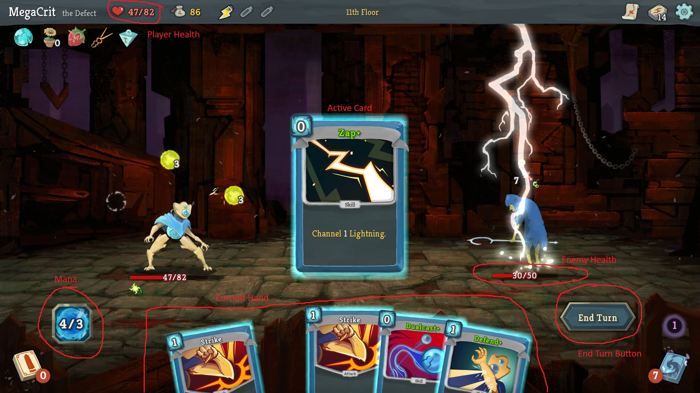

# Game Design Document - Last Game

## Glossary (**Bolded** words are defined here)
- *AI-driven* - All content will be generated by AI dynamically, based on the user's actions.
- *Roguelike* - Death will be permanent, meaning the player will restart from scratch upon each death.
- *Deckbuilding* - Combat will be card-based, and the player will collect new cards, increasing the size of their deck as they play through scenarios.
- *Run* - A single playthrough of the game, from beginning to death.
- *Mana* - What the player uses to play cards. 
  - Each card has an associated mana cost.
- *Attack* - A type of card that deals damage and possibly applies status effects.
- *Ability* - A type of card that performs a one-time action.
- *Power* - A type of card that applies an effect that lasts for the rest of the combat.
- *Keyword* - See [Game Rules](#game-rules) for more info.

## Game Overview
**Last Game** will be an **AI-driven**, dynamic **roguelike** **deckbuilding** game.
- *Gameplay*
  - The player will be faced with decisions and will be prompted by the AI to influence events and play through scenarios.
    - These scenarios will develop the story and also serve to increase the player's resources for combat.
  - The player will be placed in combat, and they will fight against enemies using the cards in their deck.
  - The player will be allowed to play for as long as they want to, without a specific end in mind.
- *Modes*
  - The main game mode will be a single-player campaign mode.
  - There will also be a multiplayer co-op mode that will allow two or more users to simultaneously play in the same game instance.

## Gameplay Mechanics
- *Text Interaction*
  - The user will interact with the AI through a text entry box.
  - The AI will give the user a scenario and ask the user what their character will do.
    - This could consist of a binary choice or an open-ended prompt.
  - The AI will respond to the user's prompt and dynamically generate new content based on previous input.
  - The AI should be able to respond to any input the user gives, even if that input attempts to do something unrealistic.
- *Combat*
  - Combat will be turn-based
    - The player will always go first
      - With multiple players, the order is arbitrary, but enemies go last.
    - A turn will consist of the player playing various cards within the limits of their **mana**.
    - A player will select an "End Turn" button when they are ready to move on.
    - The player may play as many actions as they wish, as long as they don't exceed their **mana** reserve.
  - Combat can end upon meeting one of two conditions:
    - The player's health reaches 0
    - All enemies' health is reduced to 0
  - The player should be able to see a card's description by clicking on it.
  - The player can play a card by dragging it upwards into the play area.
  - The player should be able to see their total and current **mana**.
  

- *Cards*
  - Cards will have several consistent features, and will always fit within certain rules:
    - Cards will have an associated **mana** cost.
    - Cards will have a title.
    - Cards will have a picture.
    - Cards will have one of the following attributes:
      - **Attack** 
      - **Ability** 
      - **Power** 
    - Cards will have a description.
      - This description will include any associated **keywords** in a distinct font.
      - The player should be able to hover over any **keywords** and a description of that **keyword** will be displayed.
    - Cards must consistently obey their own descriptions when played.
## Game Rules
- *Death*
  - When a player reaches 0hp, they die and must restart the game.
- *Gaining Cards*
  - The AI will generate three options for the player to choose from each time they complete combat.
  - The player will be able to gain cards when the AI allows them to during text prompt (non-combat) scenarios
- **Keywords**
  - Keywords are certain words that the AI understands have an exact, consistent meaning.
  - These keywords can range from 
  - Some keywords that we will implement are:
    - Base Effects
      - **Damage** - The attack will deal `n` damage to the target
      - **Defense** - The target will receive `n` block until their next turn
    - Status Effects
      - **Stunned** - The target will lose their next `n` turns
      - **Confused** - The target has a 50% chance to miss any attack for `n` turns
      - **Invincible** - The target is invulnerable to damage for `n` turns
      - **Exposed** - The target takes 25% more damage for `n` turns
      - **Weakened** - The target deals 25% less damage for `n` turns
      - **Slowed** - The target gains 25% less block for `n` turns
    - Buffs
      - **Strength** - The target deals `n` more damage until the end of combat
      - **Speed** - The target gains `n` more block until the end of combat
  - Keywords always produce an expected effect.
