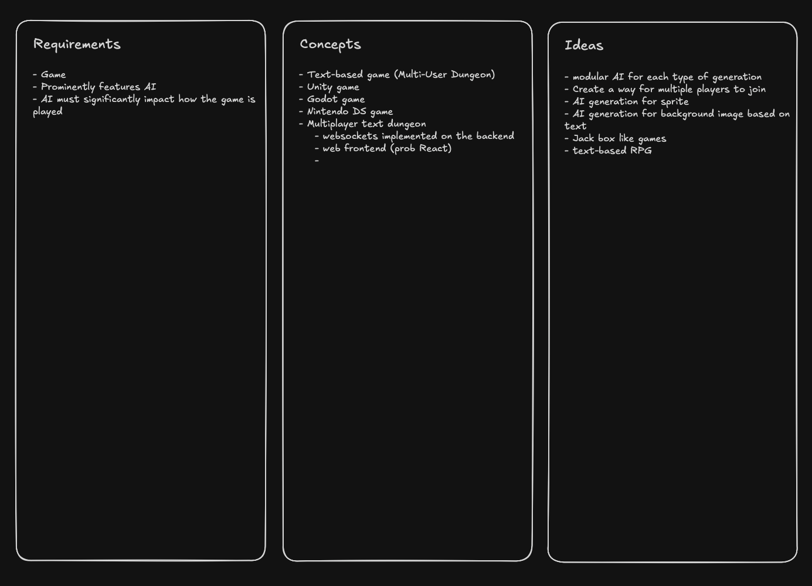

# CS3450 Team 5
Kade Angell, Samuel Chase, Andy Stevenson, Carson Bentley, Justin Plane, Jaden Beus

[Excalidraw](https://excalidraw.com/#room=5faac6400f8fd5e0f527,TWPAcGaF3VKlQK3i__DZHg)

**AI-Driven Multiplayer RPG Game**

### Overview
Our project is an AI-driven multiplayer RPG game designed in a Jackbox-style format, where one central computer runs the game, and players can join using any device with a web connection. The game offers a unique blend of AI-generated storytelling, player-driven choices, and a dynamic, evolving world. Players embark on an adventure where AI adapts the experience in real-time, shaping events, NPC interactions, and challenges based on their decisions.

At the beginning of each session, players can choose a genre such as Fantasy, Mythological, Cyberpunk, Alien, Steampunk, Horror, Zombie Apocalypse, Wild West, Medieval, or WWII. This choice determines the game’s environment, setting, and possible encounters. The AI generates the story dynamically, ensuring that every playthrough is different. Players will experience an open-ended narrative where their choices influence the world around them, and AI reacts by modifying scenarios, character dialogues, and challenges accordingly.

### Core Gameplay Mechanics
1. **Character Creation:**
   - Players create and customize their character by providing a description.
   - AI generates a character image based on the description.
   - Players choose a name for their character.
   - Option to sign in and save character progress, stats, and abilities.
   
2. **Ability Tree & Progression:**
   - Players level up by gaining experience.
   - An ability tree allows for skill customization and specialization.
   - Items and abilities can be upgraded.

3. **AI-Generated Storytelling & World:**
   - The game starts at a central hub, like a crossroads or a tavern.
   - Players choose their path (e.g., a road leading to a cyberpunk city, a cemetery, or a medieval castle).
   - AI generates encounters, NPC interactions, and events dynamically.

4. **Multiplayer Interaction:**
   - Players can collaborate, trade, or battle with each other.
   - Team-based challenges require strategic cooperation.
   - AI bots can be assigned to assist or compete with players.

5. **Game Master & Game Watcher Roles:**
   - A designated Game Master can modify rules, introduce challenges, and oversee gameplay.
   - Game Watchers can interact as ghosts, drop items, or trigger random events.

6. **Surprise & Unpredictability:**
   - AI ensures that no two game sessions are the same.
   - Randomized events and hidden areas provide fresh experiences.
   - Players can engage in moral dilemmas that affect the story.

7. **Item Collection & Cards:**
   - Players can collect special item cards to aid their journey.
   - Crafting mechanics allow players to combine resources for new items.
   - Achievements unlock special rewards and recognition.

### AI Integration
- AI plays a major role in decision-making, NPC interactions, and world-building.
- AI-driven bots can mimic human behavior, making solo play engaging.
- AI tracks player choices to create a personalized and evolving story.

### Summary
This project aims to create an innovative RPG experience where AI dynamically generates the world, story, and challenges. With an open-ended multiplayer format, rich character customization, and an evolving narrative, this game will offer a unique and immersive role-playing adventure for players of all skill levels.

### Next Steps
- Gather feedback from the team on core mechanics and AI implementation.
- Define technical requirements and framework selection.
- Develop a prototype focusing on AI-driven world generation and character interaction.
- Implement multiplayer functionality and test scalability.

Let’s discuss how we can refine these ideas further!

