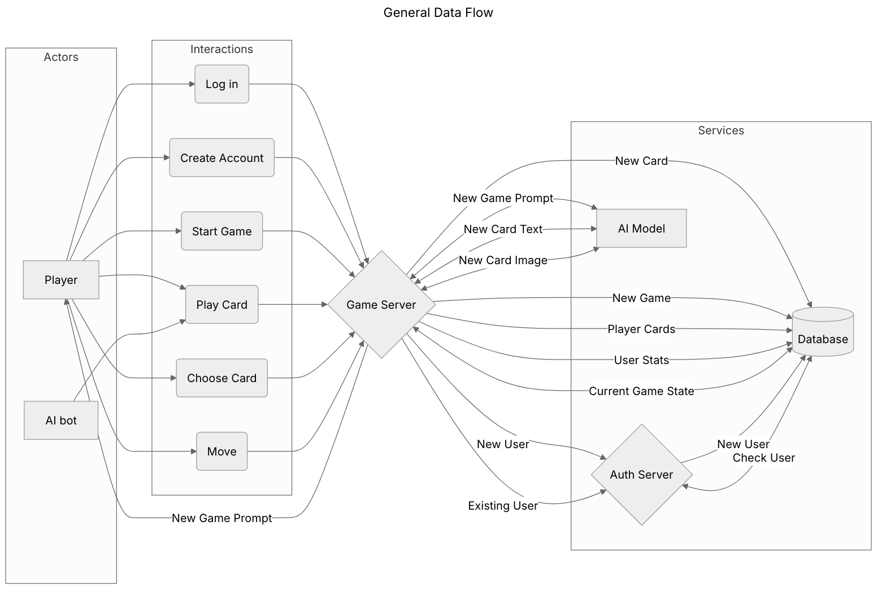
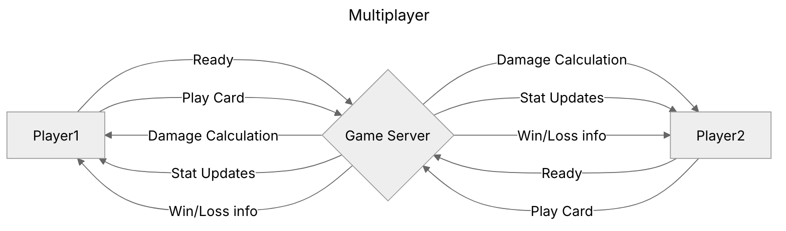

---
header-includes:
  - \usepackage[a4paper,margin=1in]{geometry}
---
# Combined Game Documentation

## 1. User Requirements

### Overview

- This document outlines the user requirments for our single player roguelike deck-building game. The game is designed to offer an immersive experience where players navigate through dynamically generated enviroments, build powerful decks and, interact with AI-driven worlds. This document provides a structured breakdown of the different user roles  and their expectations from the game, including mechanics,AI behavior and thematic consistency.

### User Roles 
- **Player**  
  The player is the primary user of the game, they can navigate through procedurally generated text-based rooms, battling enemies, collecting cards and shaping the world through their choices. The player can engage in different modes such as a single player roguelike runs, competetive battles and a multiplayer co-op mode.

- **AI Bot**  
  The AI bod would act as the game master, generating rooms, enemies, friends, and story elements dynamically. It also ensures that all game components, such as card interactions and enemy behaviors, remain balanced while maintaining thematic consistency across different settings.

### Core Gameplay Mechanics

#### Single-Player Roguelike Mode

The game will feature a deep, engaging single-player roguelike mode where players will navigate through a procedurally generated world. Each playthrough will offer a completely unique experience, ensuring that no two runs feel the same. Players will be presented with a variety of challenges, including encounters with powerful enemies, strategically placed obstacles, variety of difficulty level puzzles, and opportunities to collect valuable resources to improve their deck.

Each room in the game will be described in text format, with detailed narratives that paint vivid images of the player's surroundings. Players will have the ability to interact with their environment by making choices such as attacking enemies, defending against incoming threats, using cards from their deck to perform actions, or choosing to flee from particularly dangerous encounters. These choices will shape the flow of the game, creating a dynamic, branching experience where early decisions influence later events.

The combat system will be turn-based, requiring players to think critically about the cards in their deck and how best to utilize them in each situation. Different enemy types will require different strategies, and players will need to learn how to adapt in order to progress. As they explore further, they will uncover hidden lore, unlock special encounters, and face increasingly difficult foes, pushing their deck-building and decision-making skills to the limit.

#### Deck-Building System

The core mechanic of the game revolves around deck-building, allowing players to collect, upgrade, and refine their decks as they progress through their runs. Each deck represents the player's abilities in combat, with cards acting as their primary means of attack, defense, and special actions. As players advance, they will encounter new cards that can be added to their decks, providing them with more strategic options.

The game will feature a diverse range of card types, each with unique effects. Some cards may deal direct damage, while others may provide buffs, debuffs, healing, or utility effects that can influence the battlefield in different ways. Additionally, players will have the opportunity to upgrade their cards, making them more powerful and efficient.

To add further strategic depth, the game will introduce a rarity system for cards, ensuring that players have a mix of common, uncommon, rare, and legendary cards. Higher-rarity cards will provide powerful effects, but may also have trade-offs that require careful consideration when constructing a deck. Players will need to experiment with different combinations to find synergies that best suit their playstyle.

Each playthrough will encourage experimentation, as players will need to adapt their deck based on the encounters they face. Some runs may focus on high-damage output, while others may require defensive or utility-heavy strategies to overcome unique challenges. This evolving deck-building aspect will ensure that the game remains fresh and rewarding over multiple playthroughs.

#### Thematic Flexibility

One of the standout features of this game is its ability to dynamically adapt to different themes and genres. At the start of every run, players will have the option to choose a specific setting or genre, such as Medieval, Cyberpunk, Fantasy, or Horror. This choice will influence the overall aesthetic and narrative of the game, providing players with a fresh experience each time they play.

The AI bot will be responsible for adjusting enemies, environments, and items to match the selected theme, ensuring that all elements fit seamlessly into the chosen world. For example, if a player selects a Medieval setting, they may encounter knights, dragons, and enchanted artifacts, while a Cyberpunk setting might feature high-tech mercenaries, rogue AI entities, and neon-lit dystopian cities.

Despite these thematic shifts, the AI bot will maintain a structured framework that ensures functional consistency across different settings. A sword in a medieval world, for instance, will retain its fundamental mechanics and effectiveness even if the player chooses a cyberpunk world, where it may be reinterpreted as an energy blade. This flexibility allows for creative and immersive storytelling while maintaining gameplay balance.

#### Win Conditions

Unlike traditional roguelike games that may have a singular objective, this game will feature multiple win conditions to cater to different types of players and playstyles. This will provide a sense of variety and long-term engagement, ensuring that players have multiple goals to strive for across different runs. The primary win conditions include:

**Fighting Towards a Goal:** Some runs will require players to reach a specific objective, such as defeating a powerful final boss or unlocking a hidden chamber deep within the game world. These objectives will be clearly defined at the start of each run, giving players a concrete challenge to work towards. Completing these objectives may unlock additional content, such as new card sets, lore entries, or gameplay modifiers.

**Survival Mode:** Another win condition will involve players seeing how long they can survive in an endless mode, where difficulty steadily increases over time. This mode will test players’ endurance and adaptability, as they will have to continuously refine their strategies to stay alive against increasingly formidable enemies. Leaderboards and personal records will encourage replayability by allowing players to challenge themselves and others to beat their survival times.

**Overarching Progression:** For players who enjoy long-term goals, the game will incorporate an overarching progression system that spans multiple runs. Certain accomplishments from previous runs may carry over into future playthroughs, providing persistent rewards or minor advantages. This could include unlocking new starting decks, gaining access to special challenges, or discovering deeper layers of the game’s lore. This system will encourage players to continue experimenting and refining their approach across multiple playthroughs.

### MoSCoW Method for Core Gameplay Mechanics

#### Must Have:
- Procedural generation for varied experiences
- Turn-based deck-building combat
- AI-driven thematic adaptation
- Multiple win conditions for replayability
- Progressive deck refinement and upgrades

#### Should Have:
- Persistent rewards spanning multiple runs
- Customizable difficulty settings
- Adaptive enemy encounters based on player choices

#### Could Have:
- Multiplayer co-op and competitive modes (future expansion)
- Unlockable alternate game modes or challenges
- Dynamic AI-generated side quests and lore expansion

#### Will Not Have (for now):
- Fully animated graphical environments
- Voice-acted narration
- Real-time combat mechanics

### User Stories for Roguelike Deck-Building Game

#### Player
- As a player, I want to play in a single player roguelike mode so that I can experience the game solo.
- As a player, I want to develop different decks that I can reuse later in multiplayer so that I can refine my strategies over time.
- As a player, I want to choose the setting/genre at the start of every run so that I can have a fresh experience each time.
- As a player, I want to engage in multiplayer co-op mode so that I can team up with others.
- As a player, I want to fight a large boss together in multiplayer using decks I have created in the past so that I can strategize with my team.
- As a player, I want to play through a normal roguelike run with my friends in multiplayer so that we can explore and fight together.
- As a player, I want to participate in competitive multiplayer battles so that I can test my decks against others.
- As a player, I want to battle against others using decks I have made in the past so that I can improve my competitive strategy.
- As a player, I want to collect and use cards of different rarities so that I can create more powerful and unique decks.
- As a player, I want to have multiple win conditions so that each game mode feels varied.
- As a player, I want to fight towards a specific goal so that I can work towards an achievable objective.
- As a player, I want to see how long I can survive so that I can challenge myself to improve.
- As a player, I want to progress towards an overarching goal that spans multiple runs so that my efforts feel meaningful over time.

#### Game Master (undecided if applicable by team yet )
- As a game master, I want to create custom challenges so that I can tailor the experience for players.
- As a game master, I want to modify difficulty settings mid-game so that I can balance the experience.
- As a game master, I want to introduce special events so that I can make the game more engaging.
- As a game master, I want to oversee player stats and progress so that I can provide hints or challenges when needed.

#### Game Watcher (undecided if applicable by team yet )
- As a game watcher, I want to observe a multiplayer session so that I can see how players interact.
- As a game watcher, I want to trigger surprise events so that I can add excitement to the game.
- As a game watcher, I want to reward players with in-game resources so that I can encourage creative play.
- As a game watcher, I want to activate special modifiers so that I can enhance or challenge the players.

#### AI Bot
- As an AI bot, I want to generate unique worlds so that every playthrough feels different.
- As an AI bot, I want to adapt my encounters based on the player’s deck so that the game remains balanced.
- As an AI bot, I want to act as an opponent in single-player mode so that I can provide a challenging experience.
- As an AI bot, I want to generate meaningful dialogue so that the world feels immersive.
- As an AI bot, I want to track player choices so that I can shape the world accordingly.
- As an AI bot, I want to offer dynamic difficulty adjustments so that players have a fair but engaging challenge.
- As an AI bot, I want to create randomized challenges so that no two runs are the same.
- As an AI bot, I want to roleplay NPCs dynamically so that interactions feel organic.
- As an AI bot, I want to have total thematic freedom within a structured framework so that I can seamlessly integrate different genres (e.g., a medieval knight’s sword being compatible in a cyberpunk world).
- As an AI bot, I want to be friends with the player until the final fight when I turn against them so that I can potentially win and add the element of suprise for the player.

---

## 2. Business Requirements

The following business requirements will be used to increase revenue and overall player count for the customer. These requirements will help business operators make decisions and improve the business side of the game.

### Analytics
The program should store information about users and how they engage with the platform. The following information should be tracked and sent to a separate business server for analyzing the data. This data will serve to inform business operators of demographics to target, features that will increase play time and player count, and the overall health of the game.

* **User Engagement:** The program should keep track of users' time spent in activities such as single-player experiences, multiplayer, and co-op experiences within the game.  
* **User Spending:** The program should keep track of the user's monetary transactions within the game. It should store when, how much, and what the user spent money on.  
* **User Information:** The program should keep track of user demographic info such as location, age, and hardware.  
* **Player Count:** The program should keep track of the number of active players per day.  
* **Data Retrieval:** Business operators should be able to download data into common data formats such as .xlsx and Json for analysis.

### User Acquisition Strategy:
A variety of strategies will be executed to increase user acquisition.

* **Search Engine Optimization (SEO):** The game’s website and app store listings should be optimized with targeted keywords to rank higher in search results.
* **User Targeted Ads:** User analytics should be used to target ads towards the demographic of people who play the game the most such as RPG enjoyers, Card game enjoyers, and other groups identified by game analytics.
* **Multiplayer:** The game should include multiplayer elements such as co-op battles and player versus player battles to encourage friends to buy the game.
* **Referrals:** The game should offer rewards such as loot boxes for current users for each new user they get to sign up.
* **New User Rewards:** The game should offer in-game incentives such as loot boxes for new users who join.
* **Language Support:** The game should be able to support multiple languages to reach a broader audience.
* **Accessibility:** The game must adhere to accessibility standards, such as support for screen readers, text-to-speech, and customizable font sizes to reach a broader audience.
* **Platform Access:** The game should be built on a widely accessible platform like the web or multiple platforms to maximize access to the game.

#### Community Building
As part of user acquisition, the game should deploy a variety of features to foster a strong community for the game which will in return attract more players.

* **Single Player Leaderboard:** The game should provide a global leaderboard that tracks the fastest time through the single-player campaign to foster a speed-running community.
* **Multi-Player Leaderboard:** The game should provide a multiplayer leaderboard, tracking the most wins and win percentage to encourage a competitive scene.
* **Social Media Engagement:** Social media channels should be created and regularly updated with content such as sneak peeks, gameplay trailers, updates, and community engagement. These accounts should be accessible from the game's main website.
* **Community Promotion:** The official site should promote community content such as YouTube videos and Twitch streams to build a healthy community.

### User Retention Strategy
A variety of strategies and features should be deployed to encourage players to continue playing the game.

* **Daily and Weekly Challenges:** Offer daily and weekly challenges that reward players with bonuses such as experience points, currency, or unique cards. These challenges should be worthwhile for the player to encourage players to return regularly.
* **Achievement System:** The game should offer an extensive achievement system where players can unlock milestones, titles, and special rewards based on their progress and accomplishments to encourage more playtime.
* **Progression System:** The game should implement level-based progression where players unlock new gameplay features, cards, and things to do.
* **In-Game Events:** The game should host limited-time events that feature exclusive content, challenges, or storylines. These events can encourage players to log in and participate during a specific time window.
* **Push Notifications:** The game should utilize push notifications and emails to remind players of upcoming events, challenges, and important updates. Offer incentives like bonus rewards for logging in after a period of inactivity.

### Quality Control and Feedback:
The program should provide a method for users to give feedback to improve the program and user experience.

* **Bug reporting:** Players should be able to report bugs and issues they come across in the game.
* **Game Feedback:** Players should have the option in the game to send feedback for improvements.
* **Activity Feedback:** When new features or gameplay mechanics are introduced the user should be prompted to rate the experience and send feedback if necessary.

### Monetization:
The game should employ a variety of monetization options.

* **Paid Model:** Players should pay for the game using a payment service such as Stripe.
* **Free Demo:** A free demo should be offered for players to try the game for free by playing through 2 boss battles. After the trial expires they should be prompted to upgrade to the full paid version of the game.
* **In-Game Monetization**: The game should not have micro-transactions. The game should allow players on the free trial to buy the full game in-game and should be built to allow future DLC content to be bought in-game as well as on other platforms it is built on.

### Scalability
The game should be built to allow growth in users and experiences:

* **Database**: The database must be capable of scaling to millions of players.
* **Game experiences**: The game should allow for easy implementation of future content such as DLCs and special events.
* **Servers**: Game Servers must be able to handle high traffic as much as 1 million concurrent players at a time.

### Security
User information and game services should be secure

* **System Authorization:** The system should only be accessible to authorized employees such as software engineers and business operators. The system should employ some employee verification system (employee sign-in) allowing only authorized personnel to access the site.
* **User Account Security:**: User's accounts must be secured through username and password. Passwords and emails must not be in plain text and must be encrypted.
* **User Data:** Personal user data should be encrypted and user data for analytics should be anonymized. Data storage should comply with data protection regulations.

### Business Requirements MoSCoW Analysis:
For version 1.0 of our project, we will largely focus on the main core single-player experience, so many of our business requirements will not be prioritized until the base gameplay of our game is finished. If must have business requirements conflict with core game requirements we will prioritize the game requirements and focus on business requirements in version 2.0.

#### Must-Have:
* **Progression features:** We will have some progression system in version 1.0 that will allow users to feel like they are making progress. To begin this will be based on card collection. Other progression features will be treated as could haves for version 1.0.
* **Paid Model:** We will prioritize the paid model over all other monetization options since the customer wants to make money from the game. This implementation should be easier to implement than others and is a generally accepted monetization model.
* **User Data Security:** We will prioritize protecting user data.
* **User Account Security:** We will require users to create an account with a username, email, and password to sign in. Passwords and emails will be encrypted.

#### Should-Have:
* **Multiplayer:** We believe this is an important aspect of creating a fun game people can play. Multiplayer will help with user retention and recruiting new players, but we want the core single-player gameplay to be prioritized first since it makes up the bulk of the customer's wants. If single-player is polished we will move to Multiplayer implementation next.
* **System Authorization:** Before the product ships we should have some form of system authorization. However, because we are mostly focused on core gameplay we anticipate system authorization will not be highly prioritized until the core game is built. System authorization during this initial development cycle will be handled through Git Hub.
* **Database Scalability:** Our database should be able to scale. Since gameplay is the most important we won't prioritize this as high, but we believe we can implement a scalable database to account for a growing player base.

#### Could-Have:
* **Leaderboards:** Leaderboards could be implemented, but are likely more suitable after core gameplay features and mechanics are implemented. The game should be fun to play before trying to build a competitive scene.
* **Analytics:** We could implement a way to track user information for analytic purposes as that would be helpful for the business owner to make decisions, but we don't expect this will be in version 1.0. We want the game to be playable before we worry about collecting data for business decisions.
* **User Acquisition:** While user acquisition will be key for the game to be popular in the long term, we want to prioritize making the game playable and fun before implementing new ways to gain players. Focusing on making the core gameplay fun will be far more productive in enticing new players than trying other methods of recruitment. Multiplayer will be prioritized over other user acquisition strategies since it is gameplay-based but will come second to the single-player base game. If single-player and multiplayer are implemented we will move on to adding some of the feature requirements listed in the User Acquisition section to begin to expand the player base, but we don't expect these will be in version 1.0.
* **Achievement System:** An achievement system would be a great feature to retain players and increase playtime, but will not be prioritized over core gameplay mechanics. This likely will be in version 2.0.
* **Bug reporting and Game Feedback:** Bug reporting and game feedback will be crucial in maintaining the game, but we don't expect this to be present in version 1.0. While reporting/feedback likely won't be integrated straight into the game in this version, the business can rely on emails and app store feedback if used until these features are implemented.
* **Social Media:** If by the end of this development phase, the game is ready to launch, creating social media channels will be important in community building and advertising. Our focus is on the game itself so social media will not be as highly prioritized until we have a finished product to build a community around.
* **Scalable Server:** The server should be scalable, but we are more interested in making sure the game functions. Server capacity can be upgraded after the game is built and players start to join.

#### Won't Have:
* **Localization:** The game won't have support for other languages in version 1.0, but may become available in other languages after core gameplay has been implemented. Our focus for this cycle will be to target the English-speaking audience.
* **Accessibility:** Accessibility is important but our focus will be on making the game playable for version 1.0. As the game becomes more polished we can begin to add accessibility features to broaden our audience in Version 2.0.
* **In-game Monetization**: We will not be implementing in-game monetization for this version since we don't have any DLC content as the base game has not yet been developed. We will provide an option to pay for the game, but it likely won't be built directly into the game itself until future versions.
* **Push Notifications, Daily and Weekly Challenges, In-game Events:** These retention features may be prioritized in future versions of the game to retain the player base, but will not be implemented in version 1.0 since improving the core game experience will be the best way to retain new players in the games infancy.
* **Game Content Scalability:** We think it is important to build a game that makes adding new content easy, but we are focused on the main gameplay at this time. Also, AI implementation in the game should add a fresh experience that will allow the need for new content to be minimized in the future.
* **Platform Access:** The focus on version 1.0 will be game mechanics so we will develop for only one platform. We will choose a popular platform to reach a larger audience. If successful the game could be expanded to other platforms in version 2.0.

#### Business Operator User Stories:
* As a business operator, I want data for analytics so that I can better understand how users are playing the game and make good decisions for the game in the future.
* As a business operator, I want user feedback so that I can make decisions that will improve the game and increase revenue.
* As a business operator, I want to monetize the game so that I can make money.
* As a business operator, I want to advertise the game so that more games are bought and I can make money.
* As a business operator, I want to develop a community for the game so that player acquisition is cheaper and more organic.
* As a business operator, I want to increase playtime in-game so that I can make more money.
* As a business operator, I want data to be secure so that customers trust the game and I don't get sued.

---

## 3. Non-Functional Requirements

### Key Attributes
1. **Performance:**
   - AI text responses must be generated and displayed to users within 2 seconds of users selecting/inputting a text response.
   - Cards (including AI generated image assets and card stats/abilities) must be generated and displayed to users within 3 seconds of player reaching card display page

2. **Multiplayer:**
   - The game must support at least 25 simultaneous users per server initially.
   - Multiplayer systems must maintain low latency (<200ms) even during peak usage.

3. **Reliability:**
   - System uptime should be at 99.9%, once game is deployed, to minimize disruptions and ensure continuous availability to players
   - AI modules and other system modules must recover gracefully from failures and log errors for debugging without crashing the game instance.
   - User customized games should be saved onto users account, and retrieved/loaded from database quickly upon login (>10 seconds)

4. **Security:**
   - Provide secure user password storage through encryption, and ensure that passwords are retrieved/decrypted from database in >1 second
   - Ensure users are able to create account, complete with username and password, and the account details are encrypted/stored in database in >1 second
   - Perform regular security audits/checks to ensure fair gameplay for all users, and prevent against data leaks and exploits

5. **Usability:**
   - All accessibility features (e.g., adjustable font sizes, color blind modes) must adhere to WCAG Level AA standards.

6. **Compatibility:**
   - The application must function on Windows, macOS, and at least two popular Linux distributions.
   - Additionally, performance must meet or exceed minimum requirements on browser platforms for testing purposes.

7. **Maintainability:**
   - Codebase documentation must maintain 95% coverage for easy debugging and integrating team members' respective modules.
   - Modules must follow clean architecture principles, with dependencies clearly outlined and separated for independent updates.

8. **AI Behavior:**
   - NPCs must respond naturally within 2 seconds of player interaction.
   - AI must ensure a meaningful variance in dialogues and random events across consecutive playthroughs, with no two stories alike

9. **Card Generation:**
   - Cards assets and statistics should be generated quickly (>3 seconds)
   - Cards must maintain a high level of randomness, with no two cards the same
   - Cards must adhere to a basic set of stats, and stay within the defined bounds
   - Card image asset generation should be random, draw from player's created game, and be stored/retrieved in asset database quickly (>1 second)

10. **User-Defined Game Generation**
    - AI should prompt user for short, descriptive aspects of their desired game, keeping the game creation process to >5 minutes
    - After AI has received necessary requirements from user, game setting and AI tone should be generated quickly (>30 seconds)
    - User defined game length, customizable from ~1 hour- ~20 hours

---

## Identification of User Classes

1. **Casual Players**
   - Seek an enjoyable and intuitive gameplay experience, with fast, responsive gameplay
   - Desires low levels of downtime for continuous gameplay.
   - Wants to fight bosses with online friends (doesn't care as much about latency)
   - Desires fun, random cards

2. **RPG Enthusiasts**
   - Desire complex character development, high strategy, and significant player-driven choices
   - Expect deep AI adaptability and randomness (no 2 games the same) within quests and events
   - Expects AI to create accurate, realistic game scenarios based off user-supplied inputs

3. **Competitive Gamers**
   - Value real-time multiplayer interactions(low latency is important) and challenging boss battles
   - Aim to showcase skills or achievements in team battles, employing cards at the top-end of defined bounds

5. **Developers/Testers**
   - Require insight into system logs, performance monitoring tools, and debugging capabilities.
   - Ensure all functionalities adhere to documented standards during internal tests
   - Requires complete documentation and integration between various team modules

---

### MoSCoW Analysis

#### Must-Have Requirements
1. Secure, quick user account creation (>1 second)
2. Secure, quick user authentication (>1 second) via encrypted credentials.
3. Display AI responses to in-game events and player inputs in >2 seconds.
4. Efficient user-input game requirement gathering (>5 minutes)
5. Quick AI game environment/tone generation (>30 seconds)
6. Accessibility features adhering to WCAG Level AA standards.
7. AI driven card image asset generation and storage in asset database (>3 seconds )
8. AI driven card stat generation, within consistent and defined bounds (>3 seconds).
9. AI NPC's take user input, and generate/display responses in >2 seconds

#### Should-Have Requirements
1. Brief in-game tutorial, with the average player able to complete the tutorial in >10 minutes, while still imparting all necessary gameplay knowledge.
2. Multiplayer functionality for up to 25 users per server.
3. Multiplayer functionality for boss battles, with latency of >200ms

#### Could-Have Requirements
1. User leaderboards displaying statistics about cards/boss battle achievements
2. OAuth2 authentication
3. SSO Authentication
4. AI generated backgrounds, based on player-created game, generated in >5 seconds

#### Won’t-Have Requirements
1. Cross-platform play between console and PC users in the initial release.
2. Extended offline mode, with very small (>500 mb) AI models stored in local storage.
3. AI generated scenes and animations in >30 seconds.
4. Portablity to various gaming consoles

---

## Use Case Diagrams

This graph displays the general flow of data through the game, specifically concerning the player, the game server, the authentication server, and the backend

This diagram is a general overview of choices players can make and the data the server sends to both users.

---

## 4. Functional Requirements

### Single player Gameplay
* **Text Based Prompting**
  * Players can freely respond to AI generated elements and control their character using text entry.

* **Deckbuilding Mechanics**
  * Players must be able to create and manage a deck of cards, including adding, upgrading, and removing cards.
  * Card effects must support a variety of well-defined mechanics (e.g., attack, defense, buffs, debuffs, healing).

* **Roguelike Progression**
  * Procedurally generated campaigns with branching paths.
  * Encounters include battles, events, merchants, rest points, and elite challenges/bosses.
  * Permanent death upon losing all health, requiring players to begin a new run.

* **Dynamic Difficulty Adjustment**
  * AI analyzes player performance during runs (e.g., success rate, health, card synergy) to dynamically adjust encounter difficulty.
  * Gradual increase in difficulty as the player progresses further into a run.

* **Consistent Theme**
  * Players choose a theme at the start of a run (e.g., cyberpunk, fantasy, horror), and AI generates content tailored to that theme.
  * Thematic variations in cards, artwork, events, and environments.

### AI-Driven Content Generation
* **Dynamic Card Generation**
  * AI generates new cards during gameplay, considering the theme, player preferences, and progression.
  * AI ensures generated cards are balanced and fit within the player's deck strategy.

* **Event and Scenario Creation**
  * AI creates random in-game events with unique choices and consequences.
  * Scenarios are designed to match the player’s theme and adapt to their playstyle.

* **Enemy Scaling**
  * AI generates enemies with abilities, stats, and strategies that match player progression and deck strength.

* **Story Generation**
  * AI crafts narrative elements, including text for events, environment descriptions, and artwork.

### User Interface (UI) and Experience (UX)
* **Deck Management UI**
  * Visual interface to browse, upgrade, and remove cards.
  * Clear definitions of card stats and effects.

* **Battle UI**
  * Real-time display of player health, enemy stats, and the current turn’s effects.
  * Drag-and-drop or click-to-play functionality for cards.

* **Progression Map**
  * Interactive map showing branching paths with symbols representing upcoming encounters.
  * Highlights player-selected paths and their consequences.

### Analytics and Player Feedback
* **Player Performance Tracking**
  * System records data such as win/loss ratios, frequently used cards, and preferred themes.

* **Session Summaries**
  * At the end of a run, players receive detailed statistics, including enemies defeated, cards played, and progress made.

* **Feedback Mechanism**
  * Players can rate generated cards, events, and scenarios to refine future AI-generated content.

### Multiplayer
* **PvP Mode**
  * Players can challenge others with decks that are saved from previous runs.

* **Co-op Mode**
  * Players can play through campaigns together

* **Leaderboards**
  * Global leaderboards for top scores, runs completed, and unique achievements.

### Meta-Progression
* **Persistent Upgrades**
  * Option for players to invest in permanent upgrades that improve starting conditions for future runs.
  * Players can save cards or decks that they particularly enjoy.

---

## MoSCoW Analysis
### Must Have:
* Deckbuilding and Roguelike Mechanics
* AI-driven story generation
* AI-driven card generation
* AI-driven artwork generation
* Battle UI
* Text entry to control character and prompt AI
* AI generated theme based on player preferences

### Should Have:
* AI-driven adaptive difficulty
* Multiplayer Co-op mode
* Persistent upgrades
* UI-based inventory

### Could Have:
* PVP Multiplayer
* Dynamic map

### Won't Have:
* 3D graphics

This document was generated with the help of AI to generate some team requirements, user stories and MoSCoW methods. Chat-GPT was also used to generate some of the ideas for business requirements. In addition, it wrote a few requirements such as SEO requirements, Social media Campaigns, Accessibility, Language,  and a lot of user retention strategies.