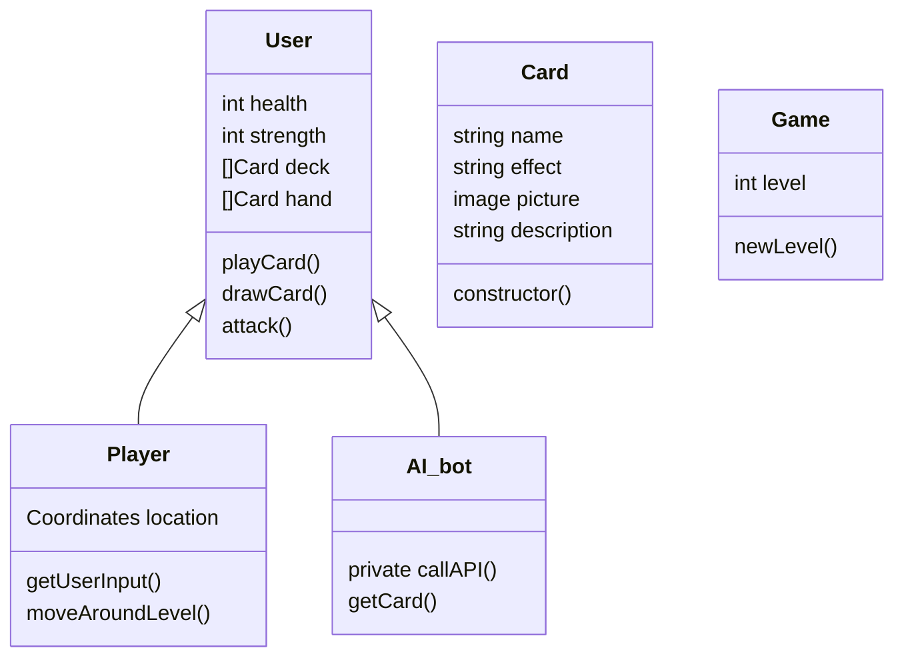

# User Requirements 
This document was generated with the help of AI, all team requirements, user stories and MoSCoW methods weere fed to GPT 4.0
#### Overview 

- This document outlines the user requirments for our single=player roguelike deck-building game. The game is designed to offer an immersive experience where players navigate through dynamically generated enviroments, build powerful decks and, interact with AI-driven worlds. This document provides a structured breakdown of the different user roles  and their expectations from the game, including mechanics,AI behavior and thematic consistency.

#### User Roles 
- The game will support two primary users: 
    - Player: The player is the primary user of the game, they can navigate through procedurally generated text-based  rooms, battling enemies, collecting cards and shaping the world through their choices. The player can engage in different modes such as a single player roguelike runs, competetive battles and a multiplayer co-op mode 

    - AI Bot: The AI bot would act as the game master, generating rooms, enemies, friends, and story elements dynamically. It also ensures that all game components, such as card interactions and enemy behaviors, remain balanced while maintaining thematic consistency across different settings. 

#### Core Gameplay Mechanics

###### Single-Player Roguelike Mode

The game will feature a deep, engaging single-player roguelike mode where players will navigate through a procedurally generated world. Each playthrough will offer a completely unique experience, ensuring that no two runs feel the same. Players will be presented with a variety of challenges, including encounters with powerful enemies, strategically placed obstacles,variety of difficulty level puzzles, and opportunities to collect valuable resources to improve their deck.

Each room in the game will be described in text format, with detailed narratives that paint vivid images of the player's surroundings. Players will have the ability to interact with their environment by making choices such as attacking enemies, defending against incoming threats, using cards from their deck to perform actions, or choosing to flee from particularly dangerous encounters. These choices will shape the flow of the game, creating a dynamic, branching experience where early decisions influence later events.

The combat system will be turn-based, requiring players to think critically about the cards in their deck and how best to utilize them in each situation. Different enemy types will require different strategies, and players will need to learn how to adapt in order to progress. As they explore further, they will uncover hidden lore, unlock special encounters, and face increasingly difficult foes, pushing their deck-building and decision-making skills to the limit.

###### Deck-Building System

The core mechanic of the game revolves around deck-building, allowing players to collect, upgrade, and refine their decks as they progress through their runs. Each deck represents the player's abilities in combat, with cards acting as their primary means of attack, defense, and special actions. As players advance, they will encounter new cards that can be added to their decks, providing them with more strategic options.

The game will feature a diverse range of card types, each with unique effects. Some cards may deal direct damage, while others may provide buffs, debuffs, healing, or utility effects that can influence the battlefield in different ways. Additionally, players will have the opportunity to upgrade their cards, making them more powerful and efficient.

To add further strategic depth, the game will introduce a rarity system for cards, ensuring that players have a mix of common, uncommon, rare, and legendary cards. Higher-rarity cards will provide powerful effects, but may also have trade-offs that require careful consideration when constructing a deck. Players will need to experiment with different combinations to find synergies that best suit their playstyle.

Each playthrough will encourage experimentation, as players will need to adapt their deck based on the encounters they face. Some runs may focus on high-damage output, while others may require defensive or utility-heavy strategies to overcome unique challenges. This evolving deck-building aspect will ensure that the game remains fresh and rewarding over multiple playthroughs.

###### Thematic Flexibility

One of the standout features of this game is its ability to dynamically adapt to different themes and genres. At the start of every run, players will have the option to choose a specific setting or genre, such as Medieval, Cyberpunk, Fantasy, or Horror. This choice will influence the overall aesthetic and narrative of the game, providing players with a fresh experience each time they play.

The AI bot will be responsible for adjusting enemies, environments, and items to match the selected theme, ensuring that all elements fit seamlessly into the chosen world. For example, if a player selects a Medieval setting, they may encounter knights, dragons, and enchanted artifacts, while a Cyberpunk setting might feature high-tech mercenaries, rogue AI entities, and neon-lit dystopian cities.

Despite these thematic shifts, the AI bot will maintain a structured framework that ensures functional consistency across different settings. A sword in a medieval world, for instance, will retain its fundamental mechanics and effectiveness even if the player chooses a cyberpunk world, where it may be reinterpreted as an energy blade. This flexibility allows for creative and immersive storytelling while maintaining gameplay balance.

###### Win Conditions

Unlike traditional roguelike games that may have a singular objective, this game will feature multiple win conditions to cater to different types of players and playstyles. This will provide a sense of variety and long-term engagement, ensuring that players have multiple goals to strive for across different runs. The primary win conditions include:

Fighting Towards a Goal: Some runs will require players to reach a specific objective, such as defeating a powerful final boss or unlocking a hidden chamber deep within the game world. These objectives will be clearly defined at the start of each run, giving players a concrete challenge to work towards. Completing these objectives may unlock additional content, such as new card sets, lore entries, or gameplay modifiers.

Survival Mode: Another win condition will involve players seeing how long they can survive in an endless mode, where difficulty steadily increases over time. This mode will test players’ endurance and adaptability, as they will have to continuously refine their strategies to stay alive against increasingly formidable enemies. Leaderboards and personal records will encourage replayability by allowing players to challenge themselves and others to beat their survival times.

Overarching Progression: For players who enjoy long-term goals, the game will incorporate an overarching progression system that spans multiple runs. Certain accomplishments from previous runs may carry over into future playthroughs, providing persistent rewards or minor advantages. This could include unlocking new starting decks, gaining access to special challenges, or discovering deeper layers of the game’s lore. This system will encourage players to continue experimenting and refining their approach across multiple playthroughs.

By offering diverse win conditions, the game ensures that different types of players—whether they enjoy structured challenges, endless survival tests, or overarching progression—have meaningful goals to pursue. This approach increases the longevity of the game and provides players with a reason to keep coming back for new experiences.

# MoSCoW Method for Core Gameplay Mechanics

### Must Have:

- Procedural generation for varied experiences

- Turn-based deck-building combat

- AI-driven thematic adaptation

- Multiple win conditions for replayability

- Progressive deck refinement and upgrades

### Should Have:

- Persistent rewards spanning multiple runs

- Customizable difficulty settings

- Adaptive enemy encounters based on player choices

### Could Have:

- Multiplayer co-op and competitive modes (future expansion)

- Unlockable alternate game modes or challenges

- Dynamic AI-generated side quests and lore expansion

- Will Not Have (for now):

- Fully animated graphical environments

- Voice-acted narration

- Real-time combat mechanics

### User Stories for Roguelike Deck-Building Game

#### Player
- As a player, I want to play in a singleplayer roguelike mode so that I can experience the game solo.
- As a player, I want to develop different decks that I can reuse later in multiplayer so that I can refine my strategies over time.
- As a player, I want to choose the setting/genre at the start of every run so that I can have a fresh experience each time.
- As a player, I want to engage in multiplayer co-op mode so that I can team up with others.
- As a player, I want to fight a large boss together in multiplayer using decks I have created in the past so that I can strategize with my team.
- As a player, I want to play through a normal roguelike run with my friends in multiplayer so that we can explore and fight together.
- As a player, I want to participate in competitive multiplayer battles so that I can test my decks against others.
- As a player, I want to battle against others using decks I have made in the past so that I can improve my competitive strategy.
- As a player, I want to collect and use cards of different rarities so that I can create more powerful and unique decks.
- As a player, I want to have multiple win conditions so that each game mode feels varied.
- As a player, I want to fight towards a specific goal so that I can work towards an achievable objective.
- As a player, I want to see how long I can survive so that I can challenge myself to improve.
- As a player, I want to progress towards an overarching goal that spans multiple runs so that my efforts feel meaningful over time.

#### AI Bot
- As an AI bot, I want to generate unique worlds so that every playthrough feels different.
- As an AI bot, I want to adapt my encounters based on the player’s deck so that the game remains balanced.
- As an AI bot, I want to act as an opponent in single-player mode so that I can provide a challenging experience.
- As an AI bot, I want to generate meaningful dialogue so that the world feels immersive.
- As an AI bot, I want to track player choices so that I can shape the world accordingly.
- As an AI bot, I want to offer dynamic difficulty adjustments so that players have a fair but engaging challenge.
- As an AI bot, I want to create randomized challenges so that no two runs are the same.
- As an AI bot, I want to roleplay NPCs dynamically so that interactions feel organic.
- As an AI bot, I want to have total thematic freedom within a structured framework so that I can seamlessly integrate different genres (e.g., a medieval knight’s sword being compatible in a cyberpunk world).
- As an AI bot, I want to be friends with the player untill the final fight when I turn against them so that I can potentially win and add the element of supriese for the player.

