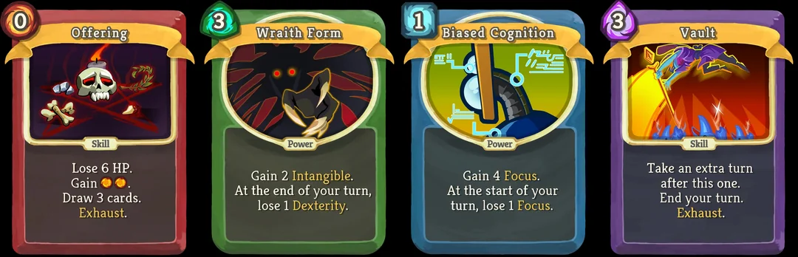

# Game Design Ideas

## Roguelike Card Game
**Roguelike:** *a game characterized by a dungeon crawl through AI-generated scenarios, turn-based gameplay, and permanent death of the character* 

**Deckbuilding Game:** *a card game in which the player progresses by permanently adding cards to his/her deck*

**Run:** *One playthrough of a roguelike game that spans from when the player restarts the game to whenever the player dies*

### Card based deckbuilding game
* Similar to [Slay the Spire](https://store.steampowered.com/app/646570/Slay_the_Spire/) but with AI generated environments and story elements
* Co-op multiplayer using turn-based actions
* Players play through AI-generated scenarios that fit in an AI-generated RPG-like story
* As players progress, they gain new cards and/or items that give them new abilities related to combat or exploration
* If a player's character dies, they start over in an entirely new scenario, with the opportunity to rebuild their deck, providing great replayability

### Well defined framework of game mechanics 
Players desire a game that is both fair and consistent. They want to be able to become better at the game as they start to understand the mechanics better. A deckbuilding roguelike is a perfect way to integrate AI-driven gameplay and story generation with a more rigid structure of consistent rules that make the game fun and engaging. The last thing we want is a game that is just a story generator where *anything* can happen and ther are no solid rules. That would bore and frustrate players looking for a challenging or engaging experience that they could become better at over time.
* AI is free to be creative within the mechanics that we design intentionally to be fair 
  * We don't want to limit the creativity of the AI, but we do want to give it a cool base architecture of intentional game design to work in
  * Examples of intentionally designed mechanics: 
    * **Consistent Keywords** - when the AI puts certain words on the generated cards, it always means the same thing. Some examples could be: 
      * When the player plays a card with the word `Stunning`, it *always* forces the enemy to lose their next turn
      * When a pickup states that it will increase the player's `Strength`, it will *always* result in the player's attack power going up
      * When a card has the attribute `Unplayable`, the player can't directly play it and it has to stay in their hand
        
        **Examples of cards from Slay the Spire.** Notice the yellow keywords that have specified definitions in the game.
      * The use of keywords like this will add to the player's immediate understanding of what cards do, how powerful they might be, and will add consistency in the way that the game is played and the way that the AI generates cards
    * **Game Rules** - As we let the AI build a unique world for us, it is critical that we have certain set rules that exactly define certain important qualities of our gameplay
      * There shouldn't be so many rules that the AI loses the ability to dynamically adapt to the player's needs, but there need to be certain lines that the AI respects when generating scenarios and plot points.
      * Examples of set game rules could include:
        * If you reach 0hp, your character dies
        * If you eliminate all enemies, you win the combat
        * Your turn consists of a certain number of actions, or a certain order
        * If you play a card, it always does what it said it would do, and follows pre-determined keywords
        * You can only gain new cards for your deck in certain circumstances
        * etc.
      * These rules are here to provide structure and help us avoid accidentally making an AI story bot like this: [A cool project, but not what we're looking for](https://aidungeon.com/)
    * **Objectives** - These fit into a similar vein as the game rules, but should be more vague. These help to give the player a sense of direction, as well as a sense of accomplishment as they slowly are able to get closer to their goal through multiple attempts.
      * This could be something objectively measurable: 
        * Gain `n` number of victory points to win (like Kade suggested)
        * Kill `n` number of monsters
      * Or, it could be something somewhat more qualitative like:
        * The player asks the AI bot to generate `n` number of rooms/scenarios to play through
        * The player describes a story-based goal they want to work towards
      * Whatever we decide to use as the objective of the game, there should be some sort of end goal in mind to engage the player and push them towards exploration
      * We could also add the option to allow the player to extend their game after they meet the objective, or dynamically generate a new, related objective so the player doesn't run out of content.

### Additional Features
Here are some other ideas that could potentially be implemented in this framework, if we decide to use it:
* **Direct feedback**
  * Player can give direct feedback and throw out poorly generated AI responses 
  * No matter how well an AI is trained, it will sometimes produce something that doesn't really make sense in the context of the game
  * We could allow the player to veto generated responses if they don't suit the playstyle well
* **Dynamic difficulty**
  * We can train the AI to dynamically adjust the difficulty of the environment to adapt to the individual player
  * Some players prefer high difficulty, some prefer low
  * We could also use this idea to compensate for if the AI generates a card that is over or under powered
    * Make it harder if the AI is giving you abilities that are too good
    * Make it easier if the AI is giving you abilities that don't work super well
* **Consistent Elements**
  * We could allow players to occasionally save a card design that the AI has generated, putting it into a database so that the same card could appear in later runs
  * We could implement some sort of persistent upgrade system that allows the player to enhance their starting character over time 

 

 